

CC BY-NC-SA 4.0

This work is licensed under a Creative Commons Attribution-NonCommercial-ShareAlike 4.0 International License.

*Dedicated to all those who, in the face of any difficulty, chose to keep learning.*

## Preface

As a child, my mother urged me to study, and for a considerable stretch of my life, I regarded this task as the mere memorization of answers to exams, only to promptly forget them once the obligation was fulfilled. It wasn't until my teenage years that I encountered a semester-long course called 'study techniques.' Here, I was instructed to read, underline, reread, and rewrite my underlined notes. While this method improved my exam scores temporarily, the knowledge would invariably fade away afterward. Historical facts became meaningless dates, equations dissolved into scribbles, and once-learned language concepts transformed into loathsome words drifting in my memory. Remarkably, I continued to pass with excellent grades.

However, my understanding of the true cost of this approach only dawned on me when I entered engineering university. The initial exams were designed merely to assess my knowledge level, but when I read the questions, I recognized them from somewhere in my past. I had known them years ago, but now they seemed vaguely familiar, and I struggled to provide the correct answers. My score? A mere 20%. As the coursework advanced, my situation deteriorated. I needed to grasp earlier concepts to excel in exams, a prospect that had never piqued my interest. Moreover, the study techniques that had served me previously proved inadequate in the face of the substantial amount of information I now encountered. I barely managed to pass, and by the time I reached my second year, where retaining previously learned concepts was essential, I faltered. Everything I had learned the prior year had vanished from memory.

I began to doubt my abilities, believing I was inherently incapable and that my brain was somehow inferior. I ultimately abandoned my university studies, deeming them a waste of time. My goals shifted, and I started working as a barista. However, my thirst for knowledge remained unquenched. Numerous subjects, particularly programming, continued to captivate my interest. Encouraged by this spark, I decided to embark on a self-guided journey to deepen my understanding of the field.

This path was fraught with stumbling blocks, errors, and challenges, but gradually, programming started to make sense. Beyond that, I began to discern a pattern in the learning process. I turned to dynamic tutorials that emphasized hands-on experience over the rote memorization of definitions or complex theories. This new approach kindled a fresh curiosity within me: How do we learn?

I set out on a quest to uncover alternative methods of studying. My initial task was to gather information on effective study techniques. I scoured the internet for articles, acquired books of interest (often more than necessary), consulted online communities, and experimented extensively. My endeavors to learn programming proved particularly illuminating; while some approaches failed, others succeeded. I persisted in refining my learning skills until I gained the confidence to reattempt formal education. This time, I did not falter. Each passing year proved more productive, and I found myself surpassing both my peers and even some of my professors. Many attributed my success to sheer intelligence, willpower, or time spent studying. Yet, they were mistaken; I had simply mastered the art of effective learning.

Over time, I noticed a significant enhancement in my comprehension abilities. I grew restless studying a single topic and began to tackle two or three simultaneously. I explored diverse disciplines, from programming and languages to carpentry, electricity, electronics, mathematics, and many others, including seemingly unrelated subjects like beekeeping and horticulture. This multifaceted approach felt effortless and enjoyable, compelling me to continue my eclectic learning journey.

What remains paramount is my unwavering commitment to learning how to learn. I reached a juncture where I amalgamated my accumulated knowledge, formal education, and independent discoveries to assist others in achieving their learning goals.

But why do we learn? Often, people associate learning with institutions, degrees, and job prospects, neglecting the value of learning for its intrinsic worth. Learning instills new values, nurtures our ethics, enhances our productivity by acquainting us with new trades and hobbies, imparts wisdom from history to prevent repeating past mistakes, and so much more. Learning doesn't merely boost our intelligence; it shapes us into better individuals.

From infancy, we begin to cultivate the skill of learning. Babies utter their first words after repeated exposure to their parents' voices, and this process continues throughout their lives. Schooling exposes them to new knowledge simply by observing teachers, acquainting them with games by watching peers, and etching book plots into their memory through reading. This childhood development lays the foundation for various learning styles and information retention techniques.

## Abstract

Within the pages of this book, we embark on a profound exploration of the intricacies of learning, delving deep into the modus operandi of our minds. Our mission is to unravel the secrets of understanding and memorizing information with the ultimate goal of enhancing our cognitive capabilities and extracting knowledge in the most lucid and meticulously organized manner.

In this quest for cognitive mastery, we encounter a rich tapestry of methods and intricate systems meticulously crafted by experts. These tools serve as catalysts, propelling us toward heightened efficacy in our learning endeavors. Learning, as we come to appreciate, transcends the mere act of reading; it demands an amalgamation of willpower, strategic finesse, relentless practice, and the wisdom to discern the most effective pathways to knowledge acquisition.

The voyage of recollection, an integral facet of the learning process, unfolds as a cyclic odyssey, replete with twists and turns, for which we must be well-prepared. Once we acquire knowledge, our brains undergo transformative processes akin to molding clay into new forms. However, this remarkable property of neuroplasticity comes with its own set of challenges. The specter of forgetting looms, albeit not indefinitely or abruptly. Under specific conditions, the precious fruits of our learning can slip away. To combat this formidable adversary, we wield a powerful weapon: the art of notation. Within our arsenal, we find an array of mechanisms, both simple and intricate, swift or detailed, all finely tuned to transcribe information with precision and purpose.

For those who may question the efficacy of the written word, there exists an alternative avenue of learning: the art of meticulously crafting organized visualizations. Diagramming, as we shall discover, demands an intimate understanding of the nuanced art of explicit and systematic description within a pristine canvas of blank space. Yet, be not deceived, for the mere act of tracing lines upon a canvas is insufficient to conjure meaningful charts and diagrams. What lies at the heart of this endeavor is an adherence to order and an unwavering dedication to the art's guiding principles and regulations.

In essence, this odyssey through the realms of learning not only equips us with the tools to ascend the peaks of knowledge but also instills a profound sense of reverence for the process itself. Learning, we come to realize, transcends the confines of institutions, degrees, and employment prospects. It is the crucible in which we forge our values, nurture our ethics, and expand our horizons. Learning transforms us into not just more intelligent beings but, fundamentally, into better individuals.

> This book was written with the objective of guiding a software project but is unrelated from it.

### ¿What is "tabula rasa"?

The term "tabula rasa," Latin for "blank slate," carries profound philosophical significance. It encapsulates the notion that each of us enters the world devoid of inherent knowledge, akin to an empty canvas, and it is through the journey of life that we inscribe our experiences upon this mental canvas, gradually etching the tapestry of our understanding.

The origin of this term draws a compelling parallel to a tool of antiquity—the Roman wax tablet. Employed by the Romans in the 1st century B.C., this tablet could be molded afresh with a stylus, permitting the erasure of previous writings and enabling the opportunity to transcribe anew. Its very emptiness led to its designation as "rasa," signifying the absence of preexisting inscriptions.

In essence, "tabula rasa" stands as a testament to the malleability of human consciousness, where the imprints of life's experiences continually shape and reshape the contours of our understanding, rendering each of us a unique work of intellectual artistry.

  

  <figcaption style="font-size: 10px; text-align: center;">Roman wax tablet</figcaption>

Philosophers employed this expression to symbolize the commencement of learning from birth, following the theory of empiricism, which posits that we acquire knowledge through experience from the moment we are born. Here, we align ourselves with this ideology, keeping our doors open to all. What is explained remains indifferent to one's origin, current circumstances, reasons for wanting to learn, or any other factors.

## General view

Writing the Tabula Rasa is a metaphorical title for the content we will delve into. Firstly, we will approach it's figurative meaning, aiming to comprehend how the human mind operates and how individuals acquire knowledge. After this metaphorical exploration, we will take a literal approach and craft the 'table' creating a record of our knowledge to facilitate recollection and interpretation by others.

The text is structured into three primary sections, each addressing key questions: How does our brain function? How do we learn and memorize it's concepts? And, lastly, how do we disseminate and organize this information?

In the first section, we will delve into the biology of neurons, dissecting their components and understanding how they interconnect to construct mental models. We will also explore the concept of 'attention' and the pivotal role of cultivating effective study habits.

The second section delves into the realms of study, memorization, and information retrieval. This domain is vast and intricate, reliant on the application of techniques across a process that leads to the comprehension and interconnection of concepts, culminating in their retention within memory. This journey takes time and cannot be accomplished in a single night.

Finally, we elucidate the process of disseminating information to make it reusable, both for oneself and others. We analyze the abstract organization of information, emphasize the importance of precision in writing and present various methods for articulating ideas effectively.

I have endeavored to present this book in an accessible manner, though it may still pose challenges for those less accustomed to extensive reading. Whether we are an expert or a novice, remember: strive to maintain a holistic perspective. Keep in mind the previously discussed topics and return to them as needed. Comprehending the connections is paramount to grasping the underpinnings of more advanced sections.

---

# A. Understanding the mind

The human brain is the most intricate organ in the animal kingdom, brimming with mysteries that have intrigued various disciplines dedicated to unraveling them. The task of thinking is carried out by tiny, specialized cells that work together in a structured and organized manner, much like bees. Each area of this remarkable organ performs a highly specific function.

But why should we be interested in knowing this? This is where knowledge is brewed. Understanding how it functions enables us to comprehend how it operates, what it's limits are and how it thinks. However, the goal is not to become neuroscientists; people can drive a vehicle without being mechanics.

We will explore the composition of the brain at the cellular level as it forms systems, eventually culminating in something larger. We will focus on an organic perspective before delving into the workings of what we will cover in the second part.

## A.1 How does the brain work?

The first step in comprehending the mind is to delve into the neuronal system within our brain, which enables us to think, remember, and understand. This peculiar organ located in our head is composed of several parts, each serving various functions. Nonetheless, our focus isn't on knowing each part individually but rather on how they come together to form the human mind.

Before delving into the biological aspects, we will employ an analogy to ease the complexity, allowing us to perceive the operations of our brain from a different perspective.

### A.1.1 A tiny city

Imagine the mind as a miniature, microscopic city inside our head, complete with people, streets and buildings.

These tiny inhabitants are so small that they can't think much on their own. They can barely hold onto a minimal unit of information, a small piece of data, something as simple as a number from 0 to 9 or a letter. They are rather clumsy on their own, but they can communicate with each other. In groups, they can form words or even images.

Within the buildings, people gather to create 'mental models.' These models are ideas and concepts formed by connecting with notions we already know. They are always a work in progress: under construction, undergoing repairs or even being demolished. The city is in constant transformation and the models change shape.

Because the population is immense (approximately billions), they often form neighborhoods to develop concise ideas. Some of these neighborhoods connect with each other through streets and alleyways, linking models and creating larger and more complex ones.

In this city, we can reach anywhere as long as we are oriented and know the way. The streets that connect the vast urban area vary; some are fast, built with concrete, while others are rustic and abandoned, making navigation challenging. The city administration is responsible for these roads. When it notices a street is frequently used, it decides to pave it to improve traffic flow.

Only a few experienced individuals can navigate the metropolis, managing tasks such as overseeing changes, organizing neighborhoods, and more. This work is carried out by our conscious and unconscious states, which are responsible for reasoning.

### A.1.2 Neurons

These tiny individuals we are referring to are called **neurons**.

Neurons are small cells that make up the human brain. They are also found in other parts of the body, forming the central nervous system. There are billions of them in each of us. Most of them have the job of interpreting our senses (sight, hearing, touch, taste, and smell), carrying information from the organs to the brain.

  

  <figcaption style="font-size:10px; text-align: center;">Neuron's parts</figcaption>

They have a particular shape, as seen in the image. They are composed of a body, arms, and legs. The body (2), also called the soma (the wider part on the left), mainly contains the nucleus (3) where our DNA is stored. The legs or dendrites (1) receive signals and are located around the nucleus. Finally, the axon (4) exits the center and is responsible for transmitting the signal to other neurons through synaptic buttons. Considering their parts, it's evident they have a system to communicate among themselves, known as **synapses**.

There are various types of these tiny cells, but the ones that matter most to us are those that perform the "*thinking*" task.

### A.1.3 Synapses

Synapses serve as the communication junctions between neurons. These minute gaps exist in close proximity to the next neuron, yet they never actually touch. Within these gaps, the axon buttons surround the dendrites.

  
  
  <figcaption style="font-size: 10px; text-align: center">Synapse</figcaption>

The interaction among these entities creates intricate networks of neurons engaged in a continuous "dialogue," forming thoughts through electrical or chemical impulses. When one neuron seeks to connect with the next, it sends a signal, and the receiving neuron transmits it to the subsequent one, creating a chain until a *concept* emerges.

When a group of neurons communicates synchronously, they form an engram. This can be likened to a house, building, or apartment within our small city. Here, working in harmony, they construct a small unit of information that can be used to shape a memory. This connection entirely relies on the impulses sent from one to another.

As engrams are usually not substantial enough to form complete models or memories, they maintain pathways or roads connecting to other engrams in different locations. These pathways are the streets linking neighborhoods, where energy flows and constructs a vast network of neurons collaborating. The more activity along these pathways, the stronger the connection becomes. This process is known as consolidation, involving the improvement of these pathways. It's a task that requires time and resources from the body to accomplish. These neuronal pathways are responsible for managing memory through the hippocampus.

### A.1.4 Hippocampus

The hippocampus is a part of the brain where a significant portion of memory-related tasks takes place. It is named after its resemblance to the seahorse. This organ can be thought of as the city's computing center.

It is responsible for remembering facts, events, and orientation tasks. It possesses a substantial amount of gray matter where axons lack myelin, which makes it slower but capable of processing information. Due to its structure, which is composed of somewhat different neurons, it is considered the site where 'reasoning' often occurs. For this reason, the hippocampus plays a crucial role in reasoning and the formation of abstract mental models.

In summary, the hippocampus is a crucial hub for memory processes in the brain and deserves a word. It's responsible for encoding new information, consolidating it into long-term memory, linking related memories, and facilitating their retrieval. Without the hippocampus, our ability to form and recall memories would be significantly impaired, making it an essential and fascinating part of our cognitive system.

### A.1.5 Neuroplasticity

Similar to the dynamics in our miniature city, the brain is in constant flux, a phenomenon known as **neuroplasticity**. This is the time when construction work takes place.

This characteristic states that our brain can adapt and create new connections between neurons. This is why we describe the mind as reconstructive and involving multiple processes to transform itself.

Without this attribute, the brain would be fixed and unchanging, much like that of an insect. It would always perform the same basic tasks, such as eating, or perhaps a few more complex yet essential and routine ones.

This change doesn't happen overnight, nor is it extraordinary. It's akin to a plant's growth from sprout to fruit, taking months of effort. It's during the night when it grows the most. This transformation necessitates healthy habits, which we will explore in A.4.1 (Mental Health).

## A.2 Memory

What's the best way to attach something to we mind? This is a complicated question. There's no simple way, no single trick, to remember something forever. If we analyze everything in our heads, we don't have memories of our first days of life, but we do remember yesterday, as long as we don't have any brain damage. Nothing in memory is eternal; always remember that it's constantly changing, archiving the old in the back room, making room for the new and more needed at the front counter.

But have we noticed that we can remember something like our birthday every time and every year? If we delve into this topic, we will realize it happens for these reasons:

1. It repeats over time.
2. It's an important day.
3. Dates are easy to remember. They're just numbers.

Break this idea to decipher the trick and we'll see the pattern: it's recurrent, linked to other events, and accessible. This will be the key to memorization. But to find out how it happens, we must first understand the functioning of memory and it's parts.

When we talk about memory in general, we refer to the mental process of encoding, retaining and retrieving information stored among our neurons. These tasks are performed by its parts. To understand these parts, we could compare memory to a backpack with 2 pockets.

  

  <figcaption style="font-size: 10px; text-align: center;">Backpack with 2 pockets</figcaption>

The first pocket (1) is much more accessible, small enough for us to reach its contents with our hand and easily retrieve something like a pen or a piece of paper. Obviously, there isn't much space; we could hardly fit a notepad. For that, we have the other pocket (2). This larger space allows us to put books, folders, calendars, even our laptops; full of information. The problem is finding and retrieving something from here requires a somewhat more tedious search. Just like this backpack, the mind has these 2 types of pockets.

Memory operates in two main parts, in addition to a memory that processes the senses and retains the information for a few seconds. These are:

- Sensory memory or register: Operates on what is captured by the senses.

- Short-term storage memory: Working memory.

- Long-term storage memory: Information deposit system.

We will focus on the last two.

### A.2.1 Short-term Storage

This memory is responsible for *processing or working with information*. It is located in the prefrontal cortex just above the eyes.

It usually has 4 *slots* or spaces where it places the information. The quantity varies from 3 to 9 spaces. Note that having fewer spaces doesn't make us less capable; on the contrary, it helps with creativity as we rely on forming relationships with information in long-term memory. This method of creating relationships is the way to answer complex questions with so little space in such a short time. We can form connections with previously acquired knowledge and process all this information together.

As a person does not focus, it "drops" the information, forgetting about it. It takes around 10 to 15 seconds to discard whatever is occupying it. To avoid forgetting, focus is necessary. Methods can be used to keep it longer. If no activity is done, it will simply be lost and needs to be revisited.

A method that helps keep pieces of information active for longer in this memory is phonological loops or repeating what we are trying to remember again and again to keep it active. Another method is visuospatial, where information is stored visually, with images located in a space. These procedures are not for archiving information in the long term, just to keep something a few seconds longer in working memory; we'll see them in detail later.

### A.2.2 Long-term Storage

In this memory, *information is stored*, knowledge, mental models. The limit is immense; it can accommodate a large amount during the course of our lives. Still, everything depends on the ability to retrieve it, that is, to bring it back to working memory for use. This practice is important for improving our information retrieval.

This memory, unlike the other, does not have an exact location; it is dispersed throughout the brain but is concentrated in the hippocampus. This leads us to think that memory uses a large number of neurons in the brain's gray matter. Each piece of gray matter forms a set of neuron links that create a memory.

To move something from working memory to this long-term memory, it must go through 4 stages:

1. **Encoding**: At this step, the brain transforms facts or concepts into models that can be interpreted by the brain.

2. **Consolidation**: Once the models are obtained, the connections between neurons must be strengthened for the next step.

3. **Storage**: Once consolidation is complete, the models are firmly placed in the brain after a few hours, during which the brain adapts the neurons through its plasticity.

4. **Retrieval**: This stage is somewhat obvious but separate from the others. It involves simply retrieving the stored information to use it.

An advantage for consolidation is to use what we already know and relate it to new knowledge. It acts as anchors, just like a spring, forming unions and pathways that connect them to the new ones. The more of these points one has, the easier it is to understand and memorize new information. It's better to study with a broader view rather than trying to memorize details.

The effort to remember information helps improve the connections in this memory. Whether it's exercises with or without assistance or clues to trigger memories, performing these tasks greatly helps strengthen the engrams. Trying to remember, without looking at what we're searching for, is one of the most effective ways to improve the information's accessibility.

Once we've understood the information, consolidation begins; in this stage, neurons start creating an engram. Once the process is completed, it's stored, but to keep the engram active, we need to practice retrieving that information and keep it active. If we don't use it, we will forget it.

#### A.2.2.1 Remembering

This task is what we seek to perfect. It involves finding the right information as quickly as possible, which is not so simple.

The mind doesn't work in a linear fashion; by this, we mean it doesn't start a sequential search in a list of memories. You can think of it as having a piece of fabric of an unknown color and wanting to find out which one it is from a list; we might go on comparing the colors on the list one by one until they match. This method is slow and ineffective. If the brain conducted the search this way, it would take hours, comparing it to the thousands of memories it stores.

To describe its search method, we can see it as accessing any part of the "list" searching based on relationships or classifications we've made when learning. What it does is look for associations with more active topics in long-term memory. If it can't achieve this, it is considered forgotten.

The best way to improve our memory recall ability is through practice. The effort to retrieve information makes neurons more active. The more we try to remember, the more skilled we become, and later in section B.4 (Memorization), we'll see techniques and exercises based on this theory.

#### A.2.2.2 Forgetting

Forgetting or failing to retrieve information can affect us in many ways. When people usually use this word, they refer to the failure or inability to remember information that has gone through all the stages listed in A.2.2 (Long-term). This can happen mainly due to the lack of use of these resources or biological factors (diseases like Alzheimer's affect long-term memory in this way).

The effect of forgetting is not instant; it develops over a period of time. Reviewing and practicing memory at intervals helps keep the neurons holding the information active. The solution is managing the timing of our reviews to prevent forgetting, something we'll discuss in A.4.3 (Discipline).

### A.2.3 Chunking

Chunking is a cognitive process used to organize and group information into smaller, manageable units or "chunks" in order to improve memory and processing efficiency. It's a valuable technique for dealing with large amounts of information more effectively. 

With this technique, we can manipulate large amounts of data stored in our minds. Since we only have about 4 usable slots in working memory, it limits the amount of information we can consider at any given time. Fortunately, human brain evolution acquired the ability to consider a context of information stored between both memories. The goal of forming chunks is to memorize something without needing to remember every detail.

Forming a chunk is not that simple. When starting to build a chunk, concentration is required, focusing only on what we have in our hands. After having the material in working memory, we step away from it to see it from a different perspective. With repetition and spaced practice, we can solidify concepts entirely.

To archive chunking we can follow the following process:

1. **Identify Key Concepts:** Begin by identifying the key concepts or pieces of information that we need to remember. These can be words, numbers or any type of data.

2. **Determine Chunk Size:** Decide on an appropriate chunk size. This can vary depending on the type of information and our own cognitive capacity. Common chunk sizes include groups of 3 to 5 items.

3. **Create Meaningful Groups:** Group related pieces of information together to form meaningful chunks. This could involve grouping numbers, words or ideas that are conceptually related.

4. **Use Patterns:** Look for patterns or connections within the information that can help we create chunks. For example, if we're trying to remember a series of numbers, we might group them by digits or by their meaning.

5. **Practice:** Once we've created these chunks, practice recalling them as distinct units. This helps we remember the information more effectively because we're dealing with fewer, more meaningful pieces.

Let's see a simple example of chunking: how to remember phone numbers. When remembering a phone number like 123-456-7890, we might chunk it into three parts: "123" as one chunk, "456" as another, and "7890" as the final chunk.

Chunking is a versatile cognitive strategy that can be applied to various types of information, from phone numbers and dates to complex concepts and ideas. It's a useful tool for both learning and everyday tasks that involve remembering and processing information efficiently.

Memory plays a crucial role in how information is related; it's necessary to understand its operation. Together, both memories can manage complex streams of information, allowing us to understand and reason. Changing perspectives leads us to the next part.

## A.3 Thinking

Thinking or reasoning involves using all our knowledge to establish connections with the environment and **draw a conclusion**. Obtaining this conclusion is what leads the hierarchy of operations to achieve what we call intelligence. Its purpose is to obtain an understanding or make a decision correctly or as closely as possible. It is important because it allows us to form and comprehend mental models by appreciating information from our experiences.

Experience is formed by **relating and processing facts stored in long-term memory**. When we were young and learning to walk, if we fell and got hurt, we used reason to understand that the negative consequence, pain, was a result of the fall. From this reflection stored in our memory, we form all the relationships that arise from such an experience. For example, falling hurts, and over time, when we try to learn to ride a bicycle, we draw from the same experience: falling will hurt - we should avoid falling. Achieving this conclusion does not require actually falling to realize it but relies on similar events that have already occurred and exist in our memory. So far, we've seen basic examples, but reasoning can be performed with complex units of information. The mind can process experiences and make judgments to understand facts; it only requires analyzing relationships based on knowledge stored in memory.

When dealing with data from various sources, such as physical or abstract modalities, and not finding relationships due to not having fresher memories, more effort is required. This effort is created by combining the act of freely recalling and associating knowledge in various ways until a conclusion is reached. This activity can take time during which the mind is working to find a **meaning**, seeking to perceive its functionality or significance through intuition.

This human activity is not constant from birth; it is a skill that is learned, developed and whose proficiency requires training. It is something all animals possess to varying degrees, but humans have taken it as far as possible. We depend on it to understand what we study; the better our reasoning, the more effective our study will be.

The work of processing acquired information is related to the level of predisposition we have when performing this task. Whether with a high or low level, focused or not, we are working in the same way but in two different ways. One way to see it is as a shift from a more closed perspective to a more open one. What do we mean by these perspectives? There are two modes of thinking, **focused and diffuse**. Although it may seem that only the first is effective, the reality is that both are equally important for effective studying. Let's look at them separately.

### A.3.1 Focused Mode

The first mode of thinking is focused or concentrated. This should be the most obvious one, and we recognize it instantly. We realize it because when we use it, we are processing information with our full consciousness, expending more energy.

When focused, the experiences and knowledge we use are active. During this time, the information to be used is located throughout (or almost all of) working memory, connected to archived memories. We are reasoning about it, seeking new relationships, meanings and questions. Although we only use this information and only this information as a closed group, not with a more open perspective. We are limited, but we achieve greater depth.

Being focused requires an effort to avoid distractions from the environment, which affects the ability to maintain the focused state. We need to make an effort to stay in this mode, what we call **sustaining attention**.

#### A.3.1.1 Attention

When talking about attention, we refer to the cognitive process of selecting information and focusing on it for processing by our minds. By definition, it involves focusing on a single stimulus or specific location and the ability to stay there. When we pay attention, we select the information we want to process and put our cognitive capacity at the service of this task. It applies to the four available slots in working memory, plus three or more additional slots that are prepared.

Environmental variables have the potential to affect attention positively or negatively; they can help us stay focused on the material or distract us from it to pay attention to other things. These variables can be sounds, images, movements, among others. Colors are a crude example of a variable that can be both positive and negative: if we see keywords highlighted in red in a text, we maintain focus on the text. However, if we had dozens of colorful drawings around the text, they would grab our attention more, diverting us from reading. It is important to manage variables so that they are on the positive side of the scale, helping rather than distracting.

A more subtle variable is the mental challenge posed by the material. Depending on the level of difficulty, attention varies. If we deal with very complex material that is beyond our reach, not understanding a large part of it, it will be impossible to concentrate. Similarly, material that is easy and/or already familiar may also lead to a loss of attention because the brain does not need to work at 100%. Ideally, we should maintain a work pace that requires effort, with challenging but not unattainable material. 

#### A.3.1.2 Cognitive Loads

Cognitive loads refer to how much the study material demands from working memory. This is what we will call the unit of measurement for the mental effort required to interpret the material. The higher the cognitive load, the more concentration is required. If we want to make studying any topic easier (for ourselves or others), we need to consider what the load will be.

What most affects the load is the presentation of the material. Depending on how difficult or complex the material is and how it is presented, the load will increase. Therefore, the material's load can be affected by two parts: intrinsic (how easy or difficult the material is) or extrinsic (how it is presented). The ideal intrinsic load is at an intermediate level between easy and difficult to maintain our attention in the task. On the other hand, the extrinsic load is better when it is simpler. Knowing the type of level we are facing makes us aware of the effort level we will require and, with some experience, calculate the time it will take to learn.

Another load that also affects attention is perceptual, which is closely related to attention. Unlike cognitive load, which uses the mind, perceptual load uses the senses to focus. Sounds, images, among others, affect our level of concentration. The more distractions there are, the higher the perceptual load. Reducing anything that affects attention will help we stay focused.

### A.3.2 Diffuse Mode

The second mode of thinking is the opposite of being focused. In this mode, the mind wanders through thoughts, discarding concrete ideas and allowing new ones of any kind to flow. Here, we are not focused on anything in particular; we let distractions take us where they want, and we let the mind do what it needs.

In this state of thinking, relationships with other knowledge are better constructed. During the diffuse mode, we "play" with concepts, moving them and trying to connect them with others, forming analogies and breaking them down to see how they are structured. This allows our creativity to be involved in studying.

Although we may think we are wasting time, the brain continues to work on the problem. Often, we feel guilt, a negative emotion, for entering this mode, believing that it is laziness, which is not true. Negative emotions do affect performance. Naturally, studying requires a good deal of focus, but we must remember that leaving this mode is also essential for aligning ideas and making progress.

Entering the diffuse mode allows the brain to explore more alternatives. We engage creativity and our knowledge in its entirety, something that would require much effort in the focused mode. Reaching the diffuse mode costs nothing; it is natural and often happens without us seeking it.

#### A.3.2.1 Daydreaming

It is common to feel that thoughts from within us invade our attention and lead us to daydream. At this point, the mind enters the diffuse mode without us consciously seeking it. It often happens autonomously, and even though the practice of concentration helps prevent daydreaming, it is inevitable.

We all have the problem of losing focus on what we are working on because our minds seem to change the subject. Although it may seem tedious and ineffective, it is a way for the brain to request a break since the mind gets tired, meaning it exhausts its concentration energy. How many times has it happened that even with the utmost determination, we cannot focus on the text we are reading, and we exert so much effort that it causes a headache? Like an engine, the human mind needs to "cool down" after a work cycle. If we use our energy for too long, we will only tire ourselves out to the point where we are not efficient. This is why staying up all night to study for an exam the next day is futile, and it does not help with long-term learning.

These distractions that separate us from studying are a sign that we are tired. It is not necessary to interpret these signals to realize it; we often think about how tired we are ourselves. At this point, the next step is to take a break and take care of ourselves; the mind will continue working in its way.

The more we study, the longer we will be able to maintain the pace. We can interpret it like training for a marathon; reaching the first 5 kilometers will require practice, learning, and each day we need to achieve a few meters further. The only way to improve is to periodically make a bit more effort, achieving better results.

## A.4 Psychic State

In this conclusion of the first part, let's talk about the well-being of the mind. A certain myth among students of all levels believes that getting tired and exhausting the mind is common, part of the student culture. This is false, we can verify it; during one day we make an effort and on another, we take the necessary time to avoid getting tired; we will remember and understand more in the second case. No matter how much information has been amassed, the human brain has a limit and, like a muscle, it needs to rest from time to time to grow.

Stress is one of the worst enemies of learning. It is true that in life there will always be situations that push us to the limit, especially in work or personal life. During study is when one must apply what they know, and what they will learn will be the results. When we study non-stop for an exam, do we know when everything we have fresh in our memory shifts to long-term memory? In the exam itself. As soon as we read the question and look for the answer in our mind, the information becomes related to the event; we use the ability to remember and interpret what causes the memorization of the information. If we fail in the exam, we will learn from the mistake, and we will know more for the next time, perhaps more than those who passed it on the first attempt. There are no losers in studying; the only ones who lose are those who don't try.

### A.4.1 Mental Health

The brain is an organ and, like any other, requires care. But it's not a conventional organ, it has some special care needs. These are emotional care. Learning requires a joyful and motivated state to be carried out. In this text, we will not delve into the reasons why get these states but instead who they affect study.

Negative emotions and stress are a big problem. Emotional well-being affects thinking performance. Harmful states that affect thinking, such as depression, increase the difficulty of concentrating, making studying impossible. One's behavior will change depending on how they feel; if they feel bad, their energy will turn against them, which will not help them sit at the desk. For these difficulties, learning requires a positive emotional state.

Controlling these problems is essential for effective studying. Personal problems have their own origin and are not within the scope of this book, however, the concern and stress caused by studying deserve a mention. The reality is that the culture of academic institutions and society has created a demand for students that causes anxiety. The need to obtain high grades and carry out large projects in a short time is (partially) present, with a back and forth of guilt between students and teachers. In learning, there is no requirement; the establishment of requirements to pass is not part of the process, they are independent of each other, not passing does not mean we have not learned. We have to abandon the mindset of learning to be evaluated and do it to improve ourselves.

Just as we take care of mental health, physical health is closely related to the mind. The brain depends on the body to survive. A balanced diet affects good blood circulation and the energy we have. Eating a variety of foods helps maintain a healthier metabolism, allowing the mind to work in better conditions. Obviously, we cannot ignore another factor, which is physical activity, where hormones are released, leaving us more active and content. Long-term well-being reduces age-related decline, preventing the death of neurons over time. The brain is part of the body, taking care of one is taking care of the other.

Lastly, and perhaps most importantly to consider in the prosperity of learning, is sleep. While we sleep, our mind changes and solidifies the knowledge learned, let's remember that it possesses the property of neuroplasticity. Let's imagine that a person from the miniature city needs to renovate their apartment. At what time could they do it if they are working all day? During sleep is when neurons take the opportunity to renew, after a study session and a good night's sleep, the dendritic spines grow to strengthen the links between neurons. Another factor we find during operating hours (while we are awake), in the brain, toxins from brain waste are generated that remain between the neurons; during sleep, they are eliminated, cleaning the organ of them. For these reasons, sleep is the moment when we end the learning cycle; without sleep, we could never reach completion.

### A.4.2 Stimuli

Having good health may not be all that is necessary to feel energized. In addition to natural energizers like exercise, the desire to complete our own goals also generates energy. Some factors come from the awareness of the mind that affect willpower when it comes to studying. These are the incentives that provoke the curiosity that learning satisfies.

The tingling of intrigue triggers the will to learn. This desire to discover is the source of energy, what fuels the determination to go through books, articles, and other texts in search of the answer to "What is it?" and "How do I learn it?" These are the questions that guide learning, but now we want to know why we ask them.

#### A.4.2.1 Motivation and Interest

Working on a project or studying a *subject that identifies us* gives a feeling that makes us move forward and maintain the effort in it; this feeling is **interest**. Seeing something without interest and believing it doesn't benefit us drains energy. It's like having to dig a hole for no reason; it annoys us, but if we do it to plant a tree, it gives it meaning, usefulness. When we awaken this interest in a project, we develop an attraction to the subject. We start setting goals, organizing, researching, getting in touch with other people related to the topic. We participate actively. This participation improves performance and sends the experiences gained to memory. It is important before sitting down to study to consider what makes the topic interesting for we.

Being emotionally connected to the study generates excitement, leaving us physically and mentally alert. This gives us desires, the desire to study or carry out a project. This **energy is motivation**. This same excitement directly affects concentration, positive emotions, and the energy with which we tackle the work. Motivation acts as sails to our sailboat that we use for learning.

**Inspiration** is an important tool for igniting motivation. Being inspired consists of having creativity and/or willpower to continue. Unlike interest, inspiration does not come from within but from external factors that trigger a reaction in the mind. These factors vary in type; they can be **personal** such as achieved goals, completed tasks, values; or they can be **external** like achievements of personalities, quotes, reference works, and many more. These factors can also make connections between solutions to the problems we face and others that have already happened, showing us the way to go. This is why the function of inspiration is important because it not only motivates but also helps to face difficulties with ingenuity.

Although the benefits they bring are many, motivation can be lost if we do not maintain the momentum generated. Interest wanes over time; humans always long for new and attractive things; children abandon the toy they have in their hand when they see a new one. Losing momentum is when thoughts of dropping out arise.

#### A.4.2.2 Procrastination

In case this is the first time you encounter this word, it basically means: *putting things off for later*. Many times, students avoid working on their projects or studying due to procrastination. Leaving everything to the last day does not allow the neurons to develop to solidify new knowledge. Therefore, it is necessary to avoid procrastination in one way or another.

The solution is not to torture ourselves to produce as much as possible. If we work until we are overwhelmed, the brain will see studying like fire; it thinks that if we touch it, we will get burned, and it has in a way. Keep in mind that overwhelming oneself will affect our mental health, bringing new problems on its own. The end result may be complete abandonment of learning and failure to achieve our goals.

To avoid overwhelming ourselves with work, studying should be done in dispersed stages over time, and although willpower is important, something more is needed to achieve it.

### A.4.3 Discipline

Discipline creates a **constant work rhythm**. It is persistence that leads the runner to finish the marathon, continuing no matter what happens and as best as they can. Frankly, building discipline is not a simple task. It takes time, organization and effort. This time it will be okay to be obedient; it will be necessary to develop the routine we need. Acquiring a strong personal discipline to carry out daily tasks will have its reward. However, establishing this rhythm is like pushing a rock up a slope; although it takes effort to get it to the edge, once it is downhill, it will move by itself, whereas working without discipline is a path full of curves and holes, difficult to traverse.

Everything we push for is a victory for ourselves and not for others; we are the masters of our own mind. Taking on the task of becoming disciplined is always for our own benefit. It is true that being disciplined is seen as both healthy and enslaving, depending on the values of the observer. Nevertheless, as it is pointed out, it does not change the fact that its usefulness is widely beneficial in study.

Once we decide to establish a study routine, we must bear in mind that it is not done overnight. It involves meeting certain objectives until it has its own momentum. These tasks will form a **study habit**, which will be a link in the chain of persistence.

#### A.4.3.1 Study Habit

A habit is a **routine or practice performed regularly** or automatically. The idea behind developing the habit of studying is to promote the recurrence with which we return to the subject of study; we already mentioned that the most effective study methods (which we will see later) include spaced repetition over time. Additionally, maintaining energy with only motivation and interest is not a practical strategy; they tend to be inconsistent. Having the habit of learning and reviewing every day unconsciously is an ideal method for dealing with the problems that come with the effort of studying.

The process of developing a new habit involves creating a cycle of **cue, craving, response and reward**. Initially, there is a cue or trigger that awakens the desire to perform the action. During the initial stage, the desire will be driven by willpower, which will later be replaced by a desire for the reward. After this, the response is triggered, which is the reaction to perform the task. Lastly, but no less important, the reward is provided. Completing the task requires giving ourselves a reward; it is important so that we do not associate work with something fruitless.

The trigger or cue should be clear and appealing, it should be as comfortable as possible, otherwise, we will avoid it. If we have to form a habit of studying, place the book where we can see it or put that thesis in the middle of our computer desk to quickly attract our attention. It's not just a memory cue but a signal to get to work. There is a 20-second rule that says: if it takes more than 20 seconds to complete, we will try to avoid it by making it counterproductive.

The idea of generating a cue comes from Ivan Pavlov's classical conditioning, where a stimulus like sitting down becomes a trigger that, after being conditioned, we associate with a reward. An alarm sound can mean that we are going to receive something we seek; over time, we will see the alarm as a signal of compensation. Positive rewards will play a key role in habit formation. On the other hand, Edward Thorndike's law of effect demonstrates that our behavior can be modified according to its consequences. If the consequences are positive, and we are rewarded with positive reinforcement for what we have done, it is more likely to be repeated. In contrast, if they are not rewarded, it will not be repeated. For this reason, the reward is very important. Forming a habit consists of making the task *visible and attractive* because unconsciously, we seek it to be immediately rewarded.

Rewards are subjective. They are usually activities that one associates with happiness. Good rewards for the mind are moments of rest and relaxation where we perform a task of little or no difficulty that we enjoy. Some examples could be having a coffee, reading a book, playing a musical instrument, meditating, to name a few cases that can be viable and rewarding. Each person will have to discover their optimal and unique rewards, which should not require energy but rather restore it.

Finally, there are bad habits that we must eliminate. If the goal is to eliminate a bad habit, we just have to do the opposite of what was explained in the previous paragraphs. We must look for everything that leads us to do it and hide it or keep it out of our reach. It should be difficult and uncomfortable to do. Once again, remember the 20-second rule; if starting that task takes more than 20 seconds, it will gradually be avoided. It should not receive a reward for completing it; instead, we provide negative reinforcement, something we don't like. Eliminating bad habits is a tactic we can use to remove triggers that lead to procrastination.

#### A.4.3.2 Intervals

As we saw in A.3.2.1 (Wandering), the brain gets tired of being focused for a long time. Being focused on the study material for too long proves to be inefficient. Ideally, **take breaks to recharge energy**. Working in intervals can solve this problem.

Using intervals for work is a method to prevent permanent exhaustion. The goal is to give the mind a break, just like we do for a muscle to avoid fatigue. This involves maintaining controlled work cycles because they continue until a certain point where activity is stopped before it leaves us exhausted. After each cycle, the mind has a break where it is allowed to wander. Additionally, breaks are good times to stretch our legs or move around a bit, which stimulates the brain and benefits overall physical health. Of course, work cycles are not meant to last forever; eventually, we will have to sleep to finish studying. Initially, it may not be possible to do this for a long time, but with dedication, it can be improved.

While the idea of intervals is quite simple and can be improvised, a known technique is the Pomodoro technique. It is as simple as setting up work intervals (usually 25 minutes) and, after completing them, taking a short break of 5 to 15 minutes, depending on how many intervals have been completed. It can be controlled with any timer or timer app.

#### A.4.3.3 Schedules

Scheduling is our strategy for gaining discipline and organizing study. Programming involves planning the days and hours of work in advance, when the study will take place. The time will depend on our own capacity plus the volume of information to be processed for each interval.

  

  <figcaption style="font-size: 10px; text-align: center;">Scheduling a calendar</figcaption>

The main tool is the **calendar**, it allows us to know what happened in the past and where we need to go in the future. Its use involves noting the days we worked, the topics, and the estimated time it will take. In it, we will mark the **daily objectives** to achieve; these are minimum and dynamic, they can change by moving to another date or what we will do on a certain day. **Periodic goals** are long or short-term objectives, where we want to go. These goals are made up of a set of daily goals that are related and planned to study a topic. Dividing the study into goals and objectives gives it a logical order where we control the evolution from initial concepts to more advanced ones, avoiding saturating ourselves with information because we lack the required knowledge to face it.

Once we have enough records of the study's progress, it will help us evaluate ourselves to be more precise in calculating the estimated time it takes to learn. With the days marked, we will measure the speed at which we manage to study concepts per day. The unit that replaces distance will be the mental models built in a day, concepts we manage to understand and archive in memory. Initially, these will be between two or three models per day, but with practice, the speed will increase, understanding more in less time.

The ideal is to keep the schedules as flexible as possible. Flexibility allows us to cover inconveniences that affect the schedule. It is good practice to calculate extra time in case any scheduled time was affected and needs to be made up or if more concepts need to be added that were not part of the initial measurement. These times are marked as wildcard days, usually within the last days before reaching the goal, where the missing concepts are studied, and the already memorized ones are reviewed. Wildcards are an adaptable system to reserve time that may be needed.

One last task in calendar management is not to spread out work times too far apart to avoid losing momentum. As we saw in A.4.2.1 (Motivation and Interest), topics can cool down, and the mind begins to procrastinate. Work times are something that can be visualized on a calendar; if we notice several days of leisure, it is likely that during these times, interest will be lost. These prolonged breaks are better suppressed to two or three days and no more.

## A.5 Conclusion of Part A

In this section, our aim was to delve into the workings of the human mind during the process of thinking. We started by examining its biological composition, including its cells and how they organize into more complex systems. Moving from the organic aspect, we explored the abstract mechanism of memory. We discussed different types of memory, such as working memory, where recently acquired or retrieved information is processed, and long-term memory, where information is stored and interconnected to form logical theorems through reasoning.

We also grasped the idea that information processing can be influenced by the cognitive load of the information, which, in turn, affects our concentration. When concentration is lost, our thinking becomes unfocused, yet our mind continues to process information diffusely, forming connections with other concepts.

Emotions play a significant role in all these cognitive tasks, as they can either enhance or hinder our mental capacity and energy during studying. Our feelings and interest in what we are learning play a crucial role in motivation, helping us to stay on track and avoid drifting away from our studies. Although the loss of focus and vigor may naturally occur over time, it can be mitigated by maintaining a well-structured work plan, ensuring that we do not lose the will to comprehend and memorize the topics at hand.

Understanding the functioning of the mind is essential for devising the most effective ways of learning, as well as for identifying the stages and methods that yield optimal efficiency. The insights gained in this chapter will serve as the foundation for the theorems discussed in the upcoming section.

---

# B. Learning

What do we consider learning? Learning is the **process** through which we acquire new knowledge or skills, whether they are intellectual or motor skills. Some examples include remembering who the Roman Emperor was in the 1st century AD, how to use a drill, or how to solve a mathematical problem. This process requires engaging the mind, which means being able to search, understand, relate concepts, and store them in long-term memory. In this section, we will explore methods that aid in this task.

  

  <figcaption style="font-size: 10px; text-align: center;">Evolution of Concepts</figcaption>

All learning takes time and is progressive. Information will go from being barely distinguishable to becoming increasingly clear because neurons are forming new connections, building the houses and buildings of the miniature city. In each session, we take tiny steps that add up until they form small concepts that can then be used to interpret complex ideas. When we can see the big picture instead of its separate parts, we have successfully built a mental model.

Learning has two phases: first, we place new information in working memory, where we understand and process it so it is encoded according to the mind's requirements. Then it is stored in long-term memory in the form of mental models. Initially, the work seems simple; all we need to do is read, listen, and analyze the study material to bring it into our minds. It is the next step that brings difficulties. From the moment we encounter unfamiliar information, we start trying to make sense of it. It will take time (perhaps minutes, perhaps months) to understand, depending largely on our familiarity with the subject area.

These mental models we've discussed since A.1.1 (A Miniature City) are a representation of reasoning. From a hypothetical perspective, they are the mechanism we use to think, organize and make sense of something complex by piecing together small pieces of data. These models shape our minds in terms of how we perceive, decide, reflect and engage in other forms of behavior. The more models we have, the better we understand new information because we have more references.

**Learning is a skill that can be learned**. When someone studies a topic, they research, take notes, memorize or perform other learning tasks with the direct goal of understanding the topic. Indirectly, they also become skilled in the tasks they perform to achieve this (in this case, researching, note-taking, and information retrieval). As we learn more, we become better at comprehending and memorizing new information. Learning is a skill, and like any other skill, it requires practice.

## B.1 Approaching New Information

Let's delve into the first stage: introducing new concepts.

To understand what information is, we must first ask: How is information formed? The definition we will use for information is **a set of organized data that is useful**. *Data* is the smallest unit; it can be facts, objects, numbers and so on. On their own, data is meaningless; they must be grouped in a way that makes sense. This grouping, in turn, is not random; data has a connecting relationship. A memorable date is composed of the day and month's numbers, along with the reason for it to be remembered. In the image below, we can see data coming together to form a tiny piece of information, for example, the International Women's Day.

  

  <figcaption style="font-size: 10px; text-align: center;">Data forming International Women's Day</figcaption>

Data can be connected to the knowledge we already possess. When learning something new, it's essential to make connections between what we're learning and what we already know. The things we already know act as **anchor points**, and the more of them we have, the easier it is to understand new information.

### B.1.1 Questions Before Starting

We'll explore a brief questionnaire before beginning the study of a new topic. This helps uncover personal or organizational objectives, which can then be used to plan the study project. We'll follow the questions with an example of learning a simple bread recipe. Try to think for a moment about what our response would be before reading the answers, as they might be different or the same due to differing objectives or approaches to accessing the recipe.

- **What are the benefits for us?**

The first question prompts we to recognize our objective before starting. This is a question that influences our interest. Recognizing the usefulness of a topic generates emotions that affect our energy when studying.

What are the benefits of learning a bread recipe: one might be saving money on buying bread or because they enjoy cooking. These reasons will be personal.

- **What tools or study materials do we need?**

The next part is discovering the necessary requirements for studying. If we want to learn carpentry, we will need both wood and tools, as well as information to perform the work. Knowing how to handle the study material is what we call being prepared to study.

What are the tools or study materials required to learn how to make bread: the recipe (list of ingredients and preparation method) and instructions for using the required appliances. If we listed the ingredients and utensils in our response, remember that we're focusing on learning how to make bread, not actually making it. We might make an exception if we wanted to learn through experimentation, which is not a very good idea in this case, but in other situations, it can be a more advantageous process.

- **Where can we access the study material?**

Information can be scattered across various sources. In this stage, we need to discover both physical and digital places where we'll extract information and determine the validity of this information.

In our case, we could list searching on websites, cooking books, magazines or consulting a professional chef.

- **What do we expect to learn from the topic?**

List in bullet points what we want to gain from the material. Each item represents an objective for learning a topic, including an open field for everything we will consider new experiences acquired during the process, not just the final goal of learning.

Let's make a list of what we expect to learn from a bread recipe:

- Understand the ingredients of bread.
- Learn to prepare our food.
- Interpret a recipe.
- Compare different cooking methods.

In this shortlist, we see that by learning a recipe, we gain several pieces of knowledge on the side. When embarking on the learning of anything, it's good to focus not only on the end goal but also on everything we will learn and practice during the process.

- **What other considerations and obstacles exist? How are these obstacles overcome?**

Nothing is easy. The journey is full of ups and downs that change the speed at which we acquire information. The most common and significant obstacles that arise during data collection are the absence of information and the existence of fraudulent information. Another common problem is the existence of various versions of the same information, especially in subjects that have been researched for centuries and have evolved. What we find may be outdated or lack a more current evaluation.

Let's say we find several recipes. Some of these recipes describe the steps for making bread in a clay oven, which we don't have, so these recipes are not useful. Similarly, if we come across recipes for different types of bread, such as whole wheat bread, these recipes are also not what we're looking for. A final example is recipes that, for whatever reason, are incorrect and useless. We'll explore this further later on; these recipes will appear during research and should be discarded.

Overcoming obstacles of this nature depends on understanding both the research objective and the context of the information and the places where it's appropriately retrieved. Considering these parameters, we can manage the data we collect to support an accurate outcome and avoid (unintentionally) spreading misinformation.

### B.1.2 Research

The research process involves **finding and evaluating information** to extract the knowledge it holds. This is a critical stage because if the result is negative, we obtain incorrect information, which means that anything we derive from this information is erroneous. We need to know how to detect complete or incomplete resources, false, outdated, biased or irrelevant to the research's purpose. This knowledge is crucial to avoid triggering a series of errors in the subsequent stages of learning.

Before we can start learning about a topic, we need to have investigated and familiarized ourself with it sufficiently. The amount of information needed is always as much as we can handle within the time allotted for this stage. When we begin the process of learning something new, we set aside time to gather and review the information we will use. In the initial stages, especially if it's a new topic, gather all the resources we can access. Thanks to the internet, we don't necessarily need to obtain information from a few sources; we can accumulate a vast amount of information quickly by cross-referencing titles, genres and metadata, something we'll explore in C.4.3 ("Resource Description").

Finally, we filter out the relevant materials for our research and discard those that are irrelevant or repetitive.

It's ideal to always research with a **purpose in mind**. When we're clear about what we need to obtain, the search for specific information is faster, and extraction becomes more effective. Much information can be appropriately trimmed using methods we'll explore in B.2 (Extracting Information) until we have only what we need. If we lack a purpose, we won't know what or how to narrow down the information to just the pieces we require, and we will end up gathering material that is partly useless.

This stage can be demanding. It's essential to take the time to read and understand the material, which requires significant mental activity. It can be tiring to receive new concepts that we must analyze and comprehend to move forward. Exhaustion is more common in this stage than in the following ones, and since it's just the beginning, it can lead to abandonment without fear of losing significant progress. On the other hand, if this stage is rushed, common mistakes can be made, such as not analyzing the context, evaluating the source or using outdated information.

#### B.1.2.1 Context

A resource has an essential property, which is the context in which it resides. When we talk about the context of information, we refer to the **characteristics that surround a text** or any other informative medium, shaping its message. This implication will vary the meaning and purpose of the resource.

One of the characteristics is **temporal origin**, which is the moment when the information was generated. A world map before the discovery of the Americas is not the same as a current one. Information evolves, and with it, the context in which it is developed changes. As it changes, previous versions become obsolete and, depending on the depth we want to reach in the research, older materials may or may not be useful. In most cases, older material should be discarded.

The next characteristic we pay attention to is **geopolitical origin**, where it comes from. These data often serve to deduce the reliability of the resource. Depending on where it originates, it may provide a certain degree of bias towards a particular position. It is often important for political matters that, during the time of publication or writing, facts were subject to censorship or only authors supporting a person or ideology were allowed. It is also crucial in cases where the accreditation of the institution that publishes and supports the material is unknown. Analyzing the place of origin helps detect possible defects or misrepresentations in the information.

Another factor to consider when examining the context is the **reliability** of the narration of events by observers. Often, data collected from testimonies can be altered by witnesses, leading to an incorrect version of what happened. In this context, sounds or objects can obstruct viewers, changing their perspective on what happened. Suppose an object fell from a considerable height, and we are trying to find out who threw it. A witness listening to the radio claims to have heard a voice, but was it from the person who threw it or from the announcer? Contextual issues distort the investigation and should not be disregarded.

Some of the contextual data we seek can be found in the **paratext**. All parts that accompany a book or other written work are part of the paratext. These elements surround the text with additional information about its content. They usually aim to convince the reader to explore its pages. Some components of the paratext include the back cover, the table of contents, the foreword, printing details, and more. From these sections, we can get an indication of the theme and learn about the context that may not be explicitly mentioned in the content.

Investigating the context of information's origin not only helps detect possible errors made accidentally by authors but also helps us decipher if the information has an origin that casts doubt on its content, potentially spreading misinformation and concealing or distorting the reality of events.

#### B.1.2.2 Misinformation

One of the challenges we encounter in research includes fallacies, poorly conducted studies, incorrect statistics and facts without evidence. Simply put, a statement by an individual does not make it true. For example, stating that "the Roman Emperor Aurelian did not wear a crown" declares a fact, but stating it does not make it true. Facts are influenced by the author's bias, principles or beliefs. Whether what is said is true depends on the veracity of the evidence and general approval.

Both rumors and personal experiences (from non-professional individuals) often are not good sources of information. Although they may not be wrong, information obtained in this way may have been coincidental and not supported by logical evaluation. Urban myths are a clear example, where society believes, for some reason, that something happens or works without investigating whether it is true; in most cases, these are simply myths. This type of information without the backing of a properly conducted study is **misinformation** or **false information**.

Let's look at two examples of informal information that fail to be accepted:

- A student claims that rewriting the text is the best strategy for memorization because it works for him. The premise cannot be accepted as true solely based on one person's evidence.

- A horticulturist says that his apple trees produce an average of 20 fruits each, and he claims that these trees always produce that amount. He does not consider factors such as tree age, region, variety, climate, etc. This is a poorly conducted study where the data collected does not reflect the reality of apple trees in other parts of the world.

There are no rules that work 100% to detect misinformation. Nowadays, with the vast amount of information available, even for the most experienced, it is quite challenging to separate fallacy from truth. In some cases, we may even discard accurate information. However, some general tips can be listed to detect deception.

1. Verify the source: Check the credibility of the website or publication. Many sponsors are known to benefit from fraudulent information.

2. Look for multiple reports of the same type: Any pioneering information is accompanied by several sites reporting the same thing.

3. Evaluate the evidence: Check that the statistics and other data taken have been collected and evaluated properly.

4. Investigate the author: Just like in step 1, check that the author is not biased and has the competence to speak on the topic.

5. Comments and reviews: People who find inconsistencies in the material often make it clear. However, in many cases, they can be biased for various reasons.

6. Personal intuition: We must look for contradictions, assess the quality of writing, the use of attention-grabbing elements and be neutral in our convictions.

Consider the type of information source. It can be **direct or indirect**. Direct sources originate from the same sources that conduct the studies and make their claims. Indirect ones are interpretations by third parties who can publish their opinions and modify information based on their bias. Assuming that direct sources are truthful, the accounts given by others can affect the validity of the data or the meaning of the conclusions drawn. It's important to inspect the article to reach the direct sources to verify the reliability of the information.

It's essential to see the scope of the statements. Saying that something *is* is different from saying that it *may be*. Authors often use words like "capable," "perhaps," "possible," among other synonyms, to indicate that their statement is not entirely certain. It doesn't mean that their assumption is incorrect; it just means they are trying to show that they might be wrong or close to the truth.

Finally, one way to recognize if certain information is false is to evaluate opposing views; these may be the reason why a certain fact is false or an improved approximation to reality. To locate these opinions, look for access to comments and reviews of the material. Sometimes they are in the same place where we found the information or can be easily located using citation search. Reviews from other professionals, whether in favor or against the statements, help re-evaluate the objectivity of the material and its possible shortcomings.

### B.1.3 Reading

Text is a method of communication, and like all types of communication, it consists of a message that is transmitted through a medium to a recipient. When we read, we encounter two actors: a communicator (the one who emits the message) and a receiver (those of us who receive it). The communicator is the one who provides a statement, their view or understanding of a concept and has the authority to speak on the topic. While we read, we receive the message from a communicator, which they leave in written form (the medium) for us to interpret, a task we will focus on.

Reading a text is a cognitive task. It evolves as we continue reading the text, moving from hypothesis to hypothesis, answering each one as we acquire new information.

When we mention reading in this context, we refer to **active reading**, which involves constant interaction with the text. There are two ways to read: one is to simply follow the text word by word deliberately and generally. The other involves analyzing and evaluating the text, seeking to interpret the information and integrate it into our memory.

Reading, in an academic context, aims to learn the information from the material we are working with. In the initial stages, when information enters through our eyes, it is sent to working memory to be processed, related to already incorporated mental models. This task involves a delay that takes seconds or minutes, depending on the cognitive load of the text, to make sense of what is being discussed. In cases of high difficulty where we are not familiar with the material, it is necessary to reread along with searching for definitions or analogies to simplify the topic.

Reading alone does not complete the work. After grasping the meaning of the material, we move on to the memorization stage. Learning is not just about understanding what a text says but also about remembering the concept. We have to transfer what we have just understood to long-term memory. We will explore how to do this later.

Today, acquiring information can also be done not only through textual reading but also through the use of static or animated images. We can replace reading words with listening to them or watching videos. This can be confusing due to the heading, but the same conditions of active reading can be applied to information published in multimedia formats.

#### B.1.3.1 Analysis

The information we need to learn must be critiqued. It's important to remember that critiquing is not synonymous with negativity. Critiquing refers to evaluating the content of the text in a neutral, impartial manner. The goal is to find weaknesses, discover its objectivity, and determine whether it is useful for our research.

To analyze a text, we follow a process of interpretation-evaluation-decision. We interpret the author's point of view and what they intend to convey, along with the context in which it is located. The outcome of critiquing the discoveries of a physicist in the 19th century will be different from critiquing those of someone in the 21st century. We consider whether our understanding is correct: Did we understand the problem posed? What is the central idea? Next, we evaluate what the text says by comparing it with what we already know and other sources. We check if the order in which the problem is presented is correct; if it's disorganized, it can be a sign of the author's lack of knowledge. We examine whether what is said is supported by evidence, and if that evidence is valid and real. Finally, we decide whether it is correct or not and whether it is useful for our research.

Once the reading and analysis are complete, we move on to the next stage in the learning process. From now on, we will focus on separating the important (what we want to learn) from the secondary or complementary information.

## B.2 Extracting Relevant Information

Let's imagine we have a stack of books, articles and other sources of information on our desk, all our study material. But is it necessary to memorize all that content? The reality is that the vast majority of these resources can be summarized in a few pages. The reason behind this abundance is that authors try to explain, exemplify, diagram, among other ways of showing what they are trying to teach, which is important but increases the volume of information around the main topic. The concepts we are looking for can normally be extracted in many fewer words to facilitate memorization. In this chapter, we will explore methods to **separate and summarize** what we are looking for from the rest.

Having large amounts of information doesn't mean we are well-informed. Authors and we don't always have the same objectives, so not everything they write is useful in its entirety. Excess only makes studying more cumbersome due to data or facts repetition, especially in the current era, where, with large volumes of information, what we get is more than we can ever need and often redundant. Extraction is a task that also involves eliminating unnecessary information. Developing the skill of separating the significant from the insignificant has become an indispensable skill in learning.

The first step to consider is *What do we expect from the material?* After analyzing the text, we should ask ourselves what the general idea presented is, how it is presented and why it matters. With a clear goal, we can identify the information we are looking for and then extract it. We prepare ourselves for what we are about to study. We ask ourselves why we need to learn it; this will help us maintain our focus while delving into hours of study material. Next, we read the headings provided by the author, analyze the text's structure, and how the information is presented. We should never lose our sense of direction while studying, keeping in mind where we are coming from and where we are going.

The ability to extract what is important is measured by three skills. The first is to **eliminate** any redundant or repeated information and trivial details. The second is the ability to **summarize** the study material into a sentence or a short paragraph. Finally, we have the skill to **replace** lists of elements, images or concepts with a single term. Mastering these skills ensures that we have identified the important information in the text, and with practice, it will improve our ability to perform these tasks.

### B.2.1 Selection Strategies

Capturing what's important involves separating everything we identify as relevant. Intuition plays an important role in extraction, as it forms when recognizing what we are looking for. Once we spot what we need to learn in the material, we move on to *selecting it*. The goal of selection is to be able to **highlight the information we want to extract** (and learn) so that we can manipulate it later.

Suppose we want to learn from an instructional video how to build a wall, assuming we already know what bricks are and how tools are used. In that case, we will look to discover what other materials are needed and the steps to follow. We will discard the explanation of what a brick is and how to use tools. Not all the information provided is necessary, and part of the selection process involves discarding what is unnecessary. This follows the principle of not repeating. What we already know does not need to be relearned; when extracting, we seek what interests us, not what the content author finds interesting.

It is not exactly mandatory to use these mechanisms before the next stage, but they are support tools that aid in learning. The use of these strategies involves pre-separating information by rewriting it or marking it to facilitate and organize extraction. Once we have the important information available, it is easier to organize it into concise notes or other information compendiums. Additionally, performing this task complements active reading, adding to the cognitive activities we engage in to learn.

We will list the most well-known, used and common strategies, but they are not the only ones. There are a variety of ways to extract information, most of which inherit from the following.

#### B.2.1.1 Summarize

Summarizing is synonymous with reducing. When we talk about summarizing a text, we mean that we will bring that text to a **smaller size** and in more **concise words**. What we seek to achieve is to **extract the central idea** of the text clearly expressed. We will remove expressions and examples that are auxiliary to the explanation. To achieve this, it is assumed that we have already understood the text's argument; the purpose of a summary is to specify the theory we want to learn for ourselves.

Normally, what is summarized is enough information to learn something. This content needs to be committed to memory, and due to its difference in volume from the original material, it is easier to remember or review.

Although we focus on the end product, the act of summarizing itself is important. It is both a task that contributes to learning and a tool for memorization because one must have understood the topic to reduce its meaning.

Summarizing a resource can be observed in three generalized steps, which are:

1. First, we will read the text and reflect on the topic. This step involves fulfilling the active reading stage covered in B.1.3 (Reading) and understanding the concept(s) of the text.
2. Next, we will identify the ideas that are important to our study. During this stage, we will focus on locating what is of greater interest, what we want to learn from this resource. We will separate less important concepts from the primary ones and move them to the next stage.
3. Finally, we will transcribe the concepts in our own words. The third stage is the most important. Extracting word for word as the author said it (even when it is perfectly clear) loses the guarantee of being expressed in the same way as the mental model formed. The brain forms relationships between neurons, aligning concepts with others available, and these may be different from the author's. Therefore, it is best to express the idea as we would explain it in our own terminology.

#### B.2.1.2 Highlight

Both underlining and similar highlighting techniques aim to **emphasize** the text. It is common, as in this book, to see words or phrases highlighted to draw the reader's attention. Like the author, we can highlight parts of the text that are important to keep a record of the concepts and ideas we find while reading. Completing this task also improves our focus because we are interacting with the text and maintaining active reading.

There are several ways to highlight. The most basic and straightforward is to <u>underline</u>, which is as simple as passing a line below the text, sufficient to highlight a word or sentence. The next method is to use a different color than the background and text, like this line. The last ones to mention involve a small change in the "weight" or thickness of the font, making it heavier, known as **bold**, or lighter and slanted, called *italic*. All of them are extremely similar and possess the same properties; the choice only depends on the tools available and personal preference.

Highlighting can use colors for differentiation. Changing colors allows us to categorize what we are highlighting, for example, green for biology matters and orange for mathematics, which is useful when the material has various aspects. Besides differentiating by topic, colors can be used to create levels of importance, where something in red means very important and green less important. The more colors we have at our disposal, the more varied and complex our use can be designated, but regardless of this use, it is necessary to leave a hint or reference to its meaning.

Highlighting too many important points is not effective. It is recommended to highlight about 10%. If we highlight everything we find, the purpose of extraction is lost, making it unconventional. In the case of encountering a whole page of substantial information, we can mark it to return to later, but this technique is for trimming down the most important points from it. The goal of highlighting is not to store information but to highlight what is important.

The reality is that just highlighting is not sufficient for extraction; we depend on rewriting it later to not lose it. The problem is how to do this, and the most effective method we will see is taking notes.

#### B.2.1.3 Headings

We are already familiar with the headings provided by authors (which we will discuss in C.1.4.3 (Headings)), but we can also add them while extracting information. This is a less common strategy aimed at clarifying the text's structure as it relates to what we are seeking.

A heading **encapsulates the idea of what is being discussed** to guide the mind. Like titles, headings are a type of organizational signal that emphasizes the text's central theme. They can be the same as a title, although titles do not need to describe what it is about. Many times, authors use catchy titles that aim to attract attention and do not encapsulate the central idea. Additionally, their wording may not be as clear as our own. Therefore, it is preferable to use our own headings.

The activity of adding headings forces us to think and express in short words what the text is about, which is a cognitive task that helps memorize and understand the concepts discussed. For this reason, gradually detailing our own headings is also part of active reading.

Once transcribed, headings can be used to create an outline of the text. Outlines are formed by leaving the headings in a linear order with their subtopics attached in a matrix-like form. Creating our own outline of the text makes it easier to find the information that is important to us and provides an overview.

  

  <figcaption style="font-size: 10px; text-align: center;">Outline vs. Graphic Organizer</figcaption>

In addition to outlines, we can discuss graphic organizers that are more similar to concept maps, which we will see in C.2.1.2 (Concept Maps). Unlike outlines, graphic organizers are not linear and do not depend on any grid. They are usually composed of keywords connected to each other while maintaining a spatial order (from top to bottom or from left to right).

#### B.2.1.4 Compare

The next strategy involves comparisons with other concepts. Why compare? Making comparisons helps develop a better understanding of the material by finding *common elements* with other topics we already know. It is similar to how the mind works with large amounts of information, anchoring concepts with others, whether they are the same or opposite.

To make comparisons, we seek both similarities and differences. Normally, differences between two things are more naturally found; still, the mind can group similar concepts, making it easier to memorize. It is important to define what makes both parts comparable, whether they are similarities or differences.

**Analogies, metaphors and similarities** are tools used to compare complex concepts with simpler ones. They are excellent strategies for comprehension and memory aid. We will look at each one individually to understand the differences between them.

##### B.2.1.4.1 Analogies

Analogies are a type of comparison based on two different objects or ideas. They demonstrate an abstract equality. They use the word "like" (or synonyms) to show the relationship and, optionally, the word "because" to explain it. The comparison does not have to be something similar but rather, when analyzed, they serve similar functions; this makes analogies different from similarities.

Examples: Tires are like legs for humans because both move; finding my pencil is like finding a needle in a haystack because it's nearly impossible.

##### B.2.1.4.2 Similarities

In this practice, we look for things that resemble each other to compare them. Unlike an analogy, here both objects or ideas are currently similar. It is useful in cases where one is known but the other is not.

Examples: A pen is like a pencil because both write; a grill is like an oven because both cook.

##### B.2.1.4.3 Metaphors

Metaphors involve naming something by referring to something else. Simply put, we create them using the verb "is" conjugated in the third person singular of the present indicative to connect the real object with its imaginative equality. The goal is to make a mere rhetorical comparison that demonstrates a similarity between the two ideas, where both, although very different, share a certain connection.

Examples: Life is a game; time is money.

## B.2.2 Note-Taking

When we talk about notes, we are referring to **annotations about the study material** we are working with. These personal annotations are informal and are intended to aid the memory of the person taking them. They are not obligated to be understood by a third party.

The goal of notes is to extract the most important information, naturally coded for our understanding, and organize them for later retrieval and work. Their use in studying is effective only if we paraphrase their meaning in our own words, eliminate trivial or redundant information, and make it clear what we are discussing.

The ability to abstract information clearly and concisely requires practice and preparation. Cultivating the habit of taking notes improves their quality, helping us to separate what's important so that we can later transcribe them more explicitly, as in an article. Creating complex compendiums of information from notes is something we will address in Part C (Dumping).

A common mistake in note-taking is thinking that more is better. The value of notes lies in their ability to summarize a topic for easier access to memory. The true worth of notes is in the sum of them and the quality they possess.

It's worth mentioning that taking notes encompasses the activity of understanding and transcribing information, which is a cognitive activity that supports learning in general. Therefore, the task of taking and organizing notes, when done appropriately, forms a sophisticated process that helps learning.

### B.2.2.1 Note-Taking Process

The truth is that we won't see a process defined by several stages, but rather a general interpretation of the task of note-taking, due to the subjectivity of the matter. Any specific method for saving information in notes is normally focused on the field of work and the purpose of the information. However, there are good and bad procedures for documenting certain activities or data. So, we will analyze the action to detect and separate relevant information for the note, in order not to create unnecessary or useless notes.

- 1. Understand the purpose of the note

This step determines the format in which the annotations will appear and where they belong. If the notes are intended to extract a recipe, then we will know that we are looking for steps and ingredients. We will see small comments and summaries organized for each step or requirement. Finally, we will direct these notes to the category of recipes or food. In C.3 (Organizing Information), we will learn more about this.

- 2. Express the information

The most obvious step is to extract the selected information using what we learned in B.2.1 (Selection Strategies) or what we preserve in our minds. As mentioned earlier, the ideal is to express it in our own words, presenting the information as if we were explaining it to someone else.

- 3. Review and improve the note

It's always a good idea not to take for granted that the note-taking work has been perfect, even if we have a lot of practice, we can make mistakes. In the process of studying, a misunderstood concept means considering a lie as truth and learning something wrong. Detecting these errors is done either at the moment or later and is part of calibration (B.3.4.4). That's why it's important to review our notes, even just one more time, to make sure we have captured the correct information.

- 4. Save the note

The final step is to save it properly so it can serve its purpose. One way to do this is explained in B.2.2.3 (Note Box), but first, how do we format our notes?

### B.2.2.2 Note Format

The most popular way to take a note is by *writing*. Text is the most practical due to easy access to tools that perform the task and the speed of reviewing them. Despite the reputation of written notes, it is not a requirement that notes be taken in this way. An audio recording, a video, or even a drawing or a small diagram can be a note. Notes taken in audiovisual format will be referred to as *multimedia* notes.

Audio recordings are popular; many people like to leave notes with their voice on a device capable of capturing and storing audio. They are more practical in situations where writing is not possible but we want to record a thought or reminder before it is lost from short-term memory.

Similarly, we can record an instructional video to represent a note. Videos (given the ease of filming today) are perfect for storing complex activities and explanations that take advantage of visual perception.

We will also mention the use of diagrams as a note-taking method. Using them helps store related information more quickly and easily than with simple text. Furthermore, in some diagrams (such as mind maps), we can add images to facilitate understanding and record something in a visual format. We will learn more about diagrams in C.2.1 (Diagrams).

Taking multimedia notes is not a faster and easier task than writing. The difference with multimedia notes lies in the complexity of taking or editing them. If we make a mistake while speaking, we have to record again, and video editing is also complicated. Regardless of the format, notes must be **concise, coherent, and coordinated**.

### B.2.2.3 Note Box

An effective method of organizing notes is the note box, also known as Zettelkasten. It was popularized by Luhmann, a renowned German sociologist who, thanks to this method, managed to write more than 70 books and hundreds of articles. Although storing our notes is a personal choice, we will discuss this approach due to its advantages, based on what we saw in Part A (Understanding the Mind).

The note box method consists of taking **small and focused** notes and then placing them in a "box." Inside this box, the notes are **organized by fixed numbers** listed in an **index**. These notes must follow the concept of atomic notes; they must be tiny and encapsulate a single notion in our own words.

Using this method involves a sequence of steps to store each note:

1. Take small notes on the study material and assign them a number.

2. Build connections between the notes from step 1 and create relevant notes.

3. Record the number and a reference in an index.

4. Continue forming connections.

The first stage involves taking notes of a **disposable** nature (of personal origin) or **literary** (from books or a resource related to what we are studying) in simple annotations where we capture the information. These initial notes are not very important since we will transform them into more polished ones that we will later call **permanent** notes.

Once we have all the disposable notes related to the study material interconnected, it is time to create permanent notes. We will write in complete sentences, making the idea clear and concise. The notion we want to convey must be described as we understand it. Don't forget to record the sources of the information.

Once the permanent notes are ready, we store them in the *box* and schedule their content in the index. If this note is directly related to another, it goes right behind it and not at the same level as the others. The box will have a hierarchical numbering system, just like the topics in this document, to align the notes. If necessary to place a note behind N° 23, add it as 23-1; this way, we can reach higher levels using more numbers: 23-3-1. This way, we can have a set of organized and accessible notes.

  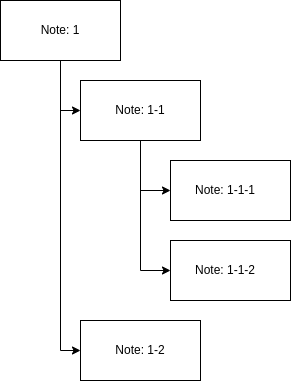

  <figcaption style="font-size: 10px; text-align: center;">Note tree</figcaption>

This system is perfect for finding relationships between different areas. The notes stored in the box have no mode of grouping by topics, only numbers to locate them. Since it lacks any firm, unalterable organization system, it allows the mind to create new relationships between the contents while maintaining ease of access and organization thanks to its index.

Another advantage is the speed at which notes are stored. Since they are only placed at the end, we avoid the task of searching for the right place, which usually takes a lot of time. Other systems based on categories, for example, require an extra step, such as deciding which category it belongs to.

The most important activity for learning provided by this methodology is discovering connections. After all notes are ready, we review each one individually to find connections between them. This forces the mind to see them from a global perspective. Then we record these connections to generate new content, something we will see in part C (Dumping Information).

#### B.2.2.3.1 Disposable or Spontaneous Notes

These types of notes originate from our thoughts while working with the study material. They are partly ideas that arise during the learning process and that we don't want to lose. The other part contains extracts as summaries that are ready to be transformed into permanent notes.

Their functions are diverse, general. They do not focus on a particular resource but on an overview of everything we are learning. This is why they always represent our thoughts.

They are called disposable because they have not been polished and located among other notes. Therefore, these notes tend to be deleted once transcribed. Their purpose is temporary assistance; they are meant to be disposable. If not discarded, we will end up with a pile of disorganized and unlocatable notes, like the index.

#### B.2.2.3.2 Literary Notes

Literary notes are ideal for concepts that stand out in the text and that we don't want to lose. Unlike headings and summaries, this type of note is part of the text or a small addition to what we already have. They have the property of carrying a reference of where they come from, such as the book and the page.

In this category, we place sentence extracts or paragraphs obtained during the research phase. They also include margin notes. These last ones (so named because they are placed around the text, which is not recommended) are used to make note of connections with other notions, especially those that may be in our memory. To a lesser extent, they are used to highlight our own opinions or possible errors by the author. Both margin notes and extracts constitute literary notes.

The process of noting or highlighting on the page or around it often brings the problem of losing the location of these comments. This is where literary notes come in. In them, we can locate ourselves using the page or the minute of a multimedia resource as a reference, leaving that data next to the note along with the name of the material. This way, we don't lose the origin of where we extracted the information, which helps to understand the context.

### B.2.2.4 Connections Between Notes

The goal behind any form of note organization is to create a system for thinking. Notes are not meant to create a personal encyclopedia. The note box is designed as a *sandbox* where we can manipulate our notes and create possible combinations.

Creating connections is not a task for joining concepts. The search for connections is often related to finding a logical relationship between 2 or more concepts because they are in the same category. For example, we can link the concept of a dog with a cat because both are animals. Once we recognize a connection, we leave the number of the next note as a link. However, connections are not limited to this type of union.

A note can be arranged to connect by *relationship*, in which case one note responds to the content of another. Following our example, if we look for the relation between note N° 1 (dog) and N° 2 (cat), we can think of a fight since they are associated as enemies.

Another form of connection is by *conceptual similarity*. Many times, we see how one definition is similar to another, where both are the same thing expressed differently. Let's say we have a note defining N° 30 (can) and another for N°1 (dog). In one, we write domestic animal, and in the other, a household companion animal; they represent the same description, leading to redundancy. We use this connection to discover repeated or very similar notes from which we can eliminate one, reformulate them or create a new one by combining them.

The last connection we will see is by *addition*, in this type, one note adds meaning to another. These are relationships that progressively advance concepts or transform them into clearer ones. If we see that in note N° 10 it says that the dog is a mammal, we can link the note to N° 1 (dog) to form a new relationship.

## B.3 Studying

We can define the verb "study" as **understanding and memorizing a piece of information**. Such a piece is composed of data or facts that generate a notion we want to retain in our long-term memory. In this section, we will refer to the word "study" as understanding what the material is about, not just memorizing facts or concepts, as we will see in detail in B.4 (Memorization).

We cannot consider studying as a mere synonym for memorization. Here, we are talking about "knowing", which includes the ability to retain in memory, but it's not the whole picture. Studying involves the cognitive task of grasping the meaning of concepts or facts. To achieve this, we must engage in the task of reflecting until we can comprehend this significance. Let's say we memorize a date; that's recalling it, but what happened on that day? Why is it important? These are the questions that are part of the study. Once we understand the notion, we can then proceed to memorize it concisely to complete the study.

Another important point is that the more challenging and effort we put into it, the better our understanding will be. When material is simple, it has a low cognitive load, and we tend to grasp it more easily. However, it's often retained for a shorter time. True understanding involves delving deep into the subject, creating enough connections that aid in effective learning.

### B.3.1 Types of Study

There are two types or approaches to studying: focusing on parts or the whole. Consider a text to study; depending on the source of the text, it might be easier to study the generalized or abstract idea of the text or each topic separately.

  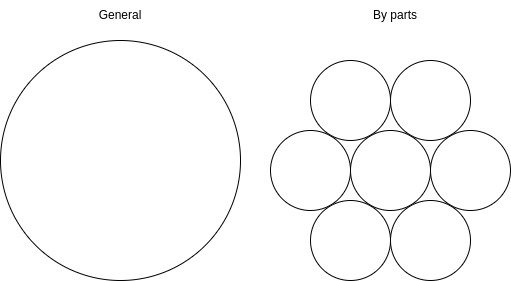

  <figcaption style="font-size: 10px; text-align: center;">Whole Study vs. Part Study</figcaption>

When we talk about studying the *whole* of the material, we refer to consolidating all its parts to understand what it's about and memorize the generalized idea. On the other hand, if we break down the text into parts, we can analyze each one separately, independent of the others. Each approach has its advantages and disadvantages, but we are not bound to a single type. We can mix the two methods. Possible combinations of study types include:

- Studying the whole, reinforced by studying each of its parts.
- A general or partial view of the entire material followed by studying each of its parts and then revisiting the initial stage.
- In parts, progressively until completion, followed by analyzing the topic as a whole.

In the first two approaches, we start by studying the generalization of the material to understand what it's about before delving deeper. The second approach involves a more rigorous study to memorize its parts one by one without neglecting the whole. The last method is typically more effective with large amounts of information. We study each part separately, then review to understand the overall idea.

Each person has their preferences to reach the same destination. Different study methods don't significantly affect performance; rather, it's a combination of factors, which we will discuss below. However, having a clear understanding of the method being used allows for persistence in that method, which can improve study efficiency (the amount learned relative to time).

### B.3.2 Repetition and Spacing

The next factor that affects memory is repetition over time. Practicing recalling information from our memory is an excellent study technique. When studying a topic, it's beneficial to pause at a certain point, recite what we've understood, ask ourselves questions or even explain it to someone else. All of these activities improve comprehension and support the task of memorization.

Let's assume, once again, the example of remembering our birthday, as we saw in A.2 (Memory). One of the key points is that it repeats every year. Repeating a concept forms more connections tied to temporal events. Contrary to a popular misconception, repeating a date over and over does not store it in long-term memory. Instead, it keeps it in working memory and creates a false sense of having memorized it forever. It shouldn't be surprising that a few hours later, the number has vanished. Remembering something permanently requires more than just having it in mind for a moment. Recall from A.1.3 (Synapses) that consolidating an engram requires time. This time is more efficiently distributed over a period; it requires less time remembering a fact every day for a week than cramming it for hours in a single day.

This is why it's important to maintain a scheduled routine to refresh knowledge so that it can transition into long-term memory. In combination with the techniques we will discuss in B.4 (Memorization) spread over a period, it becomes our study procedure.

### B.3.3 Practice

Practice and understanding go hand in hand. The brain remembers events we actively engage in more than text reading. Being able to see and act enhances the storage of information in long-term memory. The more we practice a discipline, the better we will remember its concepts.

Practice is an integral part of studying and requires repetition. Repeating the activity is the key to reinforcing the knowledge acquired during the practice. However, it relies on being extended in a **program**, which involves intervals of work.

A program can be divided into sessions to space out the development of the skill over time, gaining proficiency. These sessions are separated by nights of good sleep, allowing the brain to make the necessary changes. Maintaining the sessions depends on good planning and discipline to carry them out. Work intervals don't need to be long; just 10 to 15 minutes a day, as long as the program is respected, is sufficient. The program concludes when the study goal is achieved.

Effective practice requires evolution. If we keep revisiting the same concepts and applying the same actions, we won't learn anything new. Take the example of muscle memory required to play a musical instrument; it needs regular exercise to be used naturally. The first few days will be challenging, but over time, we'll be able to play the first melody. If we only practice the same tune over and over, we'll never learn a new one or improve our skill. To progress, we need to step out of the comfort zone of the first song and try to memorize the movements required for the next ones. Over time, learning will become easier due to having some proficiency, which means we've learned to overcome the difficulties of playing an instrument. In summary, facing new challenges helps build better memory sets and solid pathways between engrams.

Based on the analysis in the previous paragraph, we can distinguish two types of practices: **lazy and deliberate**.

Lazy is that practice where we only repeat what we already know. We find ourselves playing the same melody over and over again until we master it, but that doesn't mean we are great musicians. The reality is that with this practice, we reach a limit where we stop progressing. The beneficial aspect of it is that it reinforces our knowledge.

Deliberate practice is when we step out of our comfort zone, when we push a little beyond our limits and strive to progress. While we won't improve overnight, the change is sufficient to engage our minds. Achieving progress is essential to maintain consistency, and the habit of regular practice, pushing ourselves a little harder each time.

## B.3.4 Study Strategies

We've understood that studying involves activities that require reflection and interaction to comprehend a subject. The next question is, how can we perform this task? We'll explore methodologies to understand the meaning of the concepts we want to learn.

The goal of understanding these strategies is to assist in the studying task. Recognizing which method we are using to understand certain material focuses us on it and allows us to do it correctly or explore other methods.

### B.3.4.1 Elaborate

This technique involves uncovering new layers of information through personal reflection. It helps improve proficiency in the material and delve deeper into its content. The strategy involves the extensive use of learned concepts, which also aids in memorization.

Some ways to elaborate for better learning include:

- Finding examples where what we've learned is applied.
- Creating comparisons.
- Formulating questions based on answers we already know, which requires a good understanding of the subject.
- Creating mnemonic aids.

Within this strategy, we can mention the Feynman learning technique. This method was created to explain complex physics terms. It involves only a few steps to guide learning on any topic to the point where we can teach it. It consists of:

1. Select the concept.
2. Explain it in such a simple way that a child would understand.
3. Identify the things we still need to learn.
4. Simplify using comparisons.

Once we've reached step four, repeat the process until we can simplify the idea as much as possible.

### B.3.4.2 Generate

This strategy involves attempting to answer the question posed before seeing the result. The idea here is to generate content without prior knowledge, relying solely on what the subject is about.

Facing an unfamiliar subject helps build connections or pathways between neurons as we have to combine different concepts from various areas. The more we think about how to approach and overcome the steps involved in solving the problem, the more pathways are created. This task strengthens acquired knowledge, making the mind more perceptive while enhancing reasoning.

### B.3.4.3 Reflect

Reflecting is sitting down to think and interpret what we've studied. It involves seeking a meaning we can comprehend. Reflection is successful if we can explain something in our own words, using our own models and demonstrating connections to topics we already know.

To reflect on study material, we need to enter a diffuse thinking mode. Typically, this is done a few minutes after reviewing the information. During this time, we combine recalling learned concepts (which aids memory) and our own elaboration.

One popular way to reflect is to explain the information to ourself as if we were a teacher, which, of course, requires a good understanding of the topic. This allows we to review how much we know, representing it in a self-taught manner.

### B.3.4.4 Calibrate

This strategy involves another type of utility in studying. It consists of correcting conceptual errors, both our own and others', that create the illusion of knowing something when, in reality, we are mistaken.

The first task in calibrating retained information is recognizing the error through reflection. Recognizing an error involves knowing the correct version. Afterward, review the concepts with an open mind and seek differences between what we know and what the mistaken material suggests to pinpoint where the discrepancy lies.

This strategy is more commonly used in more advanced stages when we have more knowledge in the area. In the initial stages without much knowledge, it's much harder to catch errors on our own. Here, the only way to apply this method is with external assistance. If we don't have a professional to supervise the information we acquire, we rely on correcting erroneous concepts throughout the study process. For these reasons, this strategy is applied at an intermediate or advanced level.

## B.4 Memorization

We've already seen that in the initial stage of studying, understanding the concepts is crucial. However, to complete the process of learning something, we need to move these understood concepts into our long-term memory. The idea behind this section is to **solidify ideas into memory through activities and spaced repetition**.

Achieving effective memorization means being able to retain something in memory and being capable of recalling it after some time. The duration of the memory depends on how frequently we've engaged with it. The more we work with the same information, the longer it will stay in memory, and the quicker we'll be able to recall it. The techniques we'll explore involve consistent application until these ideas are firmly entrenched in the mind.

The difficulty of memorizing varies depending on the type of information. Theoretical data can be more challenging to retain because the mind hasn't interacted with it. Study materials are often filled with conceptual facts that we can't acquire through our senses since they are typically presented in a way that isn't perceivable, such as written text. This section aims to facilitate the transfer of this type of information into long-term memory by creating tasks that use or connect with these concepts.

The primary task of memorization is managing the information stored in the vast library that is our mind. The most important aspect of this task is how quickly we can store something and how efficiently we can retrieve it to bring it into working memory. Therefore, we can say that memorization is divided into two parts: **storage** and **retrieval**. Initially, we'll assess the process of encoding information in B.4.1 (Techniques for Memorization), where we'll examine methods for coding something into the mind. Then, in B.4.2 (Retrieval Exercises), we'll explore ways to solidify that information and practice retrieving it. From these activities, we'll decipher how to effectively memorize something.

### B.4.1 Techniques for Memorization

These techniques are systems designed to store something in long-term memory. They assist in memorizing information that we have already comprehended. The goal with these techniques is to find a way for the mind to solidify the concepts we are working on.

Ideally, we would like memorization to be a one-time task, but unfortunately, it's not possible. As discussed in A.2.2.2 (Forgetting), we mentioned that memory needs periodic refreshing of stored content, or it will fade away. That's why these techniques need to be repeated over time until we are satisfied with how well the material is consolidated.

A common feature among these strategies is that they transform what we want to remember into something captivating that stands out in our minds. When something resonates, it sticks more quickly.

There may be more techniques out there, but the goal isn't to list every available option. Instead, it's to demonstrate how memorization works. By analyzing these techniques, we understand the process for the mind to retain something optimally.

#### B.4.1.1 Visual-Spatial Recall

This strategy involves turning a concept into an image where we visualize an object placed in a specific location. It's easier to memorize this way because we engage simulated visual receptors, especially if what we imagine is attention-grabbing. For example, it's easier to remember the appearance of a toucan by seeing a simple photograph than reading a long written description. Another complementary tool is assigning a location because the mind has the ability to remember places. Placing something in a position, even if fictitious, aids in concrete memorization. The mind can recall an idea by how we visualize it and where we place it.

Knowing this technique, we can easily store a fact or concept in our mind by turning it into an image, a visual portrait, whether it's a photo or diagram. If it's dynamic, such as an animation, even better. Thanks to the various ways to represent a concept available today, it's recommended to translate ideas into a graphical representation whenever possible to assist in memorization.

Regarding location, it's particularly useful for remembering things related to a physical place, making it a secondary aid for theoretical concepts. However, we can leverage it by connecting an idea to a place, creating a mental map or layout. An ancient memory technique called the "method of loci" involves placing, in an exaggerated manner, figures of objects we want to remember around a familiar location. If we want to remember that liquid nitrogen is at -196°C and can cause burns, we could visualize white flames coming out of our freezer, which helps we recall it's cold and the associated risks. By creating a position in a familiar space, we tap into the mind's diverse ways of remembering.

#### B.4.1.2 Mnemonics

These are creative ways to condense information into memory aids. They can be stories, rhymes, acronyms, or other strategies that involve verbal mediators or images to represent what we want to remember.

Due to their limitations, the mind finds it easier to retain a word than a list of words. Lists require significant repetition and use to be remembered, but mnemonics synthesize them perfectly, condensing a list of concepts into a simple phrase or common word, even in the desired order.

Mnemonics can be applied in any discipline. Their ability to compress various types of information by creating their own rules allows them to adapt to various contexts. They often use associations with everyday things like words, places, actions or body parts. In some cases, body parts are used to form figures with meanings, as in the case of knuckles to remember which months have 30 or 31 days. Another example is the phrase "Eddie Ate Dynamite Good Bye Eddie" used to remember the guitar strings in order (E, A, D, G, B, e). There are many examples like these, created by professionals who were once students themselves and passed them on to their students. However, the most effective mnemonics are often those created by individuals themselves.

#### B.4.1.3 Repetition or Looping

Another classic and widely known strategy for memorization is repeating content over and over in our mind. This method is born out of the fact that we tend to forget easily and often get distracted, leading to rapid forgetting. This looping methodology helps recall information, making it effective in keeping a few pieces of data within working memory for a longer duration.

However, using this method doesn't necessarily mean we are actively working with and memorizing the information. It creates a *feeling* of memorization when, in reality, we haven't achieved it. The use of repetition serves as a supportive or intermediate task in studying. Information remembered in this way should be taken to other activities, as we'll see below, to be truly memorized.

### B.4.2 Retrieval Exercises

In this section, we'll explore two activities that put our information retrieval skills to the test. They force us to navigate our minds, either deliberately or with assistance, to find what we need.

Once we acquire certain knowledge, we can put it to use to ensure it remains in our memory. The more we can see and interact repeatedly with these notions, the faster we'll memorize them. Any activity that puts into practice and creates events that use the concepts learned in previous stages will solidify the information in long-term memory.

The crucial aspect of these activities is the **effort to remember**. Searching for specific information in our memory improves our access to it. The more we engage in this effort, the more vividly it remains in our minds. Once the goal is achieved, we can continue repeating these exercises over time to keep the information active in our memory.

#### B.4.2.1 Self-Assessments

An assessment involves the challenge of recalling a particular concept to answer a question correctly.

What we gain from these assessments is a result. This result serves to gauge the progress of concept consolidation in our memory. The utility is that we can maintain a record of these assessments for analysis and personal statistics.

This type of evaluation consists of short quizzes that test our memory. During these quizzes, we strive to retrieve information from long-term memory to answer questions, improving the mental pathways that lead to such information, making it more "accessible" or easy to remember.

Assessment questions can be **deliberate**, where we test our ability to obtain information without any hints or assistance. While these questions are more challenging to answer, they have the benefit of expediting the memorization process and testing our recall abilities. On the other hand, **assisted** prompts are more abundant and simpler, allowing for a higher volume of questions that are easier to answer, making them ideal for an initial stage. The ideal approach is to maintain a pace, starting with assisted prompts and then progressing to deliberate questions.

To truly consolidate information, it's necessary to repeat these assessments periodically. Being able to answer all the questions correctly in a single session doesn't mean we've memorized the material. It takes time to memorize something thoroughly, and during this period, we should repeat the process of searching for the concepts in our memory.

Another important factor is that the mind can make mistakes and misunderstand an idea, which can be corrected in more advanced sessions with tasks we've already seen in B.3.4.4 (Calibration). To ensure we've solidified the concepts, we should space out these assessment sessions over time to compel our memory to search for the information once more.

###### B.4.2.1.1 Questionnaires

These assessments are used to actively engage the mind in remembering. They are commonly found in institutions, from schools to universities or even in corporations, where they are used to evaluate the knowledge of their members. However, their very use is a tool for consolidation.

Questionnaires can have assisted or unassisted prompts. There are no strict rules for them, leaving them open to providing assistance or avoiding it. In cases where the question is assisted, there is a trigger that helps recognize the answer. In contrast, unassisted questions require a more strenuous search to respond to. Both cases serve for memorization, but those without assistance require more effort and therefore yield better results.

There is a wide variety of question formats, but most of them derive from the basic ones:

- Selecting the correct option
- Properly ordering a list
- Matching related items
- Producing a response (this adds the skill of formulation)

By expanding and combining them, we can create more alternatives, such as:

- Choosing the true option among one or several false ones
- Completing the correct sentence
- Scaling from 1 to 10
- Grouping items
- Selecting the correct image

Among others. With creativity, we can add more varieties at the cost of increasing complexity. A very complex questionnaire can lead to confusion about what is expected in the response. The idea behind questionnaires is to aid in memorization rather than demonstrating interpretation skills.

##### B.4.2.1.2 Memory Cards

The use of memory cards is a self-assessment model where we write a "clue" or **hint** on one side, which can be a keyword, a question, an image, etc., and the **answer** on the other. Once the cards are prepared, we shuffle them and start going through the deck, trying to recognize the solution without looking at the back of the card. We aim to answer the question or explain what the card is asking without seeing the result. The goal is to provide the mind with a trigger that indicates what it's about and then generate a response based on what we have memorized.

As we answer, we separate the ones that are challenging or we cannot answer for a second round. We create two decks as we progress – one with the cards we could solve and another with the ones we couldn't. When finished, we attempt again. We can repeat this process until we have effectively memorized all the cards.

A poor practice is to permanently eliminate cards because we consider them easy. The advantage of having some cards in the deck that have been consolidated is to create intervals between the difficult ones and the ones we know. The more cards we have, the more effective the session will be. We should not assume they have been memorized either.

The application of spaced repetition and metacognition are features of this system. Although it is an assisted memorization technique, it has the advantage of being able to use a non-textual tool, such as an image, which forces the mind to make connections until it recognizes what is being referred to. It is similar to how puzzles work, creating an enigma to solve.

#### B.4.2 Projects

Completing projects involves carrying out tasks that require the use of knowledge acquired during our study. By applying what we know, we rapidly reinforce mental models. Due to the substantial interaction between what we know and practical application, we reinforce knowledge by creating memorable events.

Projects consist of complex tasks where we engage in at least one activity in each task until they are completed. Unlike memorization exercises, projects take more time. They involve planning that helps distribute tasks over time, allowing us to utilize our memory to complete them, which ingrains spaced repetition.

At the beginning of a project is the exploration of everything we don't know, in a phase we call **research**; one could argue it's the longest phase. The time it takes to complete a project depends on the research involved plus the percentage completed per day. During the research phase, we focus on understanding and extracting the necessary information, which often takes a considerable amount of time because we need to learn how to do things before we can actually do them. Once this stage is complete, we proceed to take action and begin fulfilling the project's requirements.

Being personally connected to a project's goals generates excitement, which fuels the motivation to work. Projects can help focus our attention, as discussed in A.4.2.1 (Motivation and Interest), by igniting the desire to fulfill their purpose. This sense of ownership is perfect for capturing interest in work for a while, which self-assessments lack.

However, starting a project and completing it are two different things. There are two approaches (with variations derived from them) to working on a project: short and long intervals. Long intervals involve simply taking motivation, turning it into energy and focus, and using them to work; this allows us to progress quickly and efficiently. But what happens when motivation runs out? The further we progress, the more obstacles we encounter, increasing the difficulty and decreasing motivation, leaving only discipline and planning. In our action plan, we schedule short work intervals that don't require much energy, thus avoiding exhaustion, allowing us to continue working until we overcome the pit of despair.

  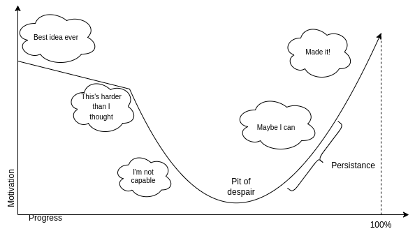

  <figcaption style="font-size: 10px; text-align: center;">Motivation in a project</figcaption>

Maintaining **persistence**, i.e., the discipline to continue, is a requirement for completing projects. Due to their size, compared to something short like a quiz, a project can overwhelm us. Progress is slow and full of ups and downs. The only solution to this challenge is to break through the comfort barrier and keep completing tasks.

## B.5 Conclusion of Part B

During this section, we analyzed how we understand and memorize information.

In the early stages of learning, we encounter the unknown. We gather material about the topic we hope to understand, with insufficient knowledge of the area. We navigate through numerous resources with a skeptical attitude until we collect enough accurate information.

Once we have everything we need, we must still understand it and then remember it. This is a process filled with procedures that are divided over time until mental models are solidified in memory. Initially, we must grasp the meaning of new information, which involves reasoning using the knowledge we have already acquired and connecting it to what is new. After comprehending a concept, through interaction with it, we commit it to long-term memory for archiving purposes.

The purpose of memorization is somewhat diffuse. While it is within the goal of learning, what we really seek is to store the understanding of the concept, not the concept itself in a literal sense, as this would be counterproductive. The ultimate goal is to permanently internalize these concepts, aiming to efficiently shape the information as clearly as our mental models.

---

# C. Dumping Information

Writing, transcribing, drawing or any other way of transferring information to something concrete like text, images or other forms is an essential skill in learning. As we learn, we must use tools such as writing to break down important information into understandable chunks. We've already seen details in previous sections where we needed to dump information before reaching this point, whether it was note-taking or creating memory exercises. Now, our goal is to organize information in a way that can be accessible to anyone, including ourselves.

As we discussed in A.2.2.1 (Forgetting), we humans are capable of losing information from our brains under certain conditions. Because of this human trait, it is essential to know how to properly pour out our knowledge. Dumping information in a way that can be remembered leaves us with a representation of our mind, which serves excellently as a reminder. Everything we have written down is nothing more than memories explained as we understood them, making it an excellent resource to review concepts at any point in our lives.

In this section, we will seek to understand the most effective ways to articulate a concept as the mind interprets it. We will analyze the rules of language and the structure of academic texts. We won't forget about illustrations as a way to convey information, as they are another form of transcribing ideas. Finally, we will delve into organizational systems for dealing with a large volume of information.

In any type of production, it is important to view the work as the audience would. This leads us to consider the type of audience, especially whether they are familiar with the concepts we are dealing with or not. We always assume that the recipient has no idea what we are talking about. We will introduce the basic ideas first, even if it's a summary, and then we will explain the concepts.

Even if it's not the exact goal, dumping information cooperates with learning. By putting information in writing, we perform the cognitive task of explaining what we know, thereby reviewing the topic and transferring its content to long-term memory. Moreover, transcription is a task that forces us to explore the mind in order to present our knowledge correctly. During this stage, we discover weaknesses, gaps, and errors among what we know, allowing us to identify and fix them before moving forward.

## C.1 Writing

Writing is one of the most explored subjects in the history of humanity. There are thousands of valuable resources for addressing writing in various formats such as books, essays, academic articles, podcasts and videos, all oriented according to the type of text to be produced, which can be narrative, journalistic or academic. The type of writing we will address, both for production and analysis, will be exclusively of an **academic** nature.

Academic texts or books are those of an **informative nature**, in other words, they seek to inform about something. Some examples include theses, essays, monographs, summaries, among others. An important use of these writings is that they serve to retrieve information swiftly from our minds. Imagine wanting to navigate a miniature city, but instead of wandering around to find the place you want to reach, you have a map. It makes it easier to get there. Being able to understand something (especially if it has been studied at some point) with just a superficial reading is practical for studying and memorization.

To demonstrate that a text is well-informed and that the topic is understood, it must show a clear interpretation of the concepts. This involves being able to describe the problem or context presented and provide an analysis of the information.

It is worth mentioning that the very act of formulating concepts in one's own words helps with memorization and strengthens the connections in our brains. Writing requires knowledge of both language and the subject being discussed. As we progress with writing, we will learn and consolidate models because searching for other ways to explain things requires understanding the concepts in the first place. Therefore, writing is beneficial both for recording information and understanding that information.

Writing is a **skill**, and like any skill, proficiency is gained through **practice**. The ability to express oneself appropriately is not achieved overnight. The more we write, the more efficient we become at it. We will try to make this work become a habit, gaining practice every day, every time we study.

However, we must also understand the general aspects of this task. We will break down its stages to understand how a text takes shape. Then, we will analyze each of its components as small units come together to form more complex modules. We will leave the conventions used to give meaning to the text for the end.

### C.1.1 Writing Phases

Writing a text of any type is a task that involves a set of processes and subprocesses. These processes have different purposes, and each stage is a step towards completing the task, but what they aim to achieve is independent of the following phase.

The writing phases can be separated into 3, and these are:

1. Planning: The initial stage before starting to write is planning. During this phase, we outline what we will write and how we will do it.

2. Production: During this stage, we complete the task of writing on a blank canvas. We will fill in the blank with words to convey an initial idea of what we want to present.

3. Editing: Errors are inevitable. What was generated in the previous phase will have shortcomings, and this is where we correct them.

The phases are cyclical. By this, we mean that they can be repeated if necessary. The order is not linear; planning can be reconsidered, leading to rewriting and editing. Nothing is conclusive.

## C.1.1.1 Planning

The first stage is carried out before starting the writing task. At this point, we stand on all our research, our notes and the fresh information in our memory. We have everything we could extract, but before the first letter, we must plan how it will be written.

Planning involves defining the topic; we will **outline** how the three parts of the text, as seen in C.1.4.1 (Text Parts), will unfold. It is common to jot down an outline of the order in which topics will be presented, writing down the titles and optionally a summary of the content to be written. 

We can use graphics to demonstrate the relationship between each part. The first thing to complete is the title, which sets the overall idea of the text, followed by subtitles that focus on dividing the text into sections. A summary of the content can also be added. In this task, we focus on outlining the order and presentation of the topics to be addressed. This can be done in a matrix or as a tree.

  

  <figcaption style="font-size: 10px; text-align: center;">Matrix vs Tree</figcaption>

Once the sections are outlined, we will define how they connect. The links between information must be clear for the reader to understand the relationship between concepts. This can be achieved with simple arrows that show the order and relationships between elements.

#### C.1.1.2 Production

This is the main stage where we **start writing** until we achieve a goal defined by the objectives that the text must cover. During this stage, we write with the aim of making the intended idea clear.

As we progress, it is crucial to keep an eye on the planning. When writing, we can focus on one section and lose sight of the overall organization of the text, resulting in developing parts separately from each other. What we want to achieve is to demonstrate the relationship between various parts of a composition.

We should avoid unnecessary words when writing. This happens when we speak in a generalized manner without any argument. The text should fulfill its goal of informing without presenting unnecessary information that confuses the reader.

A text is complete when all the information is presented in a logical order and in a clear manner. All ideas must be fully developed. It is important not to lose sight of the argument or the question it aims to answer and if that answer is provided.

#### C.1.1.3 Editing

Editing or revising is when we go back over our written words in the previous stages in **search of errors**. This task is performed at least once the first draft is completed, with all the required content. Even the most experienced writer can make a slip and needs to correct their work.

The errors we encounter can be linguistic or logical in origin. Confusing explanations, poorly ordered paragraphs, unclear titles are examples of logical errors because they affect the intended meaning and not just the readability. We will address linguistic errors later.

During this stage, we also review if the structure planned during the planning is correct. Organizing something without having the content is quite challenging and prone to failure, even partially. When this type of error occurs, it requires rethinking the text's order.

**Rephrasing** is used to improve clarity and cohesion in the text. It may also be necessary to rewrite to better suit the audience, in cases where we are dealing with a reader who lacks the required knowledge, we must adapt the text to the planned level.

Finally, there is elimination or **trimming**. Many parts of a text can become excess or repetition that leads to confusion and/or misinterpretation of its meaning. When this type of content is detected and cannot be repaired, the best option is to simply delete it.

### C.1.2 Components of a Text

A text is a collection of organized sentences that convey meaning. From the smallest unit of information, which is a word, to the entire text. There are different levels that progress from more concise to more generalized.

Components of the same level group together, and this grouping leads to a higher-level component. Words form sentences, sentences form paragraphs, and paragraphs are grouped into sections. Each level has links between its components; without these relationships, a coherent grouping cannot be formed.

#### C.1.2.1 Words

From a biological perspective, we can compare words to the cells of a body. They are the **smallest units of language with individual meanings**.

A word can have one or several meanings. Meanings vary depending on the context or linguistic framework and accentuation.

The type of meaning can be **denotative or connotative**. It is denotative when it exactly refers to what it means; if I call a fruit bitter, it's because it is bitter. Words of a connotative nature are especially part of metaphors and analogies. In "she couldn't hide her bitter disappointment", bitter is used connotatively to convey not the literal taste but the strong negative emotion of disappointment, resentment or unhappiness.  

Meanings combine and form relationships, creating a more complex unit, which is sentences.

#### C.1.2.2 Sentences

Sentences are groups of words that must be **meaningful, coherent, and complete an idea**.

Sentences can contain a **single central point or multiple points**. The former is called *simple* sentences as they are usually short and precise, emphasizing what they are about. Those that refer to multiple topics simultaneously are *compound* sentences, which contain complex ideas used to relate to others or make comparisons. It is important to use each one at the appropriate time; too many complex sentences lack clarity and add complexity, while using only simple sentences may limit the text's exposition. Variation between types of sentences is essential for expressing the argument and maintaining text dynamics.

A good practice is for sentences to be capable of standing independently, so we can separate them from the text and understand them without knowing their context. Sentence autonomy increases their complexity but makes the text clearer.

#### C.1.2.3 Paragraphs

A **groups of sentences**, when strung together with **coherence and cohesion**, merge to create a notion. This set of connected sentences gives rise to a **paragraph**.

Paragraphs are the organs of a text. There are no strict rules for forming paragraphs; however, informal conventions have been used nowadays to facilitate text comprehension.

The **topic sentence** mentions what the paragraph is about. This sentence summarizes the central idea to be presented or argued. It may be accompanied by secondary sentences that elaborate on the main theme.

The body of the paragraph lies between the topic sentence and the conclusion; it is where the argument or topic is presented. It is filled with examples, evidence, references, and explanations that support the topic presented in the topic sentence.

Some recommendations for writing paragraphs include:

- Each paragraph contains a central idea.

- Place the topic sentence at the beginning. The start of a paragraph is considered the stress point, where the reader emphasizes and pays more attention.

- Avoid long paragraphs (more than 6 sentences).

- Use the body to elaborate on the argument.

- Provide a conclusion at the end.

- Maintain connection and coherence between paragraphs.

These are optional recommendations, meaning they don't need to be followed all the time. The goal of such suggestions is to facilitate text reading and persuasion.

Similar to the preceding components, the concepts addressed in each paragraph are unified into a larger area.

#### C.1.2.4 Sections

Text sections, usually called chapters, consist of several paragraphs. Due to dealing with various hierarchical ideas, paragraphs are grouped together to form a chapter where a **higher-level idea is represented**. This concept is explored in detail to cover all necessary details to complete the chapter.

Each chapter typically begins with an introduction that outlines the topic to be discussed, followed by paragraphs that support the argument, and finally a conclusion to the worked idea. These lines serve to demarcate the content that has been addressed and what is not part of the section.

The text always progresses linearly, from the most basic to the most advanced. This is why chapters have numbering and a title that summarizes the content. The first section covers the initial points, presents definitions and other prerequisites to advance. It then delves deeper into the topic until it is complete and concludes the idea.

In C.1.4.1 (Text Parts), we will see how multiple sections come together to create a structure.

### C.1.3 Spelling and Grammar

In order to be understood, any text relies on the proper use of these areas of linguistics. Words and sentences can have multiple meanings that vary depending on how they are combined. This is where defined rules come into play; they will change the meaning depending on their placement in the text.

When it comes to expressing our knowledge, we will use the language we are most familiar with. The scope will be limited; any content we produce can only be utilized by oneself and others who speak the same language. Let's acknowledge that translations are not an easy task and are not within the scope of this book, as we focus solely on learning. Thus, we will not delve deeply into this area due to the disparities among different languages. We will limit ourselves to defining its function in academic writing, leaving room for individual exploration.

#### C.1.3.1 Grammar

Grammar **studies and defines the rules to give meaning to the text**. This study varies based on the purpose of a text; expressing oneself in an argumentative text will be different compared to a narrative one.

Studying this subject allows us to convey what we want to say appropriately. Without knowing the grammar of the language, we tend to not make our intentions clear, hindering the recipient from understanding the message.

A grammatical recommendation for academic texts is to maintain an **active voice**, which affects verb conjugation, where the subject directly performs the actions. If we want to convey that we drive a vehicle, we do so with the subject followed by the verb, "I drive my car" not "The car is driven by me." This allows us to simplify sentences and be more direct, avoiding misinterpretation.

#### C.1.3.2 Spelling

Orthographic rules are norms that define the appropriate way to write a word to convey the intended meaning. These rules are established by one or several language-studying institutions (although, in some cases, there might not be any) to ensure the correct usage of language.

Similar to grammar, spelling errors can lead the reader to misinterpret the meaning of the sentence. Proper language use requires respecting the spelling rules defined to avoid learning or teaching something incorrectly.

##### C.1.3.2.1 Punctuation

Punctuation rules are graphical conventions that define tones in writing. They function to structure the text, especially the punctuation marks that define sentence and paragraph boundaries. Punctuation represents how we speak, our pauses, and where we emphasize.

In language, a punctuation mark is as important as a word and can change the meaning of a sentence. For example, saying "Let's eat grandma" is different from "Let's eat, grandma". The correct use of punctuation is a skill we must acquire to promote proper writing.

### C.1.4 Text Structure

We've already mentioned that a text is divided into parts, but why do we do this? We do it to **gradually introduce concepts** in an organized and encapsulated manner. Whenever possible, we'll set aside a concept to define it, explain it, and provide examples; subsequently, we'll relate it to another. We'll follow this framework repeatedly until we conclude.

Having a structure is essential. A building doesn't stand without pillars, and the same applies to a text. The pillars are the main ideas upon which we constantly rely. Meanwhile, the walls and windows are everything else, assisting the main ideas—these are arguments or evidence that demonstrate and explain. Every text is composed of main ideas (what we want to inform) and secondary ideas (what contributes to the text's objective).

Understanding how a text is structured helps us not only in writing but also in its interpretation. The ability to understand the different parts allows us to interpret better, know what to expect, and anticipate what will happen.

Information presented directly, like in a dictionary, doesn't achieve the same educational impact as when arranged sequentially. That's why each part discusses from start to finish, introducing the concepts in a more accessible way to the recipient.

#### C.1.4.1 Parts of the Text

Every academically inclined text consists of three parts: an **introduction** or opening where the argument and/or theme are presented, the **body** or development and a **conclusion** or closing.

We use each part for a different purpose. Both the introduction and the conclusion will talk about the same theme and are within the same text, but each will encapsulate its own meaning. Despite their differences, they remain part of the same project and are interconnected.

Unlike the components of text C.1.2 (Components of a Text), the parts are not as obviously separated. Their divisions are more abstract and diffuse than a period; they often span one or several chapters. We could compare it to a speech—as the speaker progresses, the central point changes, adapting to what they're discussing.

##### C.1.4.1.1 Introduction

It's the text's opening, the welcome, and the orientation. At any beginning, the reader is **introduced to what will be discussed**. In this stage, it's important to answer: What is the question being answered? How will it be answered? And what is required?

One of the first things placed is the **abstract or the overview**. These paragraphs are organizers that start before the main content, aiming to guide the reader regarding the order in which things are presented and why. Similar to the overview is the **prologue**. Unlike the former, here, the author often comments on the text, other works and so on. Another tool often placed in this part is the **preface**, where what will be discussed is presented, usually in an informal manner. Prefaces contain the reasons for why it was written, why to read it, what to expect from the text, among other content the author would like to convey before starting.

Introductory tools are essential to introduce the reader to the content, the theme and the organization; they're also used to establish conventions. Much of what we will discuss has requirements that the reader may be unaware of, and it's our job to declare and justify the need to know these contents. If given the opportunity, it's suggested to provide a summary of these requirements; otherwise, at least cite where the reader can obtain information about them. The beginning is the time to determine all the requirements for reading the material.

##### C.1.4.1.2 Development

This is the stage where we present what we are going to convey. Naturally, it's the longest of all. It involves **explaining**, in a didactic manner, the answer to the main question posed in the previous part. Introducing and analyzing each concept to be presented in an orderly manner until we determine that the explanation is sufficient and the theme is clear.

Here, we will present and develop the information the reader needs to learn what we are communicating. This information must be justified, proven and explained (in one or several ways) until its meaning becomes clear. There are various resources we can use to express ourselves; some of them include:

- Explanations of the statement
- Examples
- Definitions
- Comparisons
- Connectors that demonstrate a relationship between two facts

The content must not be disorganized. The paragraphs of this stage should be connected by signals that we will discuss in C.1.4.2 (Signaling). The text should give the impression that it is organized logically, accessible, and properly detailed; otherwise, the explanation will lack sense.

##### C.1.4.1.3 Conclusion

Finally, the closing of the text. The conclusion should answer, in a few words, the question posed at the beginning of the text. We can think of this part as a **synthesis**.

A good article has its final words, which can be a sentence or a paragraph where the main idea is summarized to leave the reader thinking. This part may contain a question or a reflection on what has been discussed, encouraging the reader to reflect. Obviously, this part lacks extensive information detailing what has been announced. There will be no explanations or examples; it will simply convey the essence of the text.

It is precisely useful for rereading and refreshing the content. Once we have learned the topic, we expect this part to help our memory, which is why the conclusion should contain all the information possible to make it easy for us to recall the theory we studied earlier.

#### C.1.4.2 Signaling

The signals we leave behind act as a **guide** for the reader; they serve to emphasize and direct the concepts we address. Signaling in a text can be compared to signs with arrows or warnings; the goal is to mark the path and connect the concepts so that the text makes sense.

We'll look at two types: phrases or words that set the course and typographic tools that highlight the text.

##### C.1.4.2.1 Connectors

When we write, we use phrases and keywords that help guide the reader and maintain the flow of the text. We refer to these orientation markers as **connectors**. If we come across the phrase "*from this point forward*, we will identify the unknown as *x*," we know that the change will begin from that point forward, and not before. It's like seeing a sign that says UNKNOWN = X.

The purpose of connectors is to create transitions. These transitions serve to show the relationship between ideas and topics presented as the text progresses. Without these connectors (or their improper use), the reader will not find coherence. Another important utility is maintaining a narrative order where we lead from a premise to a conclusion.

There are various types of connectors, and their utility is crucial for demonstrating a relationship between concepts. Therefore, we must know them well and understand which ones to use in each case. Some examples of connectors from the text can be categorized by the type of guidance they provide:

- Connectors that show contrast: "however", "but", "on the other hand"

- Connectors that show continuation or addition: "in addition", "furthermore"

- Connectors that indicate conclusion: "as a result", "thus", "to conclude"

- Connectors that emphasize importance: "it is important", "one must not forget"

- Connectors that provide examples: "for example", "to illustrate"

- Connectors that indicate time: "before", "in a moment"

##### C.1.4.2.2 Intensity Markers

Our second type of marker is intensity markers. These are **punctuation marks and tools for emphasis** that serve to highlight a specific word or phrase. By using them, we draw the reader's attention with the aim of making an impact and demonstrating importance.

  

  <figcaption style="font-size: 10px; text-align: center;">Different font sizes affect attention</figcaption>

Since the birth of printing, certain text styles have been standardized to stand out from the rest of the text. These styles add or remove weight, making the letters different by either making them bolder or thinner. They are commonly known as **bold** (the boldest) and *italic* (thinner and slanted). Another method to attract attention is font size; our eyes are naturally drawn from larger to smaller text.

Punctuation marks like exclamation points (¡!) or quotation marks ("") are also used for emphasis. These have been in use before bold or italic styles, but unlike the latter, they do not stand out as much to the human eye, making them subtler compared to text formatting.

Finally, we have the simple mechanism of using capital letters. Although not as commonly used today, typing something in all capitals is also known to grab attention due to the increase in letter size. However, using all capital letters has a known effect of annoyance, as it is equivalent to shouting and can make reading uncomfortable for some people. This method is not the most popular and should be avoided whenever possible; however, its use is not necessarily incorrect.

#### C.1.4.3 Headings

Headings are a type of header that helps the reader see the topics covered, their structure and the order in which they are presented. Like signaling, headings assist in informing the reader about the content and assigning a name to what they address. They should answer the question, "What is the text I'm about to read all about?"

  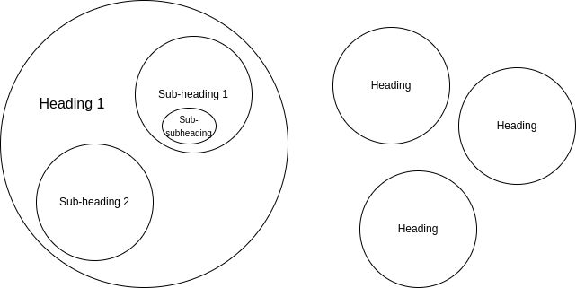

  <figcaption style="font-size: 10px; text-align: center;">Headings and subheadings vs. no organization</figcaption>

They serve to locate a specific section within the text. They are grouped in the table of contents or index, where each chapter is named in the order they appear, providing a map to locate a particular topic. For this reason, they must be precise about their subject matter.

Creating a heading is not a simple task. A good header needs to be concise, allowing the reader to recognize the topic quickly. Therefore, using long sentences is not a good practice. The goal is always to make it memorable, short, and relevant to the subject it addresses.

### C.1.5 Typography and Colors

The typeface (also known as font) is what defines the appearance of text. It affects subliminally, indirectly impacting reading and text comprehension. We have already seen how a change in font thickness can influence attention; this is an example of the importance of typography. When choosing a font, one should select a clear, visually appealing one; otherwise, it may pose difficulties in reading, leading to reader disengagement.

Each typeface corresponds to a type of information. When dealing with various topics, available fonts can be used to differentiate between them. Typically, this is clarified in the style guide.

  

  <figcaption style="font-size: 10px; text-align: center;">Colors influence attention</figcaption>

Colors, on the other hand, affect attention. It is advisable to use high-contrast colors to draw more attention and enhance visibility. The pattern of a white background with black text is an example of a combination to maintain eye focus on the text. Another suggestion is to maintain color consistency; if red is used for warnings and then reused to highlight a title, it may create confusion, leading readers to believe that the topic under that title is something to avoid.

## C.2 Information Visualization

Since our minds naturally think visually, it is more plausible to store data in images, objects or even locations imprinted in memory. Viewing information in this way helps to remember it for longer, especially if we transform it into something more engaging, aiding quicker memorization.

Images first enter the working memory to be processed. As they enter through our retinas, eye neurons send what they obtain to the brain for understanding. We first analyze what we see and then start processing to recognize objects or patterns.

The brain remembers images better than text, together they provide a simple and easy-to-memorize cognitive interpretation. The idea behind visualizing information is that using more than one medium allows for better understanding. Images and words work better together than separately. Of course, this depends on a good association between the media used.

Another goal of visualizing information is to simplify its complexity. Explaining with words can be unclear, especially when expressing various relationships that can be indicated with arrows. In non-linear diagrams, we can show connections in an orderly manner, making them easier than several paragraphs of text.

Regardless of the type of visualization, a general recommendation is to provide a clarification at the bottom. This clarification can be either a short phrase or a whole paragraph, depending on personal preference. Some authors use images in the form of a section with additional information explained in text below, while others incorporate it into the text or even assume that the reader interprets its meaning correctly.

### C.2.1 Diagrams

This type of visual tool transforms a **pile of data into a comprehensible picture** using standards or conventions that define the meaning of its parts.

Their use has become so popular that many **standardized models** have been created. In these models, certain shapes such as circles, rectangles, or specific arrows have specific meanings. The disadvantage is that one needs to be familiar with these standards, but the good thing is that once you are, interpretation becomes much faster.

Diagrams are a visual illustration and not text; therefore, they should avoid having too many words. However, the few words or phrases they do have are crucial, as they focus us on what is being explained or shown while coordinating their parts.

Another important factor in any diagram is the placement of its elements. Depending on the type, they may use a column arrangement or simply coordinates on the plane to define their value or category. Position plays an essential role and can give meaning to an element depending on where it is placed.

There is a wide variety of diagrams, and we can even create our diagrams from scratch or based on others. The main difference lies in the utility we give them. Some are better at explaining a concept, others at organizing data, and some at demonstrating hierarchy. Each type has its benefits, so let's explore some popular models.

#### C.2.1.1 Mind Maps

A mind map is a diagram designed to illustrate the **relationship between different ideas**, much like the brain does. They are commonly used as memory aids. The overall goal is to condense large amounts of information into small, understandable pieces.

  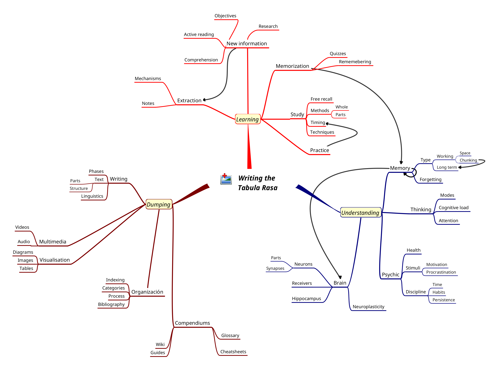

  <figcaption style="font-size: 10px; text-align: center;">Mind Map of the Book</figcaption>

These diagrams are useful for getting an overview of a topic. They may use simplified words but are capable of conveying a vast amount of information using hierarchical and easy-to-read relationships. Having a clear understanding of the connections around the topic assists in creativity and organizing subtopics.

As seen in the diagram, images are allowed, and they facilitate comprehension. It's worth noting that visual memory is crucial for memorization. Placing these images alongside the words they represent helps solidify concepts in the mind. It's even better if these images are chosen or drawn by oneself.

There are some simple rules, although they are not mandatory. Mind maps consist of limited components like branches, words and arrows, but we can add our own clever additions to expand them. They have the property of being an informal and flexible diagram, making them perfect for various situations such as study review, planning, gaining an overview, connecting concepts, among others. The rules or recommendations created by popular consensus for creating a mind map include:

1. Place the title of the topic in the center or root, using an image to represent it.

2. Use keywords rather than phrases.

3. Subtopic branches radiate from the center.

4. Branches vary in thickness depending on the level.

5. Use colors to distinguish each branch originating from the center.

6. Use arrows to connect different parts.

#### C.2.1.2 Concept Maps

These types of diagrams are very similar to mind maps in terms of purpose. They encapsulate relationships that, when combined, synthesize a concept.

  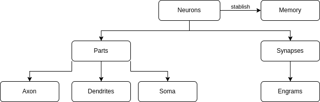

  <figcaption style="font-size: 10px; text-align: center;">Concept Map</figcaption>

In these maps, entities are shown as nodes related to each other using links that connect them, such as arrows or lines. These relationships can be hierarchical, meaning that elements at the top have greater significance or represent a more generalized concept than those at the bottom. This is optional, but it can be a useful implementation; if used, it should be clarified.

One drawback with these diagrams is their connections. It's easy to end up with a tangle of arrows going from one side to another. In such cases, we should organize them by moving their nodes until the arrows flow from one end (including the center) to the edge of the plane.

#### C.2.1.3 Pyramids

  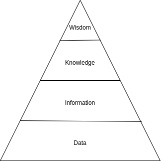

  <figcaption style="font-size: 10px; text-align: center;">Knowledge Pyramid</figcaption>

Pyramids are excellent for demonstrating hierarchical importance without adding complexity through relationships. In the image, we see an example of the knowledge pyramid, known for representing the evolution of knowledge from data to wisdom.

At the higher levels, we find what is of the greatest importance or significance. According to this pyramid, wisdom is the most important goal. Below, we have data, which is of lesser weight or size, representing the minimum unit according to the diagram.

It can also be interpreted that the lower levels form the foundation or the first step to reach the top. Each level is a stage that requires the foundation of what is below: to form information, we need data; to know, we need information, and to achieve wisdom, we need knowledge.

#### C.2.1.4 Charts

Charts are diagrams used to visualize information. They use a mathematical expression to represent data between two axes, commonly known as the *x* and *y* axes (sometimes *z* for three dimensions). Each axis is assigned an orientation, with *x* typically being horizontal and *y* vertical. There are also charts that do not use both axes at each end of the plane; for example, circular or pie charts are used to represent proportions.

These types of diagrams are prevalent in statistics and are used as visualization tools for data analysis. Their data comes from tables or matrices, which we will discuss in C.2.3 (Tables).

  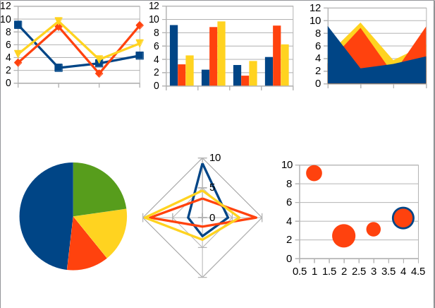

  <figcaption style="font-size: 10px; text-align: center;">Charts</figcaption>

Let's take a closer look at the ones shown in the image.

##### C.2.1.4.1 Lines

In line charts, the *x* axis, oriented horizontally, represents progress from left to right (in the order of natural numbers from 0 to infinity). The *y* axis, oriented vertically, provides the range of values for the variable of interest. Lines are drawn continuously, connecting points in space. They show changes in value on the *y* axis relative to the attribute on the *x* axis.

One scenario where line charts are ideal is for the analysis of temporal variation, where we visualize progress over time (usually located on the *x* axis). The lines formed represent changes in value over time.

##### C.2.1.4.2 Bars or Columns

The bar chart, or its tilted counterpart in columns, has numerical values on one axis and evaluated data in a bar on the other. These data can also be stacked to show more values. Their use is to illustrate the distribution of data in categories, where each group (the bar or column) represents a category to be depicted. Such a chart can have one or several categories defined.

The difference between columns and bars lies in the orientation of the plane, that is, which axis they use as a reference. Bar charts have rectangles formed in a horizontal orientation, while column charts are vertical.

##### C.2.1.4.3 Area

Area charts are used to differentiate data where the difference in elevation is the central point to be highlighted. In these charts, what's most important comes first, covering the second and so on. They are created in the same way as line charts, by filling the space between the line and the *x* axis with color. They are practical for distinguishing differences between two variables.

##### C.2.1.4.4 Circle or Pie

Circular charts can be interpreted as a pie or cake, where slices are cut to distribute. Circular sectors represent the most common alternative to axes. These use the entire circle's size to represent 100%, with a portion or slice representing the percentage of the statistic being displayed.

##### C.2.1.4.5 Radar

Radar charts, or spider net charts, form a small spiderweb where each color represents a data point. They are excellent for connecting points similar to line charts but also for showing approximations to the other ends of the (*-y* and *-x*) axes. Like area charts, they show differences in values and the approximation of their variables.

##### C.2.1.4.6 Bubbles

The last ones we'll look at are bubble charts. They are suitable for indicating areas but in disconnected and scattered regions within the chart space. They demonstrate isolated values using the circle's size (or bubble).

#### C.2.1.5 Processes

Process diagrams depict the steps to follow, operations to perform and decisions to make. There is a wide variety of diagrams created for the purpose of representing processes, including the sequence diagram, Nassi-Shneiderman and flowchart, to name a few popular ones. These graphical representations adhere to a set of rules for their design. Here, we'll focus on one of the most popular ones: the flowchart. It's relatively simple, with a few rules, and easy to understand.

A flowchart (similar to other diagram types) represents operations or steps for executing a process, workflow or algorithm one by one. When creating process diagrams, we keep the steps basic and concise. Complex tasks should not be grouped into a single stage; each step should be easily comprehensible.

  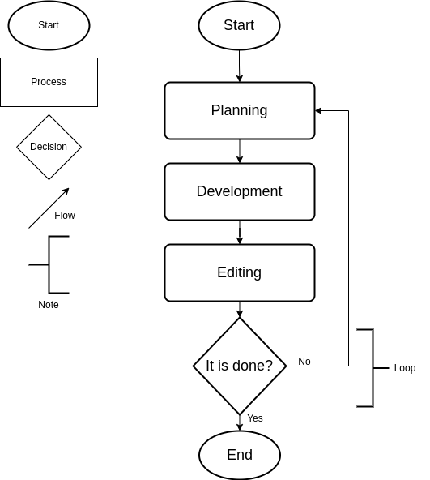

  <figcaption style="font-size: 10px; text-align: center;">Flowchart</figcaption>

There are more types of blocks than those listed, each with its own functionality. The ones presented are the most fundamental. The key symbol we look for in this diagram is the flow symbol (the arrows), which illustrates the sequence of steps and their order. Flowcharts also depict loops, situations where a process repeats, often accompanied by decision points. The collection of symbols defines the type of operation and the sequence in which it occurs, making the diagram an excellent tool for illustrating processes.

### C.2.2 Images

An image can make an impact through sight more quickly than several descriptive paragraphs. Colors and shadows are naturally identified and processed by the mind, eliminating the cognitive effort of imagining what many words attempt to describe. Furthermore, seeing something allows the mind to process its appearance, which is more conducive to memorization.

  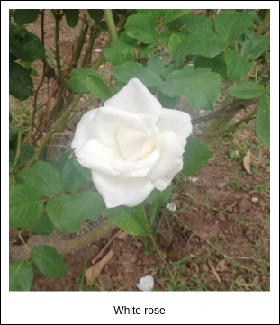

  <figcaption style="font-size: 10px; text-align: center;">Image with description</figcaption>

The best learning opportunity is to capture images personally. By viewing and experimenting with something, we create an event that registers in our memory. If we take a photograph of the moment, we can create a memorable image that will be a great aid to memory in the future. This is why it's important to capture moments of experimentation or observation.

A suggestion is to accompany images with explanations of what they represent. Despite their advantages, a photograph or similar image can be confusing if it doesn't convey the intended message. For this reason, it is recommended to provide a description along with the image.

One difficulty is obtaining images. On the Internet, we can access thousands of images in seconds, which can lead to a challenging search that takes up a significant amount of time. Taking photos ourselves is also difficult, we need to have a camera on hand and ensure a good capture, including paying attention to light, distance and angle. Nevertheless, the advantages outweigh the disadvantages, making it worthwhile to put in the effort to obtain images.

### C.2.3 Tables

We use tables to display data and values. They are organized in **rows** (horizontal) and **columns** (vertical) that are read from right to left. The data is placed between them in what we call **cells**, starting with the first of each orientation, which is used to label what the row or column refers to.

  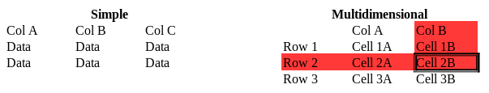

  <figcaption style="font-size: 10px; text-align: center;">Simple and Multidimensional Tables</figcaption>

Each data point is located at an intersection between a row and its column, which is referred to as its cell. In the image, it is represented in red, showing the path to the corresponding cell. Cell 2B is located at the intersection of the second row and column B. This way, we can locate data that relates to both values.

Some general recommendations for creating a table are:

- It should have at least two columns and two rows.

- The first cell contains a description of the table.

- Both columns and rows have headers.

- They are clearly divided.

- Be concise when writing in them.

### C.2.4 Multimedia

Audiovisual resources have come to stay. They have the ability to convey images, audio and text in parallel, significantly speeding up the explanatory process; which means learning more in less time.

The only drawback of this learning medium is its development. Creating an educational video involves planning, recording and editing, which requires training. Even with some experience, it remains a time-consuming task. We need to assess whether producing a video is beneficial for the topic we want to address.

It is possible, like with text, for an educational video to be overwhelming. Due to the high concentration of information, multimedia resources can become tiring and confusing. That's why we should isolate concepts separately and ensure they are not longer than 15 minutes, the shorter, the better.

A video is composed of many parts, and in each one, we address a specific topic, but it is necessary to relate them to make sense. We use anchors to transition data from one scene to another. Each scene has a specific objective, and its transition demonstrates the relationship between it, the previous ones, and the next.

One last point to consider is the use of effects. Videos use camera effects to maintain attention; these are animations displayed on the screen with colors or abrupt movements. Using too many of them is counterproductive.

### C.2.5 Mathematical Logic

Logic is the last method of visualizing information that we will see. We will use **variables** to symbolize an expression that refers to a theory. It is a less conventional method than an image but much quicker to write and has great flexibility.

Let's say we want to demonstrate the importance of time in learning. In this example, we will call all learning activities like reading or practice *l* and processing them in the mind *p*, which leads us to say that `l + p = learning`. However, we still have to evaluate the time *t* for these activities, resulting in `(l + p) * t = learning`. This simple case helps us understand mathematics as a tool to express a statement, even if it is abstract.

The most important tool is variables. Unlike constants, these can "vary," which means they can be assigned different values that are quantified (represent a number). In the previous example, we can assign any amount of time, such as ten minutes, one hour, or one day, depending on how much we assign will change the result. Variables are typically symbolized with a letter from the alphabet.

An equation consists of two members, separated by an equal sign, which means that both members are equivalent. The terms contain mathematical operations that may not be the same in both members. These operations include variables, which we can treat as variables and assign them a value to test the truth of the equality.

Mathematical logic is a symbolic method with limited use. It can be used to test the truth of a statement. It demonstrates an equality, where the terms make up the parts of the second member, showing their composition. With them, we can build a function, determine the possible values of the variables or domain, and visualize them on a coordinate system as we saw in C.2.1.4 (Graphs).

## C.3 Compendiums

Compendiums are **organized collections of information** used to document knowledge. They serve as our libraries, where we store information of all kinds according to their classification. All the tasks we have undertaken to learn so far can be materialized in these systems for storage; we move from learning from resources to creating our own. These collections form physical structures, not abstract like the models in our minds.

The content of their components varies, and all their parts consist of interactions with each other to make sense. The elements of compendiums form a kind of web of links that connect them. Each connection refers to a more comprehensive compound formed by parts at each end. We can say it is a wall of bricks where each one requires the one below and the cement that makes the union to be able to stand.

A compendium is a complex taxonomy, implying difficult organizational work. These large collections are divided into various sub-collections. The deeper we go, the more divisions we find. Each element has certain properties, in relation to the content, that make it different, leaving us with a sea of information that needs to be grouped and organized for quick retrieval. We will see how to organize in C.4 (Organizing Information).

Information is not valued by quantity but by quality. Clarity and consistency are required attributes to form a good compilation of information. When documenting the members of the compendium, we will have to use the previous mechanisms correctly; otherwise, we won't find meaning.

Now we will see certain formats that will be useful to create our own compendium of information based on what we know. When two or more of these systems can document the information in such a way that it is the same, we choose the one that is more valuable and takes less time. Each element will have a purpose, making them more or less suitable for each occasion.

### C.3.1 Encyclopedia

The first resource model for our compendium will be the encyclopedia, which **collects information on any subject and classifies it**. Their components consist of expository text where a particular topic is presented.

The **articles** in an encyclopedia are texts that focus on a single topic. They demonstrate theoretical knowledge with the purpose of informing. Each article has a name or title that defines the subject of study and a question that serves as the initiator. This question refers to what is going to be explained, how, and why.

The goal of encyclopedias is to inform, not to teach, so they lack subjectivity and a didactic sense. Instead, they are objective, get to the point and avoid presenting information unrelated to the topic. They use connections between their articles to help the reader gather all the information needed to understand the text without straying from the central theme.

Every article has three basic parts:

- The introduction
- The body
- The footer

  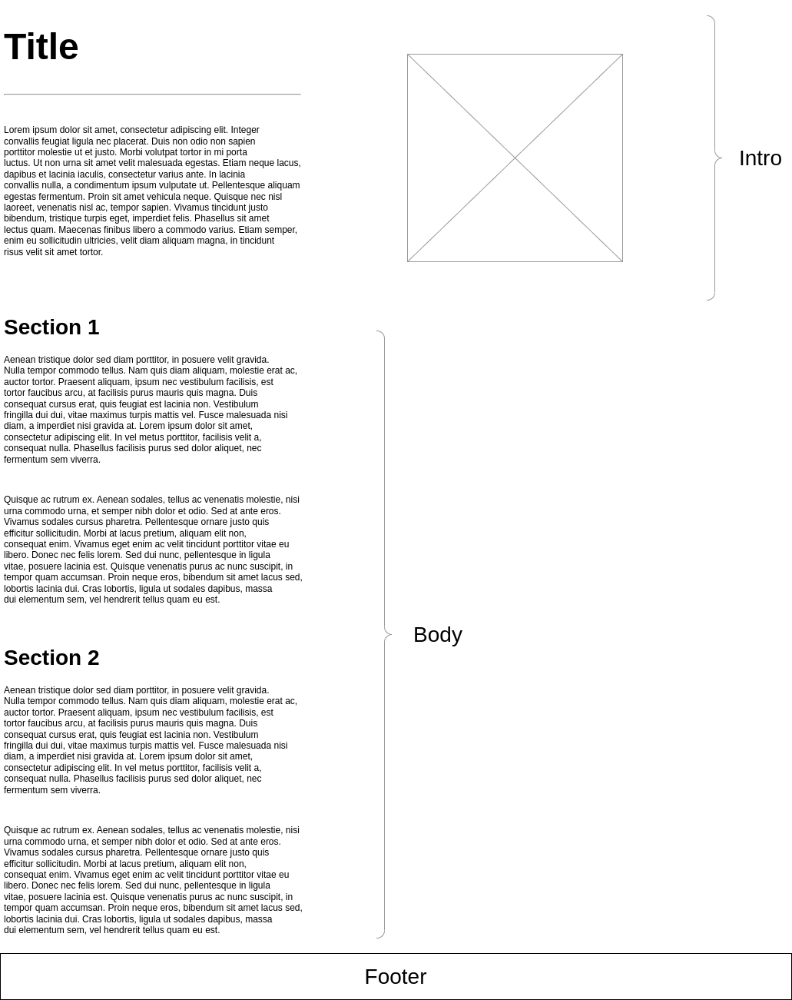

  <figcaption style="font-size: 10px; text-align: center;">Encyclopedia Article</figcaption>

The **introduction** includes the title and a presentation. During this part, a heading is placed that summarizes and introduces the content that is about to be developed. It often contains important facts and images that illustrate what is being discussed to make an impact on the reader. It is not recommended to provide an overview of the article, personal notes or catchy phrases because the goal is to provide a definition, not to start a book. This is a critical area as it is the first thing we encounter, and if it is incomplete or incorrect, it can lead to confusion.

Like any expository text, the **body** is where the main idea is developed. During this part, definitions, examples and other tools that can serve to inform the reader about everything they need to know about the topic are provided. There are headers that determine sections that are listed in a table of contents to help navigate within it. In summary, the body is where we expand on everything we know about the topic in an organized manner.

The last part of an article is at the very bottom, in what we will call the **footer**. This area serves to organize the article, and we place general information and metadata, the utility of which we will see later.

#### C.3.1.1 Wiki

In the digital age, collaborative encyclopedias (written by multiple people) have given rise to the term wiki, which refers to rapid editing. These are web spaces where any registered contributor to the system can edit and add content.

Wikis use a different organization than traditional encyclopedias that were in print and in alphabetical order. With the skills that digitalization brings, related pages can be linked together. Links allow for redirection to other articles to help readers expand their understanding of the content. This way, they create an interconnected network of encyclopedia articles.

It's not mandatory to impose a hierarchical order; pages may not be connected to each other and maintain a flat and shallow organization. Nevertheless, it's common to create parent-child relationships where one article (parent) encompasses several topics, and each sub-topic is separated (child). With this architecture, information is encapsulated in chunks, and redundant information is separated.

One advantage of wikis is version control. This is the ability to keep track of changes in articles. With the records, you can view and compare changes between old versions and the newest one, and if necessary, you can revert to and restore a previous version.

Restructuring a wiki is inevitable. Due to its dynamic nature, it's necessary to move some pages, create new links, and categories. This task is performed periodically, especially when it's noticed that chaos is taking over the organization, and a better pattern is envisioned. The iteration of **maintaining and improving the wiki is constant**.

