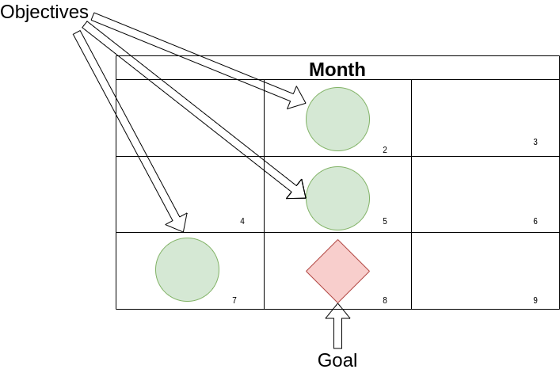

**Autor**: Valdivia, Sebastián Ricardo.

CC BY-NC-SA 4.0

This work is licensed under a Creative Commons Attribution-NonCommercial-ShareAlike 4.0 International License.

Dedicated to all those who, in the face of any difficulty, chose to keep learning.

## Preface

As a child, my mother urged me to study, and for a considerable stretch of my life, I regarded this task as the mere memorization of answers to exams, only to promptly forget them once the obligation was fulfilled. It wasn't until my teenage years that I encountered a semester-long course called 'study techniques.' Here, I was instructed to read, underline, reread, and rewrite my underlined notes. While this method improved my exam scores temporarily, the knowledge would invariably fade away afterward. Historical facts became meaningless dates, equations dissolved into scribbles, and once-learned language concepts transformed into loathsome words drifting in my memory. Remarkably, I continued to pass with excellent grades.

However, my understanding of the true cost of this approach only dawned on me when I entered engineering university. The initial exams were designed merely to assess my knowledge level, but when I read the questions, I recognized them from somewhere in my past. I had known them years ago, but now they seemed vaguely familiar, and I struggled to provide the correct answers. My score? A mere 20%. As the coursework advanced, my situation deteriorated. I needed to grasp earlier concepts to excel in exams, a prospect that had never piqued my interest. Moreover, the study techniques that had served me previously proved inadequate in the face of the substantial amount of information I now encountered. I barely managed to pass, and by the time I reached my second year, where retaining previously learned concepts was essential, I faltered. Everything I had learned the prior year had vanished from memory.

I began to doubt my abilities, believing I was inherently incapable and that my brain was somehow inferior. I ultimately abandoned my university studies, deeming them a waste of time. My goals shifted, and I started working as a barista. However, my thirst for knowledge remained unquenched. Numerous subjects, particularly programming, continued to captivate my interest. Encouraged by this spark, I decided to embark on a self-guided journey to deepen my understanding of the field.

This path was fraught with stumbling blocks, errors, and challenges, but gradually, programming started to make sense. Beyond that, I began to discern a pattern in the learning process. I turned to dynamic tutorials that emphasized hands-on experience over the rote memorization of definitions or complex theories. This new approach kindled a fresh curiosity within me: How do we learn?

I set out on a quest to uncover alternative methods of studying. My initial task was to gather information on effective study techniques. I scoured the internet for articles, acquired books of interest (often more than necessary), consulted online communities, and experimented extensively. My endeavors to learn programming proved particularly illuminating; while some approaches failed, others succeeded. I persisted in refining my learning skills until I gained the confidence to reattempt formal education. This time, I did not falter. Each passing year proved more productive, and I found myself surpassing both my peers and even some of my professors. Many attributed my success to sheer intelligence, willpower, or time spent studying. Yet, they were mistaken; I had simply mastered the art of effective learning.

Over time, I noticed a significant enhancement in my comprehension abilities. I grew restless studying a single topic and began to tackle two or three simultaneously. I explored diverse disciplines, from programming and languages to carpentry, electricity, electronics, mathematics, and many others, including seemingly unrelated subjects like beekeeping and horticulture. This multifaceted approach felt effortless and enjoyable, compelling me to continue my eclectic learning journey.

What remains paramount is my unwavering commitment to learning how to learn. I reached a juncture where I amalgamated my accumulated knowledge, formal education, and independent discoveries to assist others in achieving their learning goals.

But why do we learn? Often, people associate learning with institutions, degrees, and job prospects, neglecting the value of learning for its intrinsic worth. Learning instills new values, nurtures our ethics, enhances our productivity by acquainting us with new trades and hobbies, imparts wisdom from history to prevent repeating past mistakes, and so much more. Learning doesn't merely boost our intelligence; it shapes us into better individuals.

From infancy, we begin to cultivate the skill of learning. Babies utter their first words after repeated exposure to their parents' voices, and this process continues throughout their lives. Schooling exposes them to new knowledge simply by observing teachers, acquainting them with games by watching peers, and etching book plots into their memory through reading. This childhood development lays the foundation for various learning styles and information retention techniques.

## Abstract

Within the pages of this book, we embark on a profound exploration of the intricacies of learning, delving deep into the modus operandi of our minds. Our mission is to unravel the secrets of understanding and memorizing information with the ultimate goal of enhancing our cognitive capabilities and extracting knowledge in the most lucid and meticulously organized manner.

In this quest for cognitive mastery, we encounter a rich tapestry of methods and intricate systems meticulously crafted by experts. These tools serve as catalysts, propelling us toward heightened efficacy in our learning endeavors. Learning, as we come to appreciate, transcends the mere act of reading; it demands an amalgamation of willpower, strategic finesse, relentless practice, and the wisdom to discern the most effective pathways to knowledge acquisition.

The voyage of recollection, an integral facet of the learning process, unfolds as a cyclic odyssey, replete with twists and turns, for which we must be well-prepared. Once we acquire knowledge, our brains undergo transformative processes akin to molding clay into new forms. However, this remarkable property of neuroplasticity comes with its own set of challenges. The specter of forgetting looms, albeit not indefinitely or abruptly. Under specific conditions, the precious fruits of our learning can slip away. To combat this formidable adversary, we wield a powerful weapon: the art of notation. Within our arsenal, we find an array of mechanisms, both simple and intricate, swift or detailed, all finely tuned to transcribe information with precision and purpose.

For those who may question the efficacy of the written word, there exists an alternative avenue of learning: the art of meticulously crafting organized visualizations. Diagramming, as we shall discover, demands an intimate understanding of the nuanced art of explicit and systematic description within a pristine canvas of blank space. Yet, be not deceived, for the mere act of tracing lines upon a canvas is insufficient to conjure meaningful charts and diagrams. What lies at the heart of this endeavor is an adherence to order and an unwavering dedication to the art's guiding principles and regulations.

In essence, this odyssey through the realms of learning not only equips us with the tools to ascend the peaks of knowledge but also instills a profound sense of reverence for the process itself. Learning, we come to realize, transcends the confines of institutions, degrees, and employment prospects. It is the crucible in which we forge our values, nurture our ethics, and expand our horizons. Learning transforms us into not just more intelligent beings but, fundamentally, into better individuals.

> This book was written with the objective of guiding a software project but is unrelated from it.

### ¿What is "tabula rasa"?

The term "tabula rasa," Latin for "blank slate," carries profound philosophical significance. It encapsulates the notion that each of us enters the world devoid of inherent knowledge, akin to an empty canvas, and it is through the journey of life that we inscribe our experiences upon this mental canvas, gradually etching the tapestry of our understanding.

The origin of this term draws a compelling parallel to a tool of antiquity—the Roman wax tablet. Employed by the Romans in the 1st century B.C., this tablet could be molded afresh with a stylus, permitting the erasure of previous writings and enabling the opportunity to transcribe anew. Its very emptiness led to its designation as "rasa," signifying the absence of preexisting inscriptions.

In essence, "tabula rasa" stands as a testament to the malleability of human consciousness, where the imprints of life's experiences continually shape and reshape the contours of our understanding, rendering each of us a unique work of intellectual artistry.

  

  <figcaption style="font-size: 10px; text-align: center;">Roman wax tablet</figcaption>

Philosophers employed this expression to symbolize the commencement of learning from birth, following the theory of empiricism, which posits that we acquire knowledge through experience from the moment we are born. Here, we align ourselves with this ideology, keeping our doors open to all. What is explained remains indifferent to one's origin, current circumstances, reasons for wanting to learn, or any other factors.

## General view

Writing the Tabula Rasa is a metaphorical title for the content we will delve into. Firstly, we will approach it's figurative meaning, aiming to comprehend how the human mind operates and how individuals acquire knowledge. After this metaphorical exploration, we will take a literal approach and craft the 'table' creating a record of our knowledge to facilitate recollection and interpretation by others.

The text is structured into three primary sections, each addressing key questions: How does our brain function? How do we learn and memorize it's concepts? And, lastly, how do we disseminate and organize this information?

In the first section, we will delve into the biology of neurons, dissecting their components and understanding how they interconnect to construct mental models. We will also explore the concept of 'attention' and the pivotal role of cultivating effective study habits.

The second section delves into the realms of study, memorization, and information retrieval. This domain is vast and intricate, reliant on the application of techniques across a process that leads to the comprehension and interconnection of concepts, culminating in their retention within memory. This journey takes time and cannot be accomplished in a single night.

Finally, we elucidate the process of disseminating information to make it reusable, both for oneself and others. We analyze the abstract organization of information, emphasize the importance of precision in writing and present various methods for articulating ideas effectively.

I have endeavored to present this book in an accessible manner, though it may still pose challenges for those less accustomed to extensive reading. Whether you are an expert or a novice, remember: strive to maintain a holistic perspective. Keep in mind the previously discussed topics and return to them as needed. Comprehending the connections is paramount to grasping the underpinnings of more advanced sections.

---

# A. Understanding the mind

The human brain is the most intricate organ in the animal kingdom, brimming with mysteries that have intrigued various disciplines dedicated to unraveling them. The task of thinking is carried out by tiny, specialized cells that work together in a structured and organized manner, much like bees. Each area of this remarkable organ performs a highly specific function.

But why should we be interested in knowing this? This is where knowledge is brewed. Understanding how it functions enables us to comprehend how it operates, what it's limits are and how it thinks. However, the goal is not to become neuroscientists; people can drive a vehicle without being mechanics.

We will explore the composition of the brain at the cellular level as it forms systems, eventually culminating in something larger. We will focus on an organic perspective before delving into the workings of what we will cover in the second part.

## A.1 How does the brain work?

The first step in comprehending the mind is to delve into the neuronal system within our brain, which enables us to think, remember, and understand. This peculiar organ located in our head is composed of several parts, each serving various functions. Nonetheless, our focus isn't on knowing each part individually but rather on how they come together to form the human mind.

Before delving into the biological aspects, we will employ an analogy to ease the complexity, allowing us to perceive the operations of our brain from a different perspective.

### A.1.1 A tiny city

Imagine the mind as a miniature, microscopic city inside your head, complete with people, streets and buildings.

These tiny inhabitants are so small that they can't think much on their own. They can barely hold onto a minimal unit of information, a small piece of data, something as simple as a number from 0 to 9 or a letter. They are rather clumsy on their own, but they can communicate with each other. In groups, they can form words or even images.

Within the buildings, people gather to create 'mental models.' These models are ideas and concepts formed by connecting with notions we already know. They are always a work in progress: under construction, undergoing repairs or even being demolished. The city is in constant transformation and the models change shape.

Because the population is immense (approximately billions), they often form neighborhoods to develop concise ideas. Some of these neighborhoods connect with each other through streets and alleyways, linking models and creating larger and more complex ones.

In this city, you can reach anywhere as long as you are oriented and know the way. The streets that connect the vast urban area vary; some are fast, built with concrete, while others are rustic and abandoned, making navigation challenging. The city administration is responsible for these roads. When it notices a street is frequently used, it decides to pave it to improve traffic flow.

Only a few experienced individuals can navigate the metropolis, managing tasks such as overseeing changes, organizing neighborhoods, and more. This work is carried out by our conscious and unconscious states, which are responsible for reasoning.

### A.1.2 Neurons

These tiny individuals we are referring to are called **neurons**.

Neurons are small cells that make up the human brain. They are also found in other parts of the body, forming the central nervous system. There are billions of them in each of us. Most of them have the job of interpreting our senses (sight, hearing, touch, taste, and smell), carrying information from the organs to the brain.

  

  <figcaption style="font-size:10px; text-align: center;">Neuron's parts</figcaption>

They have a particular shape, as seen in the image. They are composed of a body, arms, and legs. The body (2), also called the soma (the wider part on the left), mainly contains the nucleus (3) where our DNA is stored. The legs or dendrites (1) receive signals and are located around the nucleus. Finally, the axon (4) exits the center and is responsible for transmitting the signal to other neurons through synaptic buttons. Considering their parts, it's evident they have a system to communicate among themselves, known as **synapses**.

There are various types of these tiny cells, but the ones that matter most to us are those that perform the "*thinking*" task.

### A.1.3 Synapses

Synapses serve as the communication junctions between neurons. These minute gaps exist in close proximity to the next neuron, yet they never actually touch. Within these gaps, the axon buttons surround the dendrites.

  
  
  <figcaption style="font-size: 10px; text-align: center">Synapse</figcaption>

The interaction among these entities creates intricate networks of neurons engaged in a continuous "dialogue," forming thoughts through electrical or chemical impulses. When one neuron seeks to connect with the next, it sends a signal, and the receiving neuron transmits it to the subsequent one, creating a chain until a *concept* emerges.

When a group of neurons communicates synchronously, they form an engram. This can be likened to a house, building, or apartment within our small city. Here, working in harmony, they construct a small unit of information that can be used to shape a memory. This connection entirely relies on the impulses sent from one to another.

As engrams are usually not substantial enough to form complete models or memories, they maintain pathways or roads connecting to other engrams in different locations. These pathways are the streets linking neighborhoods, where energy flows and constructs a vast network of neurons collaborating. The more activity along these pathways, the stronger the connection becomes. This process is known as consolidation, involving the improvement of these pathways. It's a task that requires time and resources from the body to accomplish. These neuronal pathways are responsible for managing memory through the hippocampus.

### A.1.4 Hippocampus

The hippocampus is a part of the brain where a significant portion of memory-related tasks takes place. It is named after its resemblance to the seahorse. This organ can be thought of as the city's computing center.

It is responsible for remembering facts, events, and orientation tasks. It possesses a substantial amount of gray matter where axons lack myelin, which makes it slower but capable of processing information. Due to its structure, which is composed of somewhat different neurons, it is considered the site where 'reasoning' often occurs. For this reason, the hippocampus plays a crucial role in reasoning and the formation of abstract mental models.

In summary, the hippocampus is a crucial hub for memory processes in the brain and deserves a word. It's responsible for encoding new information, consolidating it into long-term memory, linking related memories, and facilitating their retrieval. Without the hippocampus, our ability to form and recall memories would be significantly impaired, making it an essential and fascinating part of our cognitive system.

### A.1.5 Neuroplasticity

Similar to the dynamics in our miniature city, the brain is in constant flux, a phenomenon known as **neuroplasticity**. This is the time when construction work takes place.

This characteristic states that our brain can adapt and create new connections between neurons. This is why we describe the mind as reconstructive and involving multiple processes to transform itself.

Without this attribute, the brain would be fixed and unchanging, much like that of an insect. It would always perform the same basic tasks, such as eating, or perhaps a few more complex yet essential and routine ones.

This change doesn't happen overnight, nor is it extraordinary. It's akin to a plant's growth from sprout to fruit, taking months of effort. It's during the night when it grows the most. This transformation necessitates healthy habits, which we will explore in A.4.1 (Mental Health).

## A.2 Memory

What's the best way to attach something to your mind? This is a complicated question. There's no simple way, no single trick, to remember something forever. If we analyze everything in our heads, we don't have memories of our first days of life, but we do remember yesterday, as long as you don't have any brain damage. Nothing in memory is eternal; always remember that it's constantly changing, archiving the old in the back room, making room for the new and more needed at the front counter.

But have you noticed that you can remember something like your birthday every time and every year? If you delve into this topic, you'll realize it happens for these reasons:

1. It repeats over time.
2. It's an important day.
3. Dates are easy to remember. They're just numbers.

Break this idea to decipher the trick and you'll see the pattern: it's recurrent, linked to other events, and accessible. This will be the key to memorization. But to find out how it happens, we must first understand the functioning of memory and it's parts.

When we talk about memory in general, we refer to the mental process of encoding, retaining and retrieving information stored among our neurons. These tasks are performed by its parts. To understand these parts, we could compare memory to a backpack with 2 pockets.

  

  <figcaption style="font-size: 10px; text-align: center;">Backpack with 2 pockets</figcaption>

The first pocket (1) is much more accessible, small enough for us to reach its contents with our hand and easily retrieve something like a pen or a piece of paper. Obviously, there isn't much space; we could hardly fit a notepad. For that, we have the other pocket (2). This larger space allows us to put books, folders, calendars, even our laptops; full of information. The problem is finding and retrieving something from here requires a somewhat more tedious search. Just like this backpack, the mind has these 2 types of pockets.

Memory operates in two main parts, in addition to a memory that processes the senses and retains the information for a few seconds. These are:

- Sensory memory or register: Operates on what is captured by the senses.

- Short-term storage memory: Working memory.

- Long-term storage memory: Information deposit system.

We will focus on the last two.

### A.2.1 Short-term Storage

This memory is responsible for *processing or working with information*. It is located in the prefrontal cortex just above the eyes.

It usually has 4 *slots* or spaces where it places the information. The quantity varies from 3 to 9 spaces. Note that having fewer spaces doesn't make us less capable; on the contrary, it helps with creativity as we rely on forming relationships with information in long-term memory. This method of creating relationships is the way to answer complex questions with so little space in such a short time. We can form connections with previously acquired knowledge and process all this information together.

As a person does not focus, it "drops" the information, forgetting about it. It takes around 10 to 15 seconds to discard whatever is occupying it. To avoid forgetting, focus is necessary. Methods can be used to keep it longer. If no activity is done, it will simply be lost and needs to be revisited.

A method that helps keep pieces of information active for longer in this memory is phonological loops or repeating what we are trying to remember again and again to keep it active. Another method is visuospatial, where information is stored visually, with images located in a space. These procedures are not for archiving information in the long term, just to keep something a few seconds longer in working memory; we'll see them in detail later.

### A.2.2 Long-term Storage

In this memory, *information is stored*, knowledge, mental models. The limit is immense; it can accommodate a large amount during the course of our lives. Still, everything depends on the ability to retrieve it, that is, to bring it back to working memory for use. This practice is important for improving our information retrieval.

This memory, unlike the other, does not have an exact location; it is dispersed throughout the brain but is concentrated in the hippocampus. This leads us to think that memory uses a large number of neurons in the brain's gray matter. Each piece of gray matter forms a set of neuron links that create a memory.

To move something from working memory to this long-term memory, it must go through 4 stages:

1. **Encoding**: At this step, the brain transforms facts or concepts into models that can be interpreted by the brain.

2. **Consolidation**: Once the models are obtained, the connections between neurons must be strengthened for the next step.

3. **Storage**: Once consolidation is complete, the models are firmly placed in the brain after a few hours, during which the brain adapts the neurons through its plasticity.

4. **Retrieval**: This stage is somewhat obvious but separate from the others. It involves simply retrieving the stored information to use it.

An advantage for consolidation is to use what you already know and relate it to new knowledge. It acts as anchors, just like a spring, forming unions and pathways that connect them to the new ones. The more of these points one has, the easier it is to understand and memorize new information. It's better to study with a broader view rather than trying to memorize details.

The effort to remember information helps improve the connections in this memory. Whether it's exercises with or without assistance or clues to trigger memories, performing these tasks greatly helps strengthen the engrams. Trying to remember, without looking at what you're searching for, is one of the most effective ways to improve the information's accessibility.

Once you've understood the information, consolidation begins; in this stage, neurons start creating an engram. Once the process is completed, it's stored, but to keep the engram active, you need to practice retrieving that information and keep it active. If you don't use it, you'll forget it.

#### A.2.2.1 Remembering

This task is what we seek to perfect. It involves finding the right information as quickly as possible, which is not so simple.

The mind doesn't work in a linear fashion; by this, we mean it doesn't start a sequential search in a list of memories. You can think of it as having a piece of fabric of an unknown color and wanting to find out which one it is from a list; you might go on comparing the colors on the list one by one until they match. This method is slow and ineffective. If the brain conducted the search this way, it would take hours, comparing it to the thousands of memories it stores.

To describe its search method, we can see it as accessing any part of the "list" searching based on relationships or classifications we've made when learning. What it does is look for associations with more active topics in long-term memory. If it can't achieve this, it is considered forgotten.

The best way to improve our memory recall ability is through practice. The effort to retrieve information makes neurons more active. The more we try to remember, the more skilled we become, and later in section B.4 (Memorization), we'll see techniques and exercises based on this theory.

#### A.2.2.2 Forgetting

Forgetting or failing to retrieve information can affect us in many ways. When people usually use this word, they refer to the failure or inability to remember information that has gone through all the stages listed in A.2.2 (Long-term). This can happen mainly due to the lack of use of these resources or biological factors (diseases like Alzheimer's affect long-term memory in this way).

The effect of forgetting is not instant; it develops over a period of time. Reviewing and practicing memory at intervals helps keep the neurons holding the information active. The solution is managing the timing of our reviews to prevent forgetting, something we'll discuss in A.4.3 (Discipline).

### A.2.3 Chunking

Chunking is a cognitive process used to organize and group information into smaller, manageable units or "chunks" in order to improve memory and processing efficiency. It's a valuable technique for dealing with large amounts of information more effectively. 

With this technique, we can manipulate large amounts of data stored in our minds. Since we only have about 4 usable slots in working memory, it limits the amount of information we can consider at any given time. Fortunately, human brain evolution acquired the ability to consider a context of information stored between both memories. The goal of forming chunks is to memorize something without needing to remember every detail.

Forming a chunk is not that simple. When starting to build a chunk, concentration is required, focusing only on what we have in our hands. After having the material in working memory, we step away from it to see it from a different perspective. With repetition and spaced practice, we can solidify concepts entirely.

To archive chunking we can follow the following process:

1. **Identify Key Concepts:** Begin by identifying the key concepts or pieces of information that you need to remember. These can be words, numbers or any type of data.

2. **Determine Chunk Size:** Decide on an appropriate chunk size. This can vary depending on the type of information and our own cognitive capacity. Common chunk sizes include groups of 3 to 5 items.

3. **Create Meaningful Groups:** Group related pieces of information together to form meaningful chunks. This could involve grouping numbers, words or ideas that are conceptually related.

4. **Use Patterns:** Look for patterns or connections within the information that can help you create chunks. For example, if you're trying to remember a series of numbers, you might group them by digits or by their meaning.

5. **Practice:** Once you've created these chunks, practice recalling them as distinct units. This helps you remember the information more effectively because you're dealing with fewer, more meaningful pieces.

Let's see a simple example of chunking: how to remember phone numbers. When remembering a phone number like 123-456-7890, you might chunk it into three parts: "123" as one chunk, "456" as another, and "7890" as the final chunk.

Chunking is a versatile cognitive strategy that can be applied to various types of information, from phone numbers and dates to complex concepts and ideas. It's a useful tool for both learning and everyday tasks that involve remembering and processing information efficiently.

Memory plays a crucial role in how information is related; it's necessary to understand its operation. Together, both memories can manage complex streams of information, allowing us to understand and reason. Changing perspectives leads us to the next part.

## A.3 Thinking

Thinking or reasoning involves using all our knowledge to establish connections with the environment and **draw a conclusion**. Obtaining this conclusion is what leads the hierarchy of operations to achieve what we call intelligence. Its purpose is to obtain an understanding or make a decision correctly or as closely as possible. It is important because it allows us to form and comprehend mental models by appreciating information from our experiences.

Experience is formed by **relating and processing facts stored in long-term memory**. When we were young and learning to walk, if we fell and got hurt, we used reason to understand that the negative consequence, pain, was a result of the fall. From this reflection stored in our memory, we form all the relationships that arise from such an experience. For example, falling hurts, and over time, when we try to learn to ride a bicycle, we draw from the same experience: falling will hurt - we should avoid falling. Achieving this conclusion does not require actually falling to realize it but relies on similar events that have already occurred and exist in our memory. So far, we've seen basic examples, but reasoning can be performed with complex units of information. The mind can process experiences and make judgments to understand facts; it only requires analyzing relationships based on knowledge stored in memory.

When dealing with data from various sources, such as physical or abstract modalities, and not finding relationships due to not having fresher memories, more effort is required. This effort is created by combining the act of freely recalling and associating knowledge in various ways until a conclusion is reached. This activity can take time during which the mind is working to find a **meaning**, seeking to perceive its functionality or significance through intuition.

This human activity is not constant from birth; it is a skill that is learned, developed and whose proficiency requires training. It is something all animals possess to varying degrees, but humans have taken it as far as possible. We depend on it to understand what we study; the better our reasoning, the more effective our study will be.

The work of processing acquired information is related to the level of predisposition we have when performing this task. Whether with a high or low level, focused or not, we are working in the same way but in two different ways. One way to see it is as a shift from a more closed perspective to a more open one. What do we mean by these perspectives? There are two modes of thinking, **focused and diffuse**. Although it may seem that only the first is effective, the reality is that both are equally important for effective studying. Let's look at them separately.

### A.3.1 Focused Mode

The first mode of thinking is focused or concentrated. This should be the most obvious one, and we recognize it instantly. We realize it because when we use it, we are processing information with our full consciousness, expending more energy.

When focused, the experiences and knowledge we use are active. During this time, the information to be used is located throughout (or almost all of) working memory, connected to archived memories. We are reasoning about it, seeking new relationships, meanings and questions. Although we only use this information and only this information as a closed group, not with a more open perspective. We are limited, but we achieve greater depth.

Being focused requires an effort to avoid distractions from the environment, which affects the ability to maintain the focused state. We need to make an effort to stay in this mode, what we call **sustaining attention**.

#### A.3.1.1 Attention

When talking about attention, we refer to the cognitive process of selecting information and focusing on it for processing by our minds. By definition, it involves focusing on a single stimulus or specific location and the ability to stay there. When we pay attention, we select the information we want to process and put our cognitive capacity at the service of this task. It applies to the four available slots in working memory, plus three or more additional slots that are prepared.

Environmental variables have the potential to affect attention positively or negatively; they can help us stay focused on the material or distract us from it to pay attention to other things. These variables can be sounds, images, movements, among others. Colors are a crude example of a variable that can be both positive and negative: if we see keywords highlighted in red in a text, we maintain focus on the text. However, if we had dozens of colorful drawings around the text, they would grab our attention more, diverting us from reading. It is important to manage variables so that they are on the positive side of the scale, helping rather than distracting.

A more subtle variable is the mental challenge posed by the material. Depending on the level of difficulty, attention varies. If we deal with very complex material that is beyond our reach, not understanding a large part of it, it will be impossible to concentrate. Similarly, material that is easy and/or already familiar may also lead to a loss of attention because the brain does not need to work at 100%. Ideally, you should maintain a work pace that requires effort, with challenging but not unattainable material. 

#### A.3.1.2 Cognitive Loads

Cognitive loads refer to how much the study material demands from working memory. This is what we will call the unit of measurement for the mental effort required to interpret the material. The higher the cognitive load, the more concentration is required. If we want to make studying any topic easier (for ourselves or others), we need to consider what the load will be.

What most affects the load is the presentation of the material. Depending on how difficult or complex the material is and how it is presented, the load will increase. Therefore, the material's load can be affected by two parts: intrinsic (how easy or difficult the material is) or extrinsic (how it is presented). The ideal intrinsic load is at an intermediate level between easy and difficult to maintain our attention in the task. On the other hand, the extrinsic load is better when it is simpler. Knowing the type of level we are facing makes us aware of the effort level we will require and, with some experience, calculate the time it will take to learn.

Another load that also affects attention is perceptual, which is closely related to attention. Unlike cognitive load, which uses the mind, perceptual load uses the senses to focus. Sounds, images, among others, affect our level of concentration. The more distractions there are, the higher the perceptual load. Reducing anything that affects attention will help you stay focused.

### A.3.2 Diffuse Mode

The second mode of thinking is the opposite of being focused. In this mode, the mind wanders through thoughts, discarding concrete ideas and allowing new ones of any kind to flow. Here, we are not focused on anything in particular; we let distractions take us where they want, and we let the mind do what it needs.

In this state of thinking, relationships with other knowledge are better constructed. During the diffuse mode, we "play" with concepts, moving them and trying to connect them with others, forming analogies and breaking them down to see how they are structured. This allows our creativity to be involved in studying.

Although we may think we are wasting time, the brain continues to work on the problem. Often, we feel guilt, a negative emotion, for entering this mode, believing that it is laziness, which is not true. Negative emotions do affect performance. Naturally, studying requires a good deal of focus, but we must remember that leaving this mode is also essential for aligning ideas and making progress.

Entering the diffuse mode allows the brain to explore more alternatives. We engage creativity and our knowledge in its entirety, something that would require much effort in the focused mode. Reaching the diffuse mode costs nothing; it is natural and often happens without us seeking it.

#### A.3.2.1 Daydreaming

It is common to feel that thoughts from within us invade our attention and lead us to daydream. At this point, the mind enters the diffuse mode without us consciously seeking it. It often happens autonomously, and even though the practice of concentration helps prevent daydreaming, it is inevitable.

We all have the problem of losing focus on what we are working on because our minds seem to change the subject. Although it may seem tedious and ineffective, it is a way for the brain to request a break since the mind gets tired, meaning it exhausts its concentration energy. How many times has it happened that even with the utmost determination, we cannot focus on the text we are reading, and we exert so much effort that it causes a headache? Like an engine, the human mind needs to "cool down" after a work cycle. If we use our energy for too long, we will only tire ourselves out to the point where we are not efficient. This is why staying up all night to study for an exam the next day is futile, and it does not help with long-term learning.

These distractions that separate us from studying are a sign that we are tired. It is not necessary to interpret these signals to realize it; we often think about how tired we are ourselves. At this point, the next step is to take a break and take care of ourselves; the mind will continue working in its way.

The more we study, the longer we will be able to maintain the pace. We can interpret it like training for a marathon; reaching the first 5 kilometers will require practice, learning, and each day we need to achieve a few meters further. The only way to improve is to periodically make a bit more effort, achieving better results.

## A.4 Psychic State

In this conclusion of the first part, let's talk about the well-being of the mind. A certain myth among students of all levels believes that getting tired and exhausting the mind is common, part of the student culture. This is false, we can verify it; during one day we make an effort and on another, we take the necessary time to avoid getting tired; we will remember and understand more in the second case. No matter how much information has been amassed, the human brain has a limit and, like a muscle, it needs to rest from time to time to grow.

Stress is one of the worst enemies of learning. It is true that in life there will always be situations that push us to the limit, especially in work or personal life. During study is when one must apply what they know, and what they will learn will be the results. When we study non-stop for an exam, do you know when everything we have fresh in our memory shifts to long-term memory? In the exam itself. As soon as we read the question and look for the answer in our mind, the information becomes related to the event; we use the ability to remember and interpret what causes the memorization of the information. If we fail in the exam, we will learn from the mistake, and we will know more for the next time, perhaps more than those who passed it on the first attempt. There are no losers in studying; the only ones who lose are those who don't try.

### A.4.1 Mental Health

The brain is an organ and, like any other, requires care. But it's not a conventional organ, it has some special care needs. These are emotional care. Learning requires a joyful and motivated state to be carried out. In this text, we will not delve into the reasons why get these states but instead who they affect study.

Negative emotions and stress are a big problem. Emotional well-being affects thinking performance. Harmful states that affect thinking, such as depression, increase the difficulty of concentrating, making studying impossible. One's behavior will change depending on how they feel; if they feel bad, their energy will turn against them, which will not help them sit at the desk. For these difficulties, learning requires a positive emotional state.

Controlling these problems is essential for effective studying. Personal problems have their own origin and are not within the scope of this book, however, the concern and stress caused by studying deserve a mention. The reality is that the culture of academic institutions and society has created a demand for students that causes anxiety. The need to obtain high grades and carry out large projects in a short time is (partially) present, with a back and forth of guilt between students and teachers. In learning, there is no requirement; the establishment of requirements to pass is not part of the process, they are independent of each other, not passing does not mean you have not learned. We have to abandon the mindset of learning to be evaluated and do it to improve ourselves.

Just as we take care of mental health, physical health is closely related to the mind. The brain depends on the body to survive. A balanced diet affects good blood circulation and the energy we have. Eating a variety of foods helps maintain a healthier metabolism, allowing the mind to work in better conditions. Obviously, we cannot ignore another factor, which is physical activity, where hormones are released, leaving us more active and content. Long-term well-being reduces age-related decline, preventing the death of neurons over time. The brain is part of the body, taking care of one is taking care of the other.

Lastly, and perhaps most importantly to consider in the prosperity of learning, is sleep. While we sleep, our mind changes and solidifies the knowledge learned, let's remember that it possesses the property of neuroplasticity. Let's imagine that a person from the miniature city needs to renovate their apartment. At what time could they do it if they are working all day? During sleep is when neurons take the opportunity to renew, after a study session and a good night's sleep, the dendritic spines grow to strengthen the links between neurons. Another factor we find during operating hours (while we are awake), in the brain, toxins from brain waste are generated that remain between the neurons; during sleep, they are eliminated, cleaning the organ of them. For these reasons, sleep is the moment when we end the learning cycle; without sleep, we could never reach completion.

### A.4.2 Stimuli

Having good health may not be all that is necessary to feel energized. In addition to natural energizers like exercise, the desire to complete our own goals also generates energy. Some factors come from the awareness of the mind that affect willpower when it comes to studying. These are the incentives that provoke the curiosity that learning satisfies.

The tingling of intrigue triggers the will to learn. This desire to discover is the source of energy, what fuels the determination to go through books, articles, and other texts in search of the answer to "What is it?" and "How do I learn it?" These are the questions that guide learning, but now we want to know why we ask them.

#### A.4.2.1 Motivation and Interest

Working on a project or studying a *subject that identifies us* gives a feeling that makes us move forward and maintain the effort in it; this feeling is **interest**. Seeing something without interest and believing it doesn't benefit us drains energy. It's like having to dig a hole for no reason; it annoys us, but if we do it to plant a tree, it gives it meaning, usefulness. When we awaken this interest in a project, we develop an attraction to the subject. We start setting goals, organizing, researching, getting in touch with other people related to the topic. We participate actively. This participation improves performance and sends the experiences gained to memory. It is important before sitting down to study to consider what makes the topic interesting for you.

Being emotionally connected to the study generates excitement, leaving us physically and mentally alert. This gives us desires, the desire to study or carry out a project. This **energy is motivation**. This same excitement directly affects concentration, positive emotions, and the energy with which we tackle the work. Motivation acts as sails to our sailboat that we use for learning.

**Inspiration** is an important tool for igniting motivation. Being inspired consists of having creativity and/or willpower to continue. Unlike interest, inspiration does not come from within but from external factors that trigger a reaction in the mind. These factors vary in type; they can be **personal** such as achieved goals, completed tasks, values; or they can be **external** like achievements of personalities, quotes, reference works, and many more. These factors can also make connections between solutions to the problems we face and others that have already happened, showing us the way to go. This is why the function of inspiration is important because it not only motivates but also helps to face difficulties with ingenuity.

Although the benefits they bring are many, motivation can be lost if we do not maintain the momentum generated. Interest wanes over time; humans always long for new and attractive things; children abandon the toy they have in their hand when they see a new one. Losing momentum is when thoughts of dropping out arise.

#### A.4.2.2 Procrastination

In case this is the first time you encounter this word, it basically means: *putting things off for later*. Many times, students avoid working on their projects or studying due to procrastination. Leaving everything to the last day does not allow the neurons to develop to solidify new knowledge. Therefore, it is necessary to avoid procrastination in one way or another.

The solution is not to torture ourselves to produce as much as possible. If we work until we are overwhelmed, the brain will see studying like fire; it thinks that if you touch it, you will get burned, and it has in a way. Keep in mind that overwhelming oneself will affect our mental health, bringing new problems on its own. The end result may be complete abandonment of learning and failure to achieve our goals.

To avoid overwhelming ourselves with work, studying should be done in dispersed stages over time, and although willpower is important, something more is needed to achieve it.

### A.4.3 Discipline

Discipline creates a **constant work rhythm**. It is persistence that leads the runner to finish the marathon, continuing no matter what happens and as best as they can. Frankly, building discipline is not a simple task. It takes time, organization and effort. This time it will be okay to be obedient; it will be necessary to develop the routine we need. Acquiring a strong personal discipline to carry out daily tasks will have its reward. However, establishing this rhythm is like pushing a rock up a slope; although it takes effort to get it to the edge, once it is downhill, it will move by itself, whereas working without discipline is a path full of curves and holes, difficult to traverse.

Everything we push for is a victory for ourselves and not for others; we are the masters of our own mind. Taking on the task of becoming disciplined is always for our own benefit. It is true that being disciplined is seen as both healthy and enslaving, depending on the values of the observer. Nevertheless, as it is pointed out, it does not change the fact that its usefulness is widely beneficial in study.

Once we decide to establish a study routine, we must bear in mind that it is not done overnight. It involves meeting certain objectives until it has its own momentum. These tasks will form a **study habit**, which will be a link in the chain of persistence.

#### A.4.3.1 Study Habit

A habit is a **routine or practice performed regularly** or automatically. The idea behind developing the habit of studying is to promote the recurrence with which we return to the subject of study; we already mentioned that the most effective study methods (which we will see later) include spaced repetition over time. Additionally, maintaining energy with only motivation and interest is not a practical strategy; they tend to be inconsistent. Having the habit of learning and reviewing every day unconsciously is an ideal method for dealing with the problems that come with the effort of studying.

The process of developing a new habit involves creating a cycle of **cue, craving, response and reward**. Initially, there is a cue or trigger that awakens the desire to perform the action. During the initial stage, the desire will be driven by willpower, which will later be replaced by a desire for the reward. After this, the response is triggered, which is the reaction to perform the task. Lastly, but no less important, the reward is provided. Completing the task requires giving ourselves a reward; it is important so that we do not associate work with something fruitless.

The trigger or cue should be clear and appealing, it should be as comfortable as possible, otherwise, we will avoid it. If we have to form a habit of studying, place the book where you can see it or put that thesis in the middle of your computer desk to quickly attract your attention. It's not just a memory cue but a signal to get to work. There is a 20-second rule that says: if it takes more than 20 seconds to complete, we will try to avoid it by making it counterproductive.

The idea of generating a cue comes from Ivan Pavlov's classical conditioning, where a stimulus like sitting down becomes a trigger that, after being conditioned, we associate with a reward. An alarm sound can mean that we are going to receive something we seek; over time, we will see the alarm as a signal of compensation. Positive rewards will play a key role in habit formation. On the other hand, Edward Thorndike's law of effect demonstrates that our behavior can be modified according to its consequences. If the consequences are positive, and we are rewarded with positive reinforcement for what we have done, it is more likely to be repeated. In contrast, if they are not rewarded, it will not be repeated. For this reason, the reward is very important. Forming a habit consists of making the task *visible and attractive* because unconsciously, we seek it to be immediately rewarded.

Rewards are subjective. They are usually activities that one associates with happiness. Good rewards for the mind are moments of rest and relaxation where we perform a task of little or no difficulty that we enjoy. Some examples could be having a coffee, reading a book, playing a musical instrument, meditating, to name a few cases that can be viable and rewarding. Each person will have to discover their optimal and unique rewards, which should not require energy but rather restore it.

Finally, there are bad habits that we must eliminate. If the goal is to eliminate a bad habit, we just have to do the opposite of what was explained in the previous paragraphs. We must look for everything that leads us to do it and hide it or keep it out of our reach. It should be difficult and uncomfortable to do. Once again, remember the 20-second rule; if starting that task takes more than 20 seconds, it will gradually be avoided. It should not receive a reward for completing it; instead, we provide negative reinforcement, something we don't like. Eliminating bad habits is a tactic we can use to remove triggers that lead to procrastination.

#### A.4.3.2 Intervals

As we saw in A.3.2.1 (Wandering), the brain gets tired of being focused for a long time. Being focused on the study material for too long proves to be inefficient. Ideally, **take breaks to recharge energy**. Working in intervals can solve this problem.

Using intervals for work is a method to prevent permanent exhaustion. The goal is to give the mind a break, just like we do for a muscle to avoid fatigue. This involves maintaining controlled work cycles because they continue until a certain point where activity is stopped before it leaves us exhausted. After each cycle, the mind has a break where it is allowed to wander. Additionally, breaks are good times to stretch your legs or move around a bit, which stimulates the brain and benefits overall physical health. Of course, work cycles are not meant to last forever; eventually, we will have to sleep to finish studying. Initially, it may not be possible to do this for a long time, but with dedication, it can be improved.

While the idea of intervals is quite simple and can be improvised, a known technique is the Pomodoro technique. It is as simple as setting up work intervals (usually 25 minutes) and, after completing them, taking a short break of 5 to 15 minutes, depending on how many intervals have been completed. It can be controlled with any timer or timer app.

#### A.4.3.3 Schedules

Scheduling is our strategy for gaining discipline and organizing study. Programming involves planning the days and hours of work in advance, when the study will take place. The time will depend on your own capacity plus the volume of information to be processed for each interval.

  

  <figcaption style="font-size: 10px; text-align: center;">Scheduling a calendar</figcaption>

The main tool is the **calendar**, it allows us to know what happened in the past and where we need to go in the future. Its use involves noting the days we worked, the topics, and the estimated time it will take. In it, we will mark the **daily objectives** to achieve; these are minimum and dynamic, they can change by moving to another date or what we will do on a certain day. **Periodic goals** are long or short-term objectives, where we want to go. These goals are made up of a set of daily goals that are related and planned to study a topic. Dividing the study into goals and objectives gives it a logical order where we control the evolution from initial concepts to more advanced ones, avoiding saturating ourselves with information because we lack the required knowledge to face it.

Once we have enough records of the study's progress, it will help us evaluate ourselves to be more precise in calculating the estimated time it takes to learn. With the days marked, we will measure the speed at which we manage to study concepts per day. The unit that replaces distance will be the mental models built in a day, concepts we manage to understand and archive in memory. Initially, these will be between two or three models per day, but with practice, the speed will increase, understanding more in less time.

The ideal is to keep the schedules as flexible as possible. Flexibility allows us to cover inconveniences that affect the schedule. It is good practice to calculate extra time in case any scheduled time was affected and needs to be made up or if more concepts need to be added that were not part of the initial measurement. These times are marked as wildcard days, usually within the last days before reaching the goal, where the missing concepts are studied, and the already memorized ones are reviewed. Wildcards are an adaptable system to reserve time that may be needed.

One last task in calendar management is not to spread out work times too far apart to avoid losing momentum. As we saw in A.4.2.1 (Motivation and Interest), topics can cool down, and the mind begins to procrastinate. Work times are something that can be visualized on a calendar; if we notice several days of leisure, it is likely that during these times, interest will be lost. These prolonged breaks are better suppressed to two or three days and no more.

## A.5 Conclusion of Part A

In this section, our aim was to delve into the workings of the human mind during the process of thinking. We started by examining its biological composition, including its cells and how they organize into more complex systems. Moving from the organic aspect, we explored the abstract mechanism of memory. We discussed different types of memory, such as working memory, where recently acquired or retrieved information is processed, and long-term memory, where information is stored and interconnected to form logical theorems through reasoning.

We also grasped the idea that information processing can be influenced by the cognitive load of the information, which, in turn, affects our concentration. When concentration is lost, our thinking becomes unfocused, yet our mind continues to process information diffusely, forming connections with other concepts.

Emotions play a significant role in all these cognitive tasks, as they can either enhance or hinder our mental capacity and energy during studying. Our feelings and interest in what we are learning play a crucial role in motivation, helping us to stay on track and avoid drifting away from our studies. Although the loss of focus and vigor may naturally occur over time, it can be mitigated by maintaining a well-structured work plan, ensuring that we do not lose the will to comprehend and memorize the topics at hand.

Understanding the functioning of the mind is essential for devising the most effective ways of learning, as well as for identifying the stages and methods that yield optimal efficiency. The insights gained in this chapter will serve as the foundation for the theorems discussed in the upcoming section.

