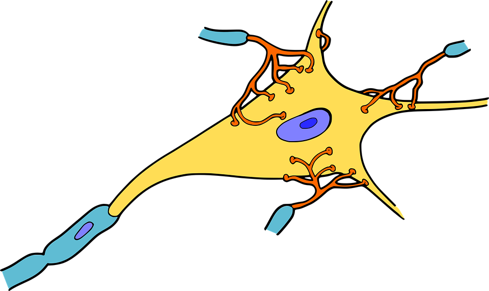

**Autor**: Valdivia, Sebastián Ricardo.

CC BY-NC-SA 4.0

Esta obra está bajo una Licencia Creative Commons Atribución-NoComercial-CompartirIgual 4.0 Internacional.

Versión Beta-03

Dedicado a todos aquellos que, ante cualquier dificultad, decidieron seguir aprendiendo.

## Prefacio

Cuando era niño, mi madre me pidió que estudiara, desde ese momento y por mucho tiempo más interpreté esa tarea como la de recordar las respuestas a un examen hasta aprobarlo. Una vez que cumplía mi obligación lo que sabía desaparecía. Luego en mi adolescencia tuve una asignación semestral llamada técnicas de estudio, en donde me instruyeron en leer, subrayar, releer y reescribir lo subrayado. En ese momento lo vi como una forma de poder aprobar con mejor nota y así fue, pero luego del examen volvía a olvidar, los hechos de historia pasaban a ser fechas sin sentido, las ecuaciones se transformaban en garabatos y los conceptos de mi lengua se transformaron en palabras odiosas que flotaban en mi memoria. Aún así aprobaba con muy buena calificación.

Fue cuando llegué a la universidad de ingeniería que entendí el daño. Recuerdo que los primeros exámenes eran solamente para que los profesores y yo conozcamos mi nivel de conocimientos. En cuanto leí esas preguntas recordaba que en algún momento las respondí, que hace años yo las sabía, ahora solo sentía cierta familiaridad, pero no conocía la respuesta. Obtuve un 20%. En cuanto empezaron a enseñar empeoró, debía poder comprender conceptos anteriores para poder superar exámenes, algo que nunca me interesó, ademas las técnicas de estudio que me enseñaron no funcionaban con el gran caudal de información con el que ahora lidiaba. A duras penas aprobaba y en cuanto alcancé al segundo año en donde se necesitaba recordar las nociones aprendidas para continuar, fracasé, todo lo aprendido el año anterior se me había olvidado.

Pensé que no era capaz, que nunca lo lograría, que era una cuestión biológica y que mi cerebro era inferior. Abandone la universidad. En ese momento parecía una perdida de tiempo. Cambie mis objetivos y empecé a trabajar como barista. Aún así mi curiosidad nunca se apagó, había cientos de cosas que deseaba aprender en especial programación. Con un poco del incentivo decidí sentarme por mi cuenta para conocer más sobre el área.

Con tropezones, errores y dificultades; programar empezó a tener sentido. No solo eso, empezaba a ver un patrón de cómo aprender. Comencé a ver tutoriales dinámicos que para enseñar tenían sitios web donde se enfocaban en poner manos a la obra en vez de enseñar definiciones o ideas complejas. Cuando vi una forma diferente de aprender sentí dentro mio una nueva curiosidad: ¿Cómo se aprende?

Emprendí el viaje de descubrir otras formas de estudiar. La primer tarea fue buscar información sobre como lograrlo. Guardaba artículos en internet, compraba libros que me interesaban (más de los que necesitaba), preguntaba a gente en línea, entre varias de otras cosas buscando descubrir lo que debía hacer. Experimentaba con lo que obtenía, en especial para poder aprender a programar, algunas intentos de aprender fallaban otros no. Continué puliendo mis habilidades de aprendizaje hasta que tome confianza y volví a intentar una institución educativa. Esta vez no fracasé. Cada año era más productivo, sabía incluso más que mis pares y hasta de algunos profesores. Todos consideraban que simplemente era "inteligente" o tenía mucha más voluntad o más tiempo, estaban equivocados, yo solo sabía estudiar correctamente.

Con el paso del tiempo note que mis habilidades de comprensión mejoraban. Ya me aburría estudiar un solo tema, iba a por dos o tres a la vez. Me instruía en programación, Lengua, carpintería, electricidad, electrónica, Matemáticas y muchas disiplinas más; varias de las cuales ni siquiera sabía porque las aprendía como con apicultura, horticultura, dibujo. Me era sencillo así y me gustaba así que seguía haciendolo.

Lo importante es que nunca dejé de aprender a aprender. Llegué hasta un punto que decidí juntar lo que sabía, lo que me enseñaron y descubrí por mi cuenta para poder ayudar a otro a alcanzar sus objetivos.

¿Por qué aprendemos? La gente relaciona aprender con el concepto de instituciones, títulos y trabajo. Nadie plantea hacerlo por uno mismo. Aprender nos enseña nuevos valores, desarrollan nuestra ética. Instruirse en nuevos oficios o hobbys nos hacen productivos, conocer de nuestra historia nos enseña a no cometer los mismos errores, etcétera. Aprender no nos convierte en alguien más inteligente, sino en una mejor persona.

Estudiar es un habilidad que se desarrolla en nosotros desde niños. Los bebes consiguen dar sus primeras palabras tras escuchar repetidas veces las voces de sus padres y de allí en más, durante el resto de su vida, todo lo que ve y experimenta pasa a su memoria. Irá al colegio y con tan solo observar a la maestra aprenderá nuevos conocimientos. Verá otros niños practicar un juego y aprenderá a jugarlo. Leerá un libro y recordará su trama. Este niño desarrollara diferentes maneras de aprender y retener información.

## Abstracto

En este libro analizaremos el aprendizaje, el *modus operandi* de nuestra mente para entender y memorizar la información con el objetivo de mejorar y poder extraer ese conocimiento de la forma más clara y organizada posible.

Hay varios métodos y sistemas complejos desarrollados por expertos que son utilizados para estimular la eficacia. Aprender es una tarea que conlleva algo más que simplemente leer, se necesita voluntad, estrategia, práctica y sabiduría. Recordar información es una tarea cíclica, llena de idas y vueltas para las cuales debemos estar preparados.

Una vez que aprendemos algo el cerebro se modifica igual cuando se moldea la arcilla. Lamentablemente esta increíble propiedad no viene sin inconvenientes. Como memorizamos algo podemos olvidarlo, no para siempre ni en poco tiempo, pero cumplidas las condiciones se puede llegar al caso. La solución: ¡Anotar!. Existen mecanismos simples y complejos, rápidos o detallados que sirven para transcribir información apropiadamente.

Si no crees que escribir sea lo indicado siempre puedes crear una visualización de la información de forma organizada y bien planeada. Diagramar requiere conocer a fondo como describir de forma explícita y organizada en un espacio en blanco. Aunque trazar líneas no es suficiente para armar un gráfico, se necesita un orden y ciertas reglas. 

> Este libro fue escrito con el objetivo de guiar un proyecto de software pero es independiente de él.

### ¿Qué es "tabula rasa"?

El término "tabula rasa" significa tabla en blanco. Proviene de la perspectiva filosófica de que todos nacemos sin conocimiento en nuestra mente, es decir que *esta en blanco* y aprendemos en el transcurso de nuestra vida. A medida que obtenemos nuevas experiencias escribimos en esa "tabla", es decir en nuestra memoria.

El nombre es en referencia a la tabla de cera romana, herramienta utilizada en el siglo IIX a.c. por los romanos para escribir. Esta podía ser moldada nuevamente con su lápiz, lo que permitía borrar lo escrito y volver a escribir encima. Al estar vacía, la tabla se denominaba "rasa" implicando que no hay nada escrito en ella. 

<div style="width: 700px; margin: 5px;">

  

  <figcaption style="font-size: 10px; text-align: center;">Tableta de cera romana</figcaption>

</div>

Los filósofos utilizaban esta expresión para representar el inicio de el aprendizaje desde el nacimiento según la teoría del empirismo (la cual mantiene que adquirimos nuestros conocimiento de la experiencia desde el momento en que nacemos). Aquí seremos partidarios de esta ideología, no cerraremos la puertas a nadie, lo que se explica es indiferente a de donde viene, cual es su situación, por qué quiere aprender u otra razón.

## Vista general

Escribiendo la tabula rasa es un nombre metafórico a los contenidos que cubriremos. Primero lo tomaremos figurativamente su significado y entenderemos el funcionamiento de la mente y como una persona consigue aprender. Tras el análisis metafórico lo tomaremos de forma literal y escribiremos la "tabla" dejando registro de nuestros conocimientos de forma tal que se puedan rememorar y/o ser interpretados por otras personas.

El texto esta dividido en tres partes principales que responde a las preguntas ¿Cómo funciona nuestro cerebro? ¿Cómo aprendemos y memorizamos sus conceptos? Y por último ¿Cómo volcamos y organizamos esta información?

En la primera parte trataremos a la biología de las neuronas. Entenderemos sus partes y como se conectan formado modelos mentales. Veremos lo que llamamos "atención" y la influencia de tener buenos hábitos de estudio.

En la segunda parte hablamos del estudio, la memorización y la recolección de información. Esta es un área amplia y compleja que depende de la aplicación de técnicas a lo largo de un proceso hasta comprender y relacionar los conceptos para luego retenerlos en la memoria. Todo esto tarda su tiempo y no se logra en una sola noche.

Por último se explica como volcar la información para poder ser reutilizada tanto por uno mismo como por otros. Se analiza la organización abstracta de la información, la correcta escritura y los diversos métodos para plasmar una idea.

Intenté escribir este libro de una forma más accesible, aún así puede costar entenderlo si no eres ávido en la lectura. Si no eres un experto o incluso si lo eres recuerda: intenta no perder la vista global. Mantén en mente los temas tratados anteriormente, vuelve a releer si es necesario. Entender las conexiones es muy importante para comprender el fundamento de secciones más avanzadas.

---

# A. Entendiendo la mente

El cerebro humano es el órgano más complicado del reino animal. Lleno de misterios que hasta el día de hoy se han esparcido entre diferentes disciplinas enfocadas en intentar descubrirlos. El trabajo de pensar es llevado por pequeñas y especiales células que trabajan en conjunto de forma estructurada y organizadas, como las abejas. Cada área de este dichoso órgano realiza una tarea muy especifica.

Pero ¿Por qué nos interesa saber esto? Aquí es donde se cocina el conocimiento. Entender como funciona nos hace entender como se maneja, cuales son sus limites, como es que piensa. Sin embargo no es el objetivo convertirnos en neurocientíficos, la gente puede conducir un vehículo sin ser un mecánico.

Veremos como esta compuesto el cerebro a nivel celular mientras va formando sistemas hasta formar algo más grande. Nos enfocaremos en un punto de vista más orgánico para luego comprender el funcionamiento de lo que trataremos en la segunda parte.

## A.1 ¿Cómo funciona el cerebro?

Lo primero que haremos para entender la mente es detallar el sistema neuronal que tenemos en nuestro cerebro para poder pensar, recordar y entender. Este peculiar órgano que se encuentra en la cabeza esta formado por varias partes que cumplen diversas funciones. Aún así no nos interesa conocer cada una, sino como es qué, unidos, pueden convertirse en la mente humana.

Antes de ir a lo biológico, usaremos, para aliviar la complejidad, una analogía que nos llevara a entender de otra forma las operaciones de nuestro cerebro.

### A.1.1 Una ciudad miniatura

Imagina la mente como una ciudad miniatura, microscópica, adentro de tu cabeza. Completa de personas, calles y edificios.

Estas personillas son tan diminutas que no pueden pensar mucho por si solas. A duras penas pueden retener una unidad mínima de información, un pequeño dato, algo como tan solo un numero del 0 al 9 o una letra. Son muy torpes pero pueden comunicarse entre ellas, haciendo que, en grupos, puedan formar una palabra o hasta una imagen.

En los edificios se amontona la gente formando *modelos mentales*. Estos modelos son ideas, conceptos que se forman creando conexiones con nociones que ya sabemos. Están siempre en desarrollo: en construcción, reparación o incluso derribándose, la ciudad esta en constante transformación, los modelos cambian de forma. 

Ya que la población es inmensa (aproximadamente miles de millones), suelen formar barrios para poder formar una idea concisa. Algunos de estos barrios se conectan entre si por calles y callejones relacionando modelos y haciendo otros más grandes y complejos.

En esta ciudad se puede llegar a cualquier lugar siempre y cuando estés orientado y conozcas el recorrido. Las calles que conectan la gran área urbana difieren, algunas son rápidas, construidas con cemento mientras que otras son rústicas y abandonadas lo que hace difícil circular. La intendencia es la responsable de estos caminos, cuando detecta que una calle es usada repetidamente decide mejorarla a pavimento para mejorar la circulación.  

Solo unos pocos con experiencia se pueden manejar a través de la metrópolis, cumpliendo las tareas de administrar los cambios, organizar los barrios, etcétera. Este trabajo es realizado por nuestro estados consiente e inconsciente, quienes cumplen con la tarea de razonar.

### A.1.2 Neuronas

Estas micro personas de las que hacemos referencias se llaman **neuronas**.

Las neuronas son pequeñas células que componen el cerebro humano. También se encuentran otras partes del cuerpo formando el sistema nervioso central. Existen miles de millones de ellas en cada uno de nosotros. La mayoría tienen trabajos de interpretar los sentidos (la vista, audición, tacto, gusto y el olfato) llevando la información desde el órgano hasta el cerebro. 

<div style="width: 800px; margin: 5px;">

  

  <figcaption style="font-size:10px; text-align: center;">Partes de una neurona</figcaption>

</div>

Tienen una forma particular, como se ve en la imagen. Estan compuestas por un cuerpo, brazos y pies. El cuerpo (2) también llamado soma (la parte ancha de la izquierda) contiene principalmente el núcleo (3) donde se almacena nuestro ADN. Las piernas o dendritas (1) son quienes reciben señales, están ubicadas alrededor del núcleo. Por último el axón (4) sale del centro y son los encargados de trasmitir la señal a las otras neuronas a través de los botones sinápticos. Teniendo en cuenta sus partes se nota que tienen un sistema para conversar entre ellas, a éste se lo denomina **sinapsis**.

Existen varios tipos de estas pequeñas células pero las que más nos importan son las que cumplen la tarea de "*pensar*".

### A.1.3 Sinapsis

La sinapsis es el espacio por donde se comunican las neuronas. Es un espacio diminuto, bien cerca de la próxima neurona pero sin llegan a tocarse. En este lugar es donde los botones del axón rodean a las dendritas. 

<div style="float: left; width: 350px; margin: 5px;">

  
  
  <figcaption style="font-size: 10px; text-align: center">Sinapse</figcaption>

</div>

Esta comunicación entre las personas de la que hablamos forma redes de neuronas que mantienen una "charla" constante entre ellas para formar los pensamientos a partir de impulsos eléctricos o químicos. Cuando una neurona busca conectar con la siguiente envía un impulso y la receptora lo envía a la siguiente y a la siguiente y a la siguiente ... hasta formar una *noción*.

Cuando un conjunto de neuronas se comunican de forma sincronizada entre sí forman un engrama. Podemos interpretarlo al igual que a una casa, edificio o departamento de nuestra pequeña ciudad. En este sitio, trabajando coordinadas, elaboran una pequeña unidad de información que puede ser usada para crear una memoria. Este vínculo es llevado a cabo en su totalidad por los impulsos enviados de una a otra.

Ya que normalmente un engrama no es suficientemente grande para formar un modelo completo o una memoria estas mantienen vías o caminos que se conectan a otros engramas en diferentes lugares. Estas vías son calles que unen los barrios, donde circula la energía y construyen una gran unión de neuronas trabajando en conjunto. En cuanto más actividad haya en esos caminos más fuerte sera el enlace, esto se llama consolidar que es cuando mejoran las calles, tarea la cual toma tiempo y recursos del cuerpo para llevarse a cabo. Estas vías de neuronas operan la memoria desde el hipocampo.

### A.1.4 Hipocampo

El hipocampo es una parte del cerebro donde se realiza la una parte importante de las tareas de memoria. Es llamado así por su semejanza con el pez hipocampo o caballito de mar. Este órgano vendría a ser la biblioteca de la ciudad.

Es el encargado de recordar hechos y eventos además de tareas de orientación. Posee gran cantidad de materia gris en donde los axones carecen de melina que la hace más lenta y capaz de procesar información. Por tener una estructura integrada por neuronas algo diferentes es considerado el sitio donde se suele "razonar". Por esto el hipocampo es un órgano importante para el razonamiento y la formación de los abstractos modelos mentales.

### A.1.5 Neuroplasticidad

Tal como la dinámica en nuestra ciudad miniatura, el cerebro esta en constante cambio, esta habilidad es llamada **neuroplasticidad**. Es el momento en donde se realizan las obras de construcción.

Esta característica establece que nuestro cerebro puede modificarse y crear nuevas conexiones entre neuronas. Por esto denominamos que la mente es reconstructiva y conlleva múltiples procesos para poder transformarse. 

Sin este atributo el cerebro sería algo programado de manera fija y sin alterar, como el de un insecto. Trabajaría siempre igual, realizando las mismas tareas primarias como comer o tal vez alguna que otra más compleja pero primordial y rutinario.

Este cambio no se realiza de un momento para el otro ni es extraordinario. Al igual que una planta desde el brote hasta el fruto lleva meses de trabajo. Y es durante la noche el momento donde más crece. Este cambio requiere de sanas costumbres las cuales descubriremos en A.4.1 (Salud mental).

## A.2 Memoria

¿Cuál es la mejor forma de adherir algo a tu mente? Esta es una pregunta complicada. No hay una simple forma, un solo truco, para recordar algo por siempre. Si nos ponemos a analizar todo lo que tenemos en la cabeza no tenemos recuerdos de nuestros primeros días de vida pero si de ayer, siempre y cuando no tengas ningún daño cerebral. Nada en la memoria es eterno, recuerda que siempre está cambiando, archivando lo viejo en el depósito de atrás, dejando lugar a lo nuevo y más requerido en el mostrador de adelante.

Pero ¿Te has dado cuenta que puedes recordar algo como el día de tu cumpleaños todo el tiempo y cada año? Si te sientas en este tema te darás cuenta de que pasa por estas razones:

1. Se repite a lo largo del tiempo.
2. Es un día importante.
3. Las fechas son fácil de recordar. Solo son unos números.

Rompe esta idea para descifrar el truco y veras el patrón: es recurrente, ligado a otros hechos y accesible. Esto será la llave para memorizar. Pero para averiguar cómo sucede primero debemos entender el funcionamiento de la memoria y sus partes.

Al hablar de memoria en general nos referimos al proceso mental de codificar, retener y recuperar información almacenada entre nuestras neuronas. Estas tareas son realizadas por sus partes. Para conocer tales partes podríamos comparar la memoria con una mochila de 2 bolsillos.

<div style="width: 800px; margin: 5px;">

  

  <figcaption style="font-size: 10px; text-align: center;">Mochila con 2 bolsillos</figcaption>

</div>

El primer bolsillo (1) es mucho más accesible, suficientemente pequeño para poder alcanzar su contenido con nuestra mano y recuperar fácilmente algo como la lapicera o un papel. Obviamente no hay mucho espacio, a duras penas podríamos colocar un anotador, para eso tenemos el otro bolsillo (2). Este hueco más grande permite colocar libros, carpetas, calendarios, hasta nuestras computadoras portátiles; llenas de información. El problema es que encontrar y recuperar algo de aquí requiere de una búsqueda algo más tediosa. Al igual que esta mochila la mente tiene estos 2 tipos de bolsillos.

La memoria opera en dos partes principales, además de una memoria que procesa los sentidos y retiene la información unos segundos. Estas son:

- Memoria o registro sensorial: Opera lo captado por los sentidos.

- Memoria de almacenamiento a **corto plazo**: La memoria de trabajo.

- Memoria de almacenamiento a **largo plazo**: Sistema de deposito de información.

Las que trabajaremos serán las dos últimas. 

### A.2.1 A corto plazo

Esta memoria es la ocupada de *trabajar o procesar la información*. Esta ubicada en la corteza pre-frontal justo encima de los ojos.

Normalmente tiene 4 *casillas* o espacios donde coloca la información. La cantidad varia de entre 3 a 9 espacios. Conste que tener menos no nos hace menos capaces, en cambio ayuda a la creatividad ya que dependemos formar relaciones con información en la memoria a largo plazo. Este método de crear relaciones es la manera de responder a preguntas complejas con tan poco espacio a en poco tiempo. Somos capaces de formar uniones con conocimientos ya adquiridos y procesar toda esta información en forma conjunta.

Al no concentrarse esta deja "caer" la información, olvidándose de ella. Toma alrededor de 10 a 15 segundos para descartar lo que sea que la este ocupando. Para evitar olvidar es necesario centrarse en ella. Se pueden usar métodos para mantenerla más tiempo. Si no se realiza ninguna actividad simplemente se perderá y sera necesario retomarla.

Un método que ayuda a mantener piezas de información activas por más tiempo en esta memoria son los bucles fonológicos o repetición de lo que intentamos recordar una y otra vez para mantenerla activa. Otro método es el viso-espacial donde se almacena información de forma visual, con imágenes ubicadas en un espacio. Estos procedimientos no sirven para archivar la información a largo plazo solo para mantener algo unos segundos más en la memoria de trabajo, los veremos con detalle más adelante.

### A.2.2 A largo plazo

En esta memoria se *guarda la información*, los conocimientos, los modelos mentales. El límite es inmenso, se puede acomodar gran cantidad durante el transcurso de nuestra vida. Aún así todo depende de la habilidad de retomarla, es decir, llevarla nuevamente a la memoria de trabajo para utilizarse. Esta práctica es importante mejorar nuestra recuperación de información.

Esta memoria, a diferencia de la otra, no tiene una ubicación exacta, esta dispersa por todo el cerebro pero se concentra en el hipocampo. Lo que lleva a pensar que la memoria utiliza gran cantidad de neuronas de la materia gris del cerebro. Cada pieza de materia gris forma un conjunto de enlaces de neuronas que hacen un recuerdo.

Para llevar algo de la memoria de trabajo a esta memoria de largo plazo debe superar 4 etapas las cuales son:

1. **Codificar**. En este paso el cerebro transforma los hechos o conceptos en modelos capaces de ser interpretados por el cerebro.

2. **Consolidar**. Una vez que se tienen los modelos se deben reforzar las conexiones entre neuronas hasta el próximo paso.

3. **Almacenar**. Una vez terminada la consolidación se termina de sentar los modelos en el cerebro tras unas horas, en las cuales el cerebro adapta las neuronas gracias a su plasticidad.

4. **Recuperar**. Esta etapa es algo obvia pero separada de las otras, consta en simplemente recobrar la información almacenada para darle uso.

Una ventaja para la consolidación es utilizar lo que ya conoces y relacionarlo con  nuevos conocimientos. Actúa como puntos de anclaje, al igual que un muelle, formando uniones y vías que los unen a los nuevos. Cuanto más de estos puntos uno tenga, más sencillo sera entender y memorizar nueva información. Es mejor estudiar pensando con una vista general más que intentar memorizar detalles.

El esfuerzo de recordar información ayuda a mejorar las conexiones de esta memoria. Ya sea ejercicios con o sin ayuda o claves para disparar los recuerdos, el realizar estas tareas ayuda en gran medida a fortalecer los engramas. Intentar recordar, sin observar lo que se busca, es una de las maneras más efectivas de mejorar la posición de la información a un sitio más accesible.

Una vez que se logró entender la información se comienza a consolidar, en esta etapa las neuronas comienzan a crear un engrama. Una vez finalizado el proceso queda almacenada, pero para mantener el engrama activo se requiere practicar la recuperación de tal información y así mantenerla activa. Si no le damos uso se olvidará.

#### A.2.2.1 Recordar

Esta tarea es lo que buscamos perfeccionar. Consta en encontrar la información correcta lo antes posible, lo cual no es tan sencillo.

La mente no trabaja de forma lineal, con esto nos referimos a que no comienza una búsqueda secuencial en una lista de recuerdos. Lo podemos ver como si tuvieramos un trozo de tela de un color que desconocemos y deseamos buscar en una lista de ellas cuál es, posiblemente iremos comparando uno por uno los colores de la lista hasta que coincidan. Esta metodología es lenta e inefectiva, si el cerebro realizara así la búsqueda tardaría horas, comparando con miles de memorias que almacena.

Para describir su método de búsqueda podemos verlo como que accede a cualquier parte de la "lista" buscando a partir de relaciones o clasificaciones que hacemos al aprender. Lo que hace es buscar asociaciones con temas más activos en la memoria a largo plazo. En caso de no poder lograrlo se da por olvidado.

La mejor forma de mejorar nuestra habilidad de recordar es con la práctica. El esfuerzo de recuperar la información hace que las neuronas estén más activas. Cuanto más intentemos recordar más hábiles seremos en hacerlo, más adelante en B.4 (Memorizando), veremos técnicas y ejercicios para memorizar en base a esta teoría.

#### A.2.2.2 Olvidar

Olvidar o fallar en recuperar información que conlleva muchas formas de afectarnos. A los que normalmente se refiere esta palabra es a la falla o la inhabilidad de poder recordar la información que en algún momento pasó por todas las etapas listadas anteriormente en A.2.2 (A largo plazo). Esto se puede dar, principalmente por falta de utilización de estos recursos o por factores biológicos (enfermedades como alzheimer afectan de esta forma a la memoria a largo plazo).

El efecto de olvidar no es instantáneo, se va desarrollando durante un período de tiempo. Revisar y poner en practica una memoria en intervalos ayuda a mantener activa a las neuronas que mantienen la información. La solución es administrar el tiempo donde revisamos para evitar olvidar, algo que veremos en A.4.3 (Disciplina)

### A.2.3 Chunking

*Chunking* es el procedimiento de la memoria de trabajo para vincularse con la de largo plazo. Lo que hace es formar conexiones con información almacenada formando *chunks*, al igual que usa los puntos de anclaje para almacenar, y así poder procesarla. Un chunk son varias **piezas de información que se agrupan para tener un uso**.

Con esta técnica logramos manipular grandes cantidades de datos conectados en nuestra mente. Ya que solo tenemos alrededor de 4 espacios útiles en la memoria de trabajo nos limita a la cantidad de información que podemos tener en cuenta en el momento de pensar. Por suerte la evolución del cerebro humano adquirió la posibilidad de tener en cuenta un contexto de información almacenado entre ambas memorias. El objetivo de formar chunks es poder memorizar algo sin necesidad de recordar cada detalle.

Formar un chunk no es algo tan sencillo. Al comenzar a armar un chunk se requiere concentración pasando solo en lo que tenemos en nuestras manos. Tras tener el material en la memoria de trabajo, nos alejamos de él así logramos verlo desde otra perspectiva. Con repetición y práctica espaciada podemos afianzar los conceptos en su totalidad.

La memoria juega un papel importante en como se relaciona la información, es necesario conocerla para entender su funcionamiento. Juntas ambas memorias consiguen gestionar complejos caudales de información, lo que nos permite entender y razonar. El ir cambiando entre perspectivas nos deja en la próxima parte.

## A.3 Pensar

El pensar o razonan consta en utilizar todos nuestros conocimientos para poder establecer relaciones con el entorno y **sacar una conclusión**. Obtener esta conclusión es lo que lidera el escalafón de operaciones para alcanzar a lo que denominamos inteligencia. Su finalidad es poder obtener una noción o tomar una decisión de manera correcta o lo más cerca posible. Es importante porque permite formar y comprender modelos mentales apreciando información desde nuestra experiencia.

La experiencia se forma al **relacionar y procesar hechos almacenados en la memoria a largo plazo**. Cuando de pequeños, mientras aprendemos a caminar, nos caemos y lastimamos hacemos uso de la razón para entender que la consecuencia negativa, el dolor, fue a causa de la caída. Desde esta reflexión que guardamos en la memoria, formamos todas las relaciones que se forman a partir de tal experiencia, por ejemplo al caerse nos golpeamos y los golpes duelen. Con el tiempo si intentamos aprender a andar en bicicleta, hacemos uso de la misma experiencia, caernos dolerá - hay que evitar caerse. Alcanzar esta conclusión no requiere de caerse para darse cuenta, sino de los hechos similares que ya ocurrieron y existen en nuestra memoria. Hasta ahora vimos ejemplos básicos pero razonar es capaz de ser realizado con complejas unidades de información. La mente puede procesar experiencias y así hacer juicio para entender los hechos, tan solo requiere analizar relaciones basadas en conocimientos alocados en la memoria.

Al tener datos de diversos orígenes, como de modalidad física o abstracta, y al no encontrar relaciones por no tener memorias más frescas, requerimos de un mayor esfuerzo. Este esfuerzo se crea por la suma de recordar libremente y asociar de varias maneras los conocimientos hasta obtener una conclusión. Esta actividad puede llevar tiempo en donde la mente esta trabajando para encontrar un **sentido**, en donde busca percibir su funcionalidad o significado por intuición.

Esta actividad humana no es constante desde el nacimiento, **es una habilidad que se aprende, se desarrolla; cuya destreza requiere de entrenamiento**. Es algo que todos los animales poseen en diferentes niveles, fue el ser humano quien a logrado llevarla lo más lejos posible. De ella dependemos para comprender lo que estudiamos, cuanto mejor sea nuestro razonamiento más efectivo será el estudio.

El trabajo de procesar la información adquirida esta relacionado con el nivel de predisposición que tenemos al realizar esta tarea. Tanto con un alto o bajo nivel, concentrado o no, estamos trabajando de la misma manera pero de dos formas diferentes. Una forma de verlo es como un cambio de una perspectiva más cerrada a una más abierta pero ¿A qué nos referimos con esas perspectivas? Existen dos modos de razonar, **enfocado y difuso**. Aunque parezca que solo el primero sea el efectivo, la realidad es que ambos son igual de importantes para poder estudiar de forma efectiva. Vamos a verlos por separados.

### A.3.1 Modo enfocado

El primer modo de pensar es enfocado o concentrado. Este debe de ser el más obvio, lo reconocemos al instante. Nos damos cuenta gracias que al utilizarlo, estamos procesando la información con toda nuestra conciencia, gastando más energía.

Al estar enfocado, las experiencias y conocimientos de los que hacemos uso, están activas. Durante este momento la información a utilizar esta ubicada en toda (o casi toda) la memoria de trabajo, unida a memorias archivadas. Estamos razonando sobre ella, buscando nuevas relaciones, significados, interrogantes. Aunque solo hacemos uso de esta y solo esta información, como grupo cerrado y no con una perspectiva más abierta. Estamos limitados aunque conseguimos llegar a una mayor profundidad.

Estar enfocado requiere de un esfuerzo en evadir las distracciones del entorno lo que influye sobre la capacidad de mantener el estado de enfoque. Requerimos de empeño para permanecer en este modo, lo que llamamos **mantener la atención**.

#### A.3.1.1 Atención

Al hablar de atención hacemos referencia a el proceso cognitivo de seleccionar información y concentrarse en ella para ser procesada por nuestra mente. Por definición es centrarse en un solo estimulo o sitio específico y la habilidad de mantenerse en estos. Cuando prestamos atención lo que hacemos es seleccionar la información que buscamos procesar y poner nuestra capacidad cognitiva a merced de esta tarea. Se aplica en las cuatro ranuras disponibles de la memoria de trabajo, además tenemos tres o más ranuras adicionales que están preparadas.

Variables del entorno tienen el potencial de afectar la atención ya sea positiva o negativamente, pueden ayudarnos a mantenernos enfocados en el material o sacarnos de estos para darle atención a otras cosas. Estas variables pueden ser sonidos, imágenes, movimientos por nombrar algunas. Los colores son un crudo ejemplo de variable tanto positiva como negativa, si en un texto vemos las palabras claves destacadas en rojo mantenemos atención sobre el texto, en cambio si tuviéramos docenas de dibujos coloridos alrededor del texto estos nos llamarían más la atención, separándonos de la lectura. Es importante manejar las variables para que estén del lado positivo de la balanza, ayudando y no distrayendo.

Una variable más sutil es el reto mental al que nos desafía el material, dependiendo del nivel de dificultad la atención varía. Si tratamos con un material muy complicado y fuera de nuestro alcance, no entendiendo gran parte de lo tratado será imposible concentrarse. Igualmente, un material que es fácil y/o ya conocemos es posible que también perdamos un poco de atención ya que el cerebro no necesita trabajar 100%. Lo ideal es mantenerse a un ritmo de trabajo que requiera un esfuerzo, con un material arduo pero no inalcanzable.

#### A.3.1.2 Cargas cognitivas

Las cargas cognitivas hacen referencia a cuánto demanda el material de estudio a la memoria de trabajo. Es como llamaremos a la unidad de medida para mensurar el esfuerzo mental requerido para interpretar el material. Cuanto mayor sea la carga cognitiva mayor sera el nivel de concentración requerido. Si buscamos facilitar el estudio de cualquier tema (para uno mismo o para otros) es necesario tener en cuenta en cual será la carga que nos presente.

Lo que más afecta a la carga es la presentación del material. Según que tan difícil o complejo sea este y cuanto más difícilmente sea presentado aumentara su carga. Por ende la carga del material puede ser afectada por dos partes: intrínseca (que tan fácil o difícil es el material) o extrínseca (que tan sencillo es presentado). La carga intrínseca idónea esta a un nivel intermedio entre fácil y difícil para poder mantener nuestra atención en el trabajo. Por otro lado la carga extrínseca es mejor cuan más sencilla sea. Conocer el tipo de nivel al que nos enfrentamos nos hace conocer el nivel de esfuerzo que requeriremos y, con algo de experiencia, calcular el tiempo que llevará aprenderlo.

Otra carga que también afecta a la atención es la perceptiva, la cual esta pegada a la atención. A diferencia de la cognitiva que hace uso de la mente, la perceptiva usa los sentidos para centrarse. Los sonidos, las imágenes, entre otras; afectan a nuestro nivel de concentración. Cuanto más distracciones haya, mayor la carga perceptual. Obviamente reducir todo lo que afecte a la atención ayudará a mantenerse concentrado.

### A.3.2 Modo difuso

El segundo modo de pensar es lo opuesto a estar enfocado. En este modo la mente se desliza en los pensamientos, eliminando ideas concretas y dejando que fluyan nuevas de cualquier tipo. Aquí no estamos concentrados en nada en particular, dejamos que las distracciones nos lleven y que la mente haga lo que quiera, o mejor dicho, necesite.

En este estado de pensamiento se construyen mejor las relaciones con otros conocimientos. Durante el modo difuso "jugamos" con los conceptos, moviéndolos e intentado juntarlos con otros, formando analogías y desarmándolos para ver como están formados. Esto permite que nuestra creatividad tome parte en el estudio.

Aunque pensemos que estamos perdiendo el tiempo, el cerebro sigue trabajando el problema. Muchas veces sentimos culpa, una emoción negativa, por entrar en este modo, creyendo que es holgazanear lo cual no es cierto. Las emociones negativas si afectan al rendimiento. Naturalmente estudiar requiere en una buena parte de estar enfocado, pero debemos recordar que salir de este también es fundamental para alinear las ideas y progresar.

Entrar en el modo difuso permite al cerebro explorar más alternativas. Ponemos en juego la creatividad y nuestro saber en su completud, algo que requerirá muchísimo esfuerzo en el modo enfocado. Llegar al modo difuso no cuesta nada, es algo natural, incluso sucede sin que lo busquemos.

#### A.3.2.1 Divagar

Es común sentir que pensamientos que vienen desde dentro nuestro invadan nuestra atención y nos lleven a divagar. Al llegar a este punto la mente entra en modo difuso, sin que uno lo busque voluntariamente. Suele suceder de forma autónoma y aunque la práctica de concentración ayude a prevenir divagar es inevitable.

Todos tenemos ese problema de perder el enfoque en lo que estamos trabajando por culpa que la mente parece cambiar de asunto. Aunque parezca algo tedioso y poco efectivo es una forma que tiene el cerebro de pedir una pausa ya que la mente se cansa, es decir agota su energía de concentración. Cuántas veces ha pasado que incluso con la mayor determinación no podemos centrarnos en el texto que estamos leyendo, nos esforzarmos tanto que causa dolor de cabeza. Al igual que un motor, la mente humana necesita "enfriarse" tras un ciclo de trabajo. Si utilizamos nuestra energía durante mucho tiempo solo conseguiremos fatigarnos al punto que no somos eficientes. Esta es la razón por la que pasar toda una noche estudiando para el examen de día siguiente es en vano, menos sirve para aprender a largo plazo.

Esas distracciones que nos separan del estudio son la señal de que estamos cansados. Tampoco es necesario interpretar esas señales para darse cuenta, nosotros mismos solemos pensar en qué tan agotados estamos. Llegado al punto, el paso a seguir es tomar un descanso y aprovechar para tomar cuidado de nosotros, la mente seguirá trabajando a su manera.

Cuanto más estudiemos más tiempo lograremos mantener el ritmo. Podemos interpretarlo al igual que el entranamiento para correr una maratón, alcanzar los primeros 5 kilómetros llevará práctica, aprendizaje y cada día hay que lograr alcanzar unos metros más lejos. El único modo de superarse es ir periodicamente esforzandose un poco más, alcanzando un mejor resultado.

## A.4 Estado psíquico

En este final de la primera parte hablemos del bienestar de la mente. Cierto mito entre los estudiantes de todos los niveles cree que cansarse y agotar la mente es habitual, parte de la cultura estudiantil. Esto es falso, lo podemos comprobar, durante un día nos esforzamos y en otro nos tomamos el tiempo necesario para evitar agotarnos, recordaremos y comprenderemos más en el segundo caso. No importa cuánta información se haya acaparado, el cerebro humano tiene un límite y, al igual que un musculo, para crecer necesita descansar de tanto en tanto.

El estrés es uno de los peores enemigos del aprendizaje. Es cierto que en la vida siempre existirán situaciones que nos pongan al límite, especialmente en lo laboral o lo personal. Durante el estudio es el momento donde uno debe aplicar lo que sabe y lo que aprenderá será de los resultados. Cuando estudiamos sin parar para un examen ¿Sabes cual es el momento donde todo lo que tenemos fresco en la memoria pasa a fundirse en la memoria a largo plazo? En el examen en si. En cuanto leemos la pregunta y buscamos la repuesta en nuestra mente, la información pasa a relacionarse con el evento, usamos la habilidad de recordar y de interpretar lo que provoca la memorización de la información. Si fallamos en el examen, aprenderemos del error, y sabremos más para la próxima vez, tal vez más que quienes lo superaron en el primero intento. No existen perdedores en el estudio, los únicos que pierden serán los que no lo intentan.

### A.4.1 Salud mental

El cerebro es un órgano y, al igual que cualquier otro, requiere de cuidados. Pero no es un órgano convencional, tiene algunos cuidados especiales que solo este requiere. Estos son los cuidados emocionales. El aprendizaje requiere de un estado alegre y motivado para ser llevado a cabo. En este texto no profundizaremos sobre estos estados que afectan al estudio.

Las emociones negativas y el estrés son un gran problema. El bienestar emocional afecta el rendimiento del pensar. Estados dañinos que afecten al pensamiento, como la depresión, aumentan la dificultad de concentrarse, haciendo que estudiar sea imposible. La conducta de uno cambiará dependiendo de como se sienta, si se esta mal la energía virará y se pondrá contra el viento, lo que no ayudará a sentarse en el escritorio. Por estas dificultades aprender requiere de un estado anímico positivo.

Controlar estos problemas es primordial para estudiar efectivamente. Los problemas personales tienen su propio origen y no están en la meta de este libro, sin embargo la preocupación y estrés causado por el estudio merecen una mención. La realidad es que la cultura de instituciones académicas y la sociedad ha creado una demanda al alumnado que provoca ansiedad. La necesidad de obtener altas calificaciones y realizar proyectos de gran magnitud y en poco tiempo esta (parcialmente) presente, con un ida y vuelta de culpa entre el alumnado y el docente. En el aprender la exigencia no existe, la instauración de los requisitos para aprobar no forma parte del proceso, son independientes uno del otro, no aprobar no significa que no hayas aprendido. Tenemos que abandonar la mentalidad de aprender para ser evaluados y hacerlo para mejorarse a si mismo.

Al igual de como tomamos cuidado de la salud mental la salud física esta estrechamente relacionada con la mente. El cerebro depende del cuerpo para sobrevivir. Una dieta equilibrada afecta la buena circulación de sangre y a la energía que tenemos. Comer variado ayuda a mantener metabolismo más sano, haciendo que la mente trabaje en mejores condiciones. Obviamente no podemos obviar un factor más que es la actividad física, en donde se libera hormonas, dejándonos más activos y contentos. El bienestar del cuerpo a largo plazo disminuye la decadencia por la edad, impidiendo la muerte de neuronas con el paso del tiempo. El cerebro forma parte del cuerpo, cuidar de uno es cuidar del otro.

Lo último y quizás más importante para tener en cuenta en la prosperidad del aprendizaje es el sueño. Al dormir nuestra mente cambia y solidifica los conocimientos aprendidos, recuerdemos que posee la propiedad de neuroplasticidad. Imaginemos que una persona de la ciudad miniatura necesita renovar su departamento ¿En qué horario lo podría hacer si esta trabajando durante todo el día? Durante el sueño es cuando las neuronas aprovechan para renovar, tras una sesión de estudio y una buena noche de sueño las espinas de las dendritas crecen para fortalecer los vínculos entre neuronas. Otro factor que encontramos durante las horas de operación (mientras estamos despiertos), en el cerebro se van generando toxinas de residuos del cerebro que van quedando entre las neuronas, durante el sueño son eliminados, limpiando el órgano de ellas. Por estas razones dormir es el momento en donde finalizamos el ciclo del aprendizaje, sin el sueño nunca podríamos llegar a término.

### A.4.2 Estímulos

Gozar de buena salud tal vez no sea todo lo necesario para sentirse energizado. Además de los energizantes naturales como el ejercicio, el deseo de completar los objetivos propios también provocan energía. Algunos factores vienen desde la conciencia de la mente que afectan a la fuerza de voluntad a la hora de sentarse a estudiar. Estos son los incentivos que nos provocan la curiosidad que aprender satisface. 

El cosquilleo de la intriga desencadena la voluntad de aprender. Este afán de descubrir es la fuente de energía, lo que alimenta a la determinación de recorrer libros, artículos y otros textos en busca de la respuesta a ¿Qué es? Y ¿Cómo lo aprendo? Son estas las preguntas que guían al aprendizaje pero ahora queremos saber por qué las hacemos.

#### A.4.2.1 Motivación e interés

Trabajar en un proyecto o estudiar un *tema que nos identifica* da una sensación que nos hace avanzar y mantener el esfuerzo en él, esta sensación es el **interés**. Ver algo sin interés y creer que no nos beneficia quita la energía. Es como tener que cavar un pozo sin razón, nos fastidia, pero si lo hacemos para plantar un árbol le da sentido, utilidad. Al despertar este interés en un proyecto desarrollamos una atracción hacia la temática. Comenzamos a plantear objetivos, organizar, investigar, entrar en contacto con otras personas relacionadas a la materia. Participamos activamente. Esta participación mejora el rendimiento y envía las experiencias obtenidas a la memoria. Es importante antes de sentarse a estudiar tener en cuenta qué hace el tema interesante para ti. 

Estar emocionalmente conectado con el estudio, genera excitación dejándonos alerta físico y mentalmente. Esto nos da deseos, ganas de estudiar o realizar un proyecto. Esta **energía es la motivación**. Esta misma excitación afecta directamente a la concentración, las emociones positivas y la energía con la que tackleamos el trabajo. La motivación hace de velas a nuestro velero que usamos para aprender.

La **inspiración** es una importante herramienta para encender la motivación. Estar inspirado consta en tener creatividad y/o fuerza de voluntad para continuar. A diferencia del interés la inspiración no proviene del interior sino de factores externos que disparan una reacción en la mente. Estos factores varían de tipo pueden ser **personales** como metas cumplidas, trabajos realizados, valores; o pueden ser **externos** como logros de personalidades, frases, obras de referencia y muchas más. Estos factores también pueden hacer relaciones entre soluciones de los problemas que enfrentamos y otros que ya sucedieron, mostrándonos el camino a seguir. Por esto la función de la inspiración es importante porque no es solo motivar, además ayuda a enfrentar dificultades con ingenio.

Aunque las ventajas que traen son muchas la motivación se puede perder si no mantenemos el impulso generado. El interés decae con el tiempo, el ser humano siempre anhela cosas nuevas y llamativas, los niños abandonan el juguete que tienen en la mano al ver uno nuevo. Al perder el impulso es cuando los pensamientos de desertar asoman.

#### A.4.2.2 Procrastinación

Por si es la primera vez que te encuentras con esta palabra básicamente significa: *dejar las cosas para más tarde*. Muchas veces los estudiantes evaden el trabajo de su proyectos o el estudio debido a procrastinar. Dejar todo para el último día no permite a las neuronas a desarrollarse para asentar los nuevos conocimientos. Por consiguiente es necesario esquivar, de forma u otra, la procrastinación. 

La solución no es torturarse para producir lo más posible. Si trabajamos hasta agobiarnos el cerebro verá el estudio al igual que al fuego, piensa que si lo tocas te quemas, pues ya lo ha hecho de cierta forma. Ten en cuenta que abrumarse afectará nuestra salud mental, trayendo nuevos problemas por su cuenta. El resultado final podrá llegar a ser el abandono completo del aprendizaje y el fracaso de nuestros objetivos.

Para evitar desbordarse de trabajo el estudio se debe realizar en etapas dispersadas en el tiempo y, aunque la voluntad es importante, para cumplir se necesita algo más ella.

### A.4.3 Disciplina

La disciplina crea un **ritmo de trabajo constante**. Es la persistencia lo que lleva al corredor a terminar la maratón, continuando sin importar lo que suceda y lo mejor que pueda. Francamente construir disciplina no es una tarea simple. Lleva tiempo, organización y empeño. Por esta vez estará bien ser obsecuente, será necesario para desarrollar la rutina que necesitamos. Adquirir una tenaz disciplina personal para realizar las asignaturas diarias tendrá su lucro. Sin embargo establecer este ritmo es como empujar una roca hasta una pendiente, si bien llevarla hasta el borde cuesta, una vez que este en bajada se moverá por si sola, en cambio, trabajar sin disciplina es un camino lleno de curvas y agujeros, difícil de atravesar.

Cada cosa que aprememos es una victoria para uno mismo y no para otros, somos los dueños de nuestra propia mente. Tomar la labor de transformase en alguien disciplinado es siempre para beneficio propio. Es verdad que ser disciplinado es un atributo visto tanto de forma saludable como esclavizante, dependerá de cuales son los valores de quien lo analice. Aún así como sea señalado no cambia el hecho de que su utilidad es ampliamente beneficiosa en el estudio.

Una vez decididos a erigir una rutina de estudio, debemos tener en cuenta que no se hace de un día para el otro. Conlleva de cumplir con ciertos objetivos hasta que tenga inercia propia. Estas tareas van a formar un **hábito** que será un eslabón en la cadena de la persistencia.

#### A.4.3.1 Hábito de estudio

Un hábito es una **rutina o práctica realizada regularmente** o de forma automática. La idea detrás de construir el hábito de estudiar es promover la recurrencia con la que retomamos el sujeto de estudio, ya dijimos que los métodos más efectivos de estudio (que veremos más adelante) incluyen la repetición espaciada en el tiempo. Además mantener la energía con solo la motivación e interés no es una estrategia práctica, suelen ser inconsistentes. Tener el hábito de aprender y repasar todos los días de forma inconsciente es un método ideal para lidiar con los problemas que trae el esfuerzo de estudiar.

El proceso de desarrollar un nuevo hábito conlleva en crear un ciclo de **señal, deseo, respuesta y recompensa**. En principio se da una señal o un disparador que despierta el deseo de realizar la acción. Durante la etapa inicial el deseo será originado por voluntad que más tarde va a ser reemplazada por querer la recompensa. Tras esto se dispara la respuesta que es la reacción de realizar la tarea. Por último, y no menos importante, se provee la recompensa. Finalizar el trabajo requiere de darnos una recompensa, es importante para que no relacione el trabajo a algo sin frutos.

El disparador o señal debe ser claro y llamativo, debe ser lo más cómoda posible, si no lo evitaremos. Si tenemos que formar un hábito para estudiar coloca el libro en un lugar donde lo veas o pon esa tesis en la mitad del escritorio de tu computadora para que atraiga rápidamente tu atención. No es solo una llamada de memoria sino una señal para poner manos a la obra. Existe la regla de los 20 segundos que plantea: si se tarda más de 20 segundos en completar intentaremos evadirlo haciéndolo contra productivo.

La idea de generar una señal proviene del condicionamiento clásico de Iván Pávlov donde un estímulo como sentarse se transforma en un disparador que, tras ser condicionado, relacionamos con una recompensa. Un sonido de alarma puede significar que vamos a recibir algo que buscamos, con el tiempo veremos la alarma como señal de compensación. Las recompensas positivas jugaran una pieza clave en la formación de hábitos. Por otro lado la ley del efecto de Edward Thorndike demuestra que nuestro accionar puede ser modificado según sus consecuencias. Si las consecuencias son positivas y somos recompensados con un refuerzo positivo por lo realizado, es más probable que se vuelva a realizar. En cambio si no son recompensadas no se volverá a repetir, por esta razón la recompensa es muy importante. Formar un hábito consta en hacer que la tarea sea *visible y atractiva* gracias a que inconscientemente buscamos que sea recompensada de forma inmediata. 

Las recompensas son subjetivas. Normalmente son actividades que uno relaciona con la felicidad. Buenas recompensas para la mente son momentos de descanso y relajación en donde desempeñamos una labor de poca o sin dificultad la cual nos guste. Algunos ejemplos podrían ser tomar un café, leer un libro, tocar un instrumento, meditar; por nombrar algunos casos que pueden ser viables y gratificantes. Cada uno deberá descubrir sus óptimas y singulares recompensas, las cuales no deben exigir de energía, en cambio la debería restaurar.

Lo último son los malos hábitos, los que debemos erradicar. Si el objetivo es eliminar un mal hábito solo hay que hacer lo opuesto a lo planteado en los párrafos anteriores. Debemos buscar todo lo opuesto que para lograr formar uno. Escondemos lo que nos lleva a hacerlo o lo dejamos fuera de nuestro alcance. Debe ser difícil e incomodo de realizar. Una vez más recordemos la regla de los 20 segundos, si iniciar esa tarea lleva más de 20 segundos de a poco se irá evitando. No se debe recibir una recompensa por completarlo, en cambio otorgamos un refuerzo negativo, algo que no nos guste. Eliminar los malos hábitos es una táctica que podemos utilizar para eliminar disparadores que llevan a procrastinar.

#### A.4.3.2 Intervalos

Como ya se vio A.3.2.1 (Divagar) el cerebro se cansa de estar concentrado. El estar mucho tiempo enfocado en el material de estudio prueba ser poco eficiente. Lo ideal es **tomar pausas para recuperar la energía**. Trabajar en intervalos puede solucionar este problema.

Utilizar intervalos para trabajar es un método para evitar agotarse de forma permanente. El objetivo es darle descanso a la mente, tales como se los da a un músculo para evitar la fatiga. Esto consta de mantener ciclos de trabajo controlados, porque continúan hasta cierto punto donde se frena la actividad antes de llegar a dejarnos exhaustos. Tras cada ciclo la mente tiene un descanso donde se le permite divagar. Aparte, los descansos son buenos momentos para estirar las piernas o moverse un poco, lo que estimula al cerebro y beneficia la salud del cuerpo. Por supuesto los ciclos de trabajo no están pensados para durar para siempre, eventualmente habrá que dormir para finalizar el estudio. Al principio puede que no se llegue a realizar durante mucho tiempo pero con dedicación se puede alcanzar a mejorar.

Si bien la idea de intervalos es bastante sencilla y podrían ser improvisados, una técnica conocida es la pomodoro. Es tan simple como armar intervalos de tiempo de trabajo (normalmente de 25 minutos) y tras completarlos, realizar una corta pausa de 5 a 15 minutos, según cuantos intervalos se hayan realizado. Puede ser controlada con cualquier reloj o un temporizador. 

#### A.4.3.3 Horarios

Programar los horarios es nuestra estrategia para obtener disciplina y organizar el estudio. La programación consta en planificar con anterioridad, los días y las horas de trabajo, cuándo se llevará a cabo el estudio. El tiempo dependerá de la capacidad propia más el volumen de información a procesar por cada intervalo.

<div style="float: right; width: 350px; margin: 5px;">

  

  <figcaption style="font-size: 10px; text-align: center;">Ordenamiento de un calendario</figcaption>

</div>

La herramienta principal es el **calendario**, nos permitirá saber que sucedió en el pasado y donde se debe llegar en el futuro. Su uso consta en anotar los días que trabajamos, los temas y el tiempo estimado que nos tomará. En él marcaremos los **objetivos diarios** a cumplir, estos son mínimos y dinámicos, pueden cambiar de lugar pasándose a otra fecha o lo que realizaremos durante cierto día. Las **metas periódicas** son objetivos a largo o corto plazo, es donde queremos llegar. Estas metas están formadas por un conjunto de objetivos diarios que están relacionados y planeados para estudiar un tema. Dividir el estudio en metas y objetivos le da un orden lógico en donde vamos controlando la evolución de los conceptos iniciales a los más avanzados, evitando saturarnos de información por no tener los conocimientos requeridos para afrontarla.

Una vez que tengamos suficientes registros de la evolución del estudio nos ayudará a evaluarnos para poder ser más precisos al calcular el tiempo estimado que tardamos en aprender. Con los días marcados mediremos la velocidad en la que logramos estudiar en conceptos por día. La unidad que substituye a la distancia será los modelos mentales construidos en un día, conceptos que logramos entender y archivar en la memoria. Inicialmente éstos serán entre dos o tres modelos al día pero con la practica la velocidad aumentará comprendiendo más en menos tiempo.

Lo ideal es mantener los horarios lo más flexible posible. La flexibilidad permite cubrir inconvenientes que afecten a la programación. Es buena práctica calcular tiempo demás por si algún horario planteado fue afectado y se debe reponer o si hay que añadir más conceptos que no formaron parte de la medición inicial. Estos tiempos se marcan como días comodín, normalmente dentro de los últimos días antes de llegar a la meta, en donde se estudian los conceptos faltantes y se repasa los ya memorizados. Los comodines son un sistema adaptable para reservar tiempo que se pueda necesitar.

Una última tarea en la manipulación de los calendarios es no alejar los tiempos de trabajos para no perder el ritmo. Como vimos en A.4.2.1 (Motivación e interés), los temas se pueden enfriar y la mente empieza a procrastinar. Los tiempos de trabajo son algo que se puede visualizar en un calendario, si notamos varios días de ocio es probable que durante estos se pierda interés, a estos prolongados descansos es mejor suprimirlos a dos o tres días y no más.

## A.5 Conclusión parte A

Durante esta sección buscamos entender como trabaja la mente al pensar. Primero vimos como está compuesta desde un punto de vista biológico, sus células y como se agrupan hasta formar sistemas más complejos. De lo orgánico pasamos a ver su mecanismo abstracto para recordar: sus tipos de memoria. Conocimos la memoria de trabajo donde se procesa la información recientemente adquirida o recuperada del otro tipo de memoria: a largo plazo en donde se archiva la información y se relacionan entre ellas para formar teoremas lógicos, a través del razonamiento.

Entendimos que el procesamiento de la información puede ser afectado por la carga cognitiva que tenga tal información que afectará la concentración. Al perder concentración no estamos trabajando de forma enfocada pero seguimos su procesamiento de forma difusa formando relaciones con otros conceptos en la mente.

Toda estas tareas son afectadas por las emociones, las cuales alteran la capacidad y energía de la mente al estudiar. Nuestros sentimientos e interés hacia lo que aprendemos resalta en la motivación, de tal forma que ayuda a evitar divagar y perder el vigor con el cual estudiamos. Tal pérdida se va realizando en el tiempo pero puede ser evitado manteniendo un plan de trabajo, para no perder la voluntad de continuar la comprensión y memorización los temas tratados.

El funcionamiento de la mente es esencial para plantear las maneras más efectivas de aprender, las etapas y los métodos más eficientes. Lo que vimos en este capítulo marcara el origen de lo teoremas planteados en la próxima sección.

---

# B. Aprendiendo

¿A qué consideramos aprender? Aprender es el **proceso** en el cual adquirimos nuevos conocimientos o habilidades, ya sean intelectuales o motoras. Algunos ejemplos pueden ser: recordar quien fue emperador romano en el siglo I d.c., cómo se utiliza un taladro, la forma de solucionar un problema matemático, etcétera. Este proceso requiere de poner a trabajar la mente, esto significa ser capaz de buscar, entender, relacionar conceptos y archivarlos en la memoria de largo plazo. Durante esta sección buscaremos demostrar los métodos que ayudan a realizar esta tarea.

<div style="float: left; width: 350px; margin: 5px;">

  

  <figcaption style="font-size: 10px; text-align: center;">Evolución de conceptos</figcaption>


</div>

Todo aprendizaje lleva su tiempo y es progresivo. La información pasará de estar a penas distinguible a cada vez más clara, por la razón de que las neuronas están formando nuevas conexiones, construyendo las casas y los edificios de la ciudad miniatura. En cada sesión hacemos diminutos pasos que van incrementando hasta que forman diminutos conceptos para luego poder interpretar complejas nociones. En cuanto podemos ver la imagen en grande, en vez de sus partes separadas, hemos logrado construir un modelo mental.

El aprender tiene dos fases: primero colocamos la nueva información en la memoria de trabajo, donde la comprendemos y procesamos así se codifica acorde a cómo lo requiere la mente, luego se almacena en la memoria de largo plazo en forma de modelos mentales. Al principio el trabajo parece sencillo, lo único que debemos hacer es leer, escuchar y analizar el material de estudio para llevarlo a la mente. Es el próximo paso aquel que trae dificultades. Desde el momento en donde nos chocamos con información desconocida empezamos a intentar darle sentido. Tardará un tiempo (quizás minutos, quizás meses) en poder comprenderse, lo que normalmente depende de cuanta familiaridad tenemos con el área. 

Estos modelos mentales de los que hablamos desde A.1.1 (Una ciudad miniatura) son una representación del razonamiento. Es, desde un punto de vista hipotético, el mecanismo que tenemos de pensar, ordenar y darle sentido a algo complejo juntando pequeñas piezas de datos. Estos modelos dan forma a nuestra mente en como percibimos, decidimos, reflexionamos, entre otras formas de comportamiento. En cuantos más modelos mejor entendemos nueva información gracias a tener más referencias.

**Aprender es una tarea que se aprende**. Cuando alguien estudia un tema investiga, toma notas, memoriza o cumple otra tarea del aprendizaje con el objetivo directo de poder conocer el tema; a la vez e indirectamente nos instruimos en las tareas que realizamos para lograrlo (en este caso investigar, tomar notas y recuperar información). A medida que más aprendemos mejor seremos comprendiendo y memorizando nueva información. Aprender es una habilidad y como cualquier otra requiere de práctica.

## B.1 Acercándose a nueva información

Veamos la primera etapa: introducir un nuevos conceptos.

Para poder entender qué es la información primero debemos preguntarnos: ¿Cómo se forma la información? La definición que utilizaremos de información sera **un conjunto de datos organizados de forma tal que sea de utilidad**. Los *datos* son la mínima unidad, pueden ser hechos, objetos, números, etcétera; por su cuenta son inútiles, deben ser agrupados de forma tal que tengan sentido. Esta agrupación, por su parte, no es aleatoria, los datos poseen una relación que los une. Una fecha a recordar esta compuesta por los números del día y mes ademas de la razón por qué ser recordado. En la imagen vemos los datos uniéndose para formar una mínima pieza de información en este ejemplo cuando es el día internacional de la mujer.

<div style="width: 500px; margin: 5px;">

  

  <figcaption style="font-size: 10px; text-align: center;">Datos formando el día internacional de la mujer</figcaption>

</div>

Los datos pueden ser conectados con conocimiento que ya conocemos. Al aprender algo es importante hacer conexiones entre lo que estamos aprendiendo y lo que ya sabemos. Las cosas que ya conocemos actúan como **puntos de anclaje** y cuanto más de ellos tengamos más fácil será comprender nueva información.

### B.1.1 Preguntas antes de empezar

Veremos un pequeño cuestionario para antes de comenzar el estudio de un nuevo tema, esto sirve para descubrir los objetivos propios (personales o de una organización) para luego preparar la planificación del proyecto de estudio. Seguiremos los interrogativos con el ejemplo de aprender una sencilla receta de pan. Intenta pensar por un segundo cual sería la respuesta antes de leer la resolución, pueden ser diferentes o iguales ya que podemos, o no, tener los mismos objetivos y/o diferentes formas de acceder a la receta.

- **¿Qué beneficios tiene esto para ti?**

La primer pregunta plantea reconocer nuestro objetivo antes de empezar. Esta es una pregunta que influye en el interés. Reconocer la utilidad de un tema genera emociones que influyen en nuestra energía al momento de estudiar.

Cuales serían los beneficios de que aprendas una receta de pan: uno podría ser ahorrarse dinero en la compra de pan o porque disfruta de cocinar. Estas razones serán personales.

- **¿Qué herramientas o materiales de estudio necesitas?**

La próxima parte es descubrir cuales son los requerimientos necesarios para poder estudiar. Si queremos aprender carpintería necesitaremos tanto madera y herramientas como información para poder realizar el trabajo. Conocer sobre como manipular el material de estudio es lo que denominamos estar capacitado para estudiar.

Cuales son las herramientas o materiales de estudio requeridos para hacer conocer la forma de preparar pan: la receta (lista de ingredientes y la forma de preparación) e instrucciones de uso de electrodomésticos requeridos. Si listaste los ingredientes y utensilios al responder recuerda que nos enfocamos en aprender a hacer pan, no en hacerlo. Podríamos exceptuar si quisieras aprender a hacerlo a través de la experimentación lo cual no es muy buena idea en este caso, pero en otras situaciones puede ser un proceso más ventajoso.

**¿Dónde se puede acceder al material de estudio?**

La información puede estar dispersa entre varios sitios. En esta etapa debemos descubrir los lugares tanto físicos como digitales de donde extraeremos la información y poder determinar la valides de esta información.

En nuestro caso podríamos listar la búsqueda en sitios web, libros y revistas de cocina o consultarle a un cocinero profesional.

**¿Qué esperas aprender del tema?**

Toma una lista señalada por viñetas lo que se quiere obtener del material. Cada ítem representa un objetivo de un tema para aprender, éstos incluyen un campo abierto a todo lo que consideraremos nueva experiencias adquiridas durante el proceso, no solo a la meta final de aprender.

Hagamos una lista de lo que esperamos aprender de una receta de pan:

- Conocer los ingredientes del pan.
- Aprender a preparar nuestro propio alimento.
- Interpretar una receta.
- Comparar diferentes formas de cocinar.

En esta pequeña lista vemos que de aprender una receta, obtenemos varios conocimientos de forma colateral. Al emprender el aprendizaje de cualquier cosa es bueno fijarse no solo la meta final sino también todo lo que conoceremos y practicaremos durante el proceso.

**¿Qué otras consideraciones y obstáculos existen? ¿Cómo se superan tales obstáculos?**

Nada es fácil. El recorrido esta lleno de altos y bajos que cambian la velocidad en la que vamos adquiriendo información. Los obstáculos más recurrentes e importantes que resaltan durante la recolección de información son la ausencia de tal y la existencia de información fraudulenta. Otro problema común es la existencia de variedades de la misma información, en especial en asuntos que han sido investigados durante siglos y han evolucionado. Lo que encontramos puede estar desactualizado o carecer de una evaluación desde un punto de vista más actual.

Digamos que encontramos varias recetas. Algunas de estas recetas describen los pasos para realizar pan en horno de barro, el cual no poseemos, estas recetas no nos sirven. Al igual que si nos chocamos con recetas de variedades de panes tales como los de harina integral, estas recetas tampoco son las que buscamos. Un último ejemplo son las recetas que, sin importar sus razones, son erróneas e inservibles, ya veremos de qué se trata esto más adelante, estas recetas aparecerán durante la investigación y no serán de utilidad, por ende deben ser descartadas.

Superar obstáculos de esta índole depende de comprender tanto el objetivo de la investigación y de conocer el contexto de la información y los lugares de su apropiada recuperación. Teniendo en cuenta estos parámetros podremos administrar los datos que recopilamos para amparar un resultado exacto y no generar (sin intención) desinformación.

### B.1.2 Investigación

El proceso de investigación consta en **encontrar y evaluar información** para luego poder extraer los conocimientos que yacen en ella. Es una etapa crucial, si el resultado es negativo obtenemos información incorrecta lo que significa que todo lo que saquemos de esta información es erróneo. Necesitamos conocer como detectar recursos completos o incompletos, falsos, desactualizados, imparciales o fuera del propósito de la investigación; para así evitar desencadenar una serie de errores en las próximas etapas del aprendizaje.

Antes de poder aprender de un tema es necesario haber indagado e interiorizado suficiente sobre él. La cantidad necesaria de información es siempre cuanta se pueda tratar en el periodo de tiempo asignado a esta etapa. Al iniciar el proceso de aprender algo se designa un tiempo para recopilar y revisar la información que se utilizará. En los primeros momentos, y en especial si es un tema nuevo, se agrupa todos los recursos a los que podamos acceder. Uno no necesita, especialmente gracias a la red, obtener la información de unas pocas fuentes, podemos recopilar gran caudal en poco tiempo relacionando títulos, género y metadatos, algo que veremos en C.4.3 ("Descripción de recursos o metadatos"). Por último se irá filtrando los materiales relevantes para la investigación y los que no lo son o se repiten.

Es ideal siempre investigar con un **propósito en mente**. Al tener claro lo que es necesario obtener, la búsqueda de cierta información es más veloz y la extracción más efectiva. Mucha información puede de ser recortada apropiadamente, con métodos que veremos en B.2 (Extrayendo información), hasta obtener solo lo que uno necesita. Si carecemos de propósito no sabremos qué ni cómo reducir la información a solo las piezas que se requiere y juntaremos material que en parte nos es inútil.

Esta etapa es ardua. Es importante tomarse el tiempo para leer y entender el material lo que desata bastante actividad mental. Cansa recibir nuevos conceptos, los cuales debemos analizar y comprender para poder avanzar. El agotamiento es más común en esta etapa que en las siguientes y, al ser solo el comienzo, lleva a abandonar sin temor de perder considerable progreso. Por otra parte si esta etapa es aligerada podemos cometer errores comunes tales como no analizar el contexto, evaluar la fuente o utilizar información desactualizada.

#### B.1.2.1 Contexto

Un recurso tiene una importante propiedad que es el contexto en la cual yace. Al hablar de contexto de la información hablamos de las **características que rodean a un texto** o cualquier otro medio informativo condicionando su mensaje. De tal implicación variará el sentido y el objetivo del recurso. 

Una de las características es el **origen temporal**, es el momento en donde fue generada tal información. No será lo mismo un mapa mundial antes del descubrimiento del continente de América comparado con uno actual. La información evoluciona y con ella cambia el contexto en la cual es desarrollada. Al ir cambiando, las versiones anteriores van quedando obsoletas y, dependiendo la volatilidad del tema, pueden convertirse en inutilizables. La profundidad a la que intentamos llegar con la investigación determinara si las versiones anteriores sirven, por ejemplo si intentamos estudiar el progreso de cierta disciplina. En la mayoría de los casos el material antiguo a de ser desestimado.

La próxima característica a la que prestamos atención es el **origen geopolítico**, de donde proviene. Estos datos suelen servir para deducir la fiabilidad del recurso. Dependiendo del lugar de donde provenga, puede proveer cierto grado de preferencia hacía una postura. Suele ser de importancia para asuntos de una índole política, que durante el momento de publicación o durante la redacción, los hechos sufrían de censura o solo se permitían autores que respaldaban a una persona o ideología. También es trascendente en casos en donde se desconoce la acreditación de la institución que publica y respalda el material. Analizar el lugar de proveniencia ayuda a detectar posibles defectos o malversaciones en la información.

Otro factor que se encuentra al observar el contexto es la **fiabilidad** de la narración de los hechos por parte de los observadores. Muchas veces los datos recopilados de testimonios pueden estar alterados por los testigos, lo que lleva a obtener una versión errónea de lo que ha sucedido. En este contexto los sonidos u objetos pueden obstaculizar a los espectadores cambiando su perspectiva de lo que sucedió. Supongamos que un objeto cayó por varios metros y se intenta descubrir quien lo arrojó, un testigo que escuchaba la radio dice haber oído una voz, pero ¿Era de quién lo lanzó o del locutor? Inconvenientes en el contexto distorsionan la investigación y deben ser desestimados.

Una parte de los datos que buscamos sobre el contexto se encuentran en el **paratexto**. Todas las partes que acompañan a un libro u otro escrito forman parte del paratexto. Estas rodean al texto con información adicional sobre el contenido. Normalmente tienen el objetivo de convencer al lector a recorrer sus páginas. Algunos componentes del paratexto son la contratapa, el indice, el prólogo, datos de impresión, etcétera. De estas secciones podemos obtener un indicio de la temática y conocer sobre el contexto que puede no estar citado en su contenido.

Investigar el contexto de donde proviene la información no solo sirve para detectar posibles errores cometidos accidentalmente por los autores. En el contexto podemos descifrar si la información tiene un origen que ponga en duda su contenido, siendo esta desinformar y engañar ocultando o malversando la realidad de los hechos.

#### B.1.2.2 Desinformación

Algo con los que nos chocaremos en una investigación son falacias, estudios mal realizados y estadísticas incorrectas; hechos sin evidencia. Un autor va a reivindicar un hecho, pero porque una persona por si sola haga una declaración no la hace verdad. Un ejemplo es decir que "el emperador romano aureliano no usaba corona", esta oración declara un hecho, hacerlo no lo hace cierto. Los hechos van a ser afectados por la parcialidad del autor, sus principios o creencias. Depende de la veracidad de la evidencia y la aprobación general para poder valuar lo que dice como verdadero. 

Tanto los rumores y las experiencias personales (de individuos no profesionales) suelen no ser buen recurso de información. Si bien pueden no estar erradas, la información obtenida de esta forma puede haber sido casualidad y no esta respaldada por una evaluación lógica. Un claro caso que respalda esta teoría es la de mitos urbanos, en los cuales la sociedad cree por cierta razón que algo sucede o funciona sin indagar si es verdad, en la mayoría de los casos son simplemente mitos. Este tipo de información sin aval de un estudio adecuadamente realizado es **desinformación** o **falsa información**.

Veamos dos ejemplos de información informal que fallan a ser admitidas:

- Un estudiante asegura que reescribir el texto es la mejor estrategia para memorizar porque a él le sirve. La premisa no puede ser aprobada como cierta, solo por la evidencia de un sujeto. 

- Un horticultor cuenta que sus manzanos generan una media de 20 frutos cada uno y afirma que esos árboles dan siempre esa cantidad. No evalúa los factores de la edad de los árboles, la región, la variedad, clima, etcétera; esto es un estudio mal realizado, en donde los datos recolectados no reflejan la realidad de los manzanos en otras partes del mundo.

No existen reglas que funcionen al 100% para detectar desinformación. Hoy en día con la gran cantidad de información que existe, incluso para el más experimentado, es bastante difícil separar falacia de verdades. En algunas ocasiones podemos incluso descartar información veraz. Sin embargo se pueden listar consejos generales para detectar engaños.

1. Verificar la fuente: controlar la veracidad del sitio web o el editorial. Muchos patrocinadores son conocidos por beneficiarse de información fraudulenta.

2. Buscar más reportes del mismo tipo: cualquier información pionera esta acompañada de varios sitios que comunican lo mismo.

3. Evalúar la evidencia: se revisa que las estadísticas y otros datos tomados hayan sido recolectados y evaluados apropiadamente.

4. Investigar al autor: al igual que en el paso 1 controlamos que el autor no sea imparcial y tenga la competencia para hablar del tema.

5. Comentarios y reseñas: la gente que encuentra incoherencia en el material suele dejarlo en claro. Aún así en muchos casos puede ser imparcial por varios motivos.

6. Propia intuición: debemos buscar contradicciones, evaluar la calidad de la escritura, el uso de elementos llamativos y ser neutral a nuestras convicciones.

Se debe tener en cuenta el tipo de origen de la información. Este puede ser **directo o indirecto**. Los directos son originados de las mismas fuentes que hacen los estudios y dan su aseveración. Aquellos de naturaleza indirecta son interpretaciones de terceros, los cuales son capaces de publicar su opinión y modificar la información en base a su parcialidad. Suponiendo que las fuentes directas son veraces, el relato dado por otros puede afectar la validez de los datos o el significado de las conclusiones obtenidas. Tampoco es que las fuentes indirectas sean incorrectas, en muchos casos suelen ser convenientes por mejorar la accesibilidad o acoplar con otros estudios. Siempre debemos inspeccionar el artículo hasta llegar a las fuentes directas para verificar la fiabilidad de la información.

Es importante ver el alcance de las declaraciones. Es diferente decir que algo *es* a decir que *puede ser*, los autores suelen utilizar palabras como capaz, tal vez, es posible, entre otros sinónimos; para determinar que su declaración no es completamente segura. No significa que su suposición sea incorrecta, solo que intentan demostrar que posiblemente estén equivocados o cerca de la verdad.

Por último, una forma de reconocer si cierta información es falsa es la de evaluar las vistas opositoras, en estas puede estar la razón por la que cierto hecho es falso o una aproximación mejorada a la realidad. Para localizar estas opiniones buscamos acceso a comentarios y reseñas del material. A veces están en el mismo lugar de donde las sacamos o son fáciles de localizar usando buscador por citaciones. Las revisiones de otros profesionales, ya estén a favor o en contra las declaraciones, sirven para re-evaluar la objetividad del material y sus posibles falencias.

### B.1.3 Lectura

El texto es un método de comunicación, como todo tipo de comunicación consta en un mensaje que a travez de un medio llega a un receptor. Al leer nos encontramos con dos actores un anunciador (quien emite el mensaje) y un destinatario (los que lo recibimos). El anunciador es quien da un enunciado, su planteo de como ve o entiende un concepto y posee la autoridad para poder hablar de tema. Mientras leemos estamos recibiendo el mensaje de un anunciador, que deja plasmado en letras (el medio) para que nosotros podamos interpretar, tarea la cual haremos incapié.

La lectura de un texto es una tarea cognitiva. Esta va evolucionando a medida que continuamos con la lectura del texto, en donde vamos de hipótesis a hipótesis, respondiendo cada una a medida que adquirimos nueva información.

Cuando mencionamos lectura en este contexto hacemos referencia a la **lectura activa**, esta es lectura acompañada por la constante interacción con el texto. Se pueden ver dos formas de leer, una es la de simplemente seguir con la vista palabra por palabra de forma deliberada y general. La otra consta de analizar y evaluar el texto, buscando interpretar la información e integrarla a nuestra memoria. 

Leer, en un ámbito académico, tiene como objetivo aprender la información del material con el que estamos trabajando. En la primeras etapas, cuando la información entra por los ojos es enviada a la memoria de trabajo para ser procesada relacionándoce con modelos mentales ya incorporados. Esta tarea contrae una dilación que lleva segundos o minutos, dependiendo de la carga cognitiva que posea el texto, en donde le da sentido a lo que menciona. En casos de mucha dificultad, donde no estamos familiarizados con el material, es necesario la releer junto a la búsqueda de definiciones o analogías que simplifican lo que se esta hablando.

Con tan solo leer no concluye el trabajo. Tras tener una percepción de lo que significa el material podemos pasar a la etapa de memorizar. Aprender no es solamente comprender lo que dice un texto, también consta poder recordar el concepto. Tenemos que llevar lo que acabamos de entender a la memoria de largo plazo. Veremos sobre como realizar ésto más adelante. 

En la actualidad adquirir la información también puede ser realizado no solo por la lectura textual sino por el uso de imágenes estáticas o animadas. Podríamos cambiar leer palabras por escucharlas o ver videos. Esto puede ser confuso por el encabezado pero las mismas condiciones de lectura activa se puede aplicar a información publicada en formato multimedia.

#### B.1.3.1 Análisis

La información que debemos aprender se ha de criticar. Cabe recordar que criticar no es sinónimo de negatividad. Criticar hace referencia a evaluar el contenido del texto de forma neutral, imparcial. El objetivo es encontrar falencias en él, descubrir su objetividad y resolver si es útil para nuestra investigación.

Para poder analizar un texto se sigue un proceso de interpretación-evaluación-decisión. Interpretaremos el punto de vista del autor y lo que pretende decir, junto al contexto donde se encuentre; no será lo mismo el resultado de criticar a los descubrimientos de un físico en el siglo XIX a los de alguien en XXI. Tendremos en cuenta nuestra si nuestra posición es correcta ¿Entendimos cuál es el problema planteado? ¿Cuál es la idea central? Seguido evaluaremos lo que dice, comparándolo con lo que ya sabemos y otras fuentes. Revisaremos si el orden en como se presenta el problema es correcto, en el caso de estar desordenado puede significar una señal de falta de conocimiento de parte del autor. Veremos si lo que dice esta respaldado por evidencia, si esta es valida y real. Por último decidiremos si es correcto o no y si es de utilidad en relación nuestra investigación.

Una vez terminada la lectura más su análisis pasamos a la próxima etapa en el proceso de aprender. A partir de ahora nos centraremos en separar lo importante (lo que queremos aprender) de lo secundario o complementario.

## B.2 Extrayendo información relevante

Supongamos que tenemos una pila de libros, artículos y otras fuentes de información sobre nuestro escritorio, todo nuestro material de estudio, pero ¿Es necesario memorizar todo ese contenido? La realidad es que gran mayoría de esos recursos puede ser resumido en menos de unas hojas. La razón detrás de tal abundancia es debido a que los autores intentan explicar, ejemplificar, diagramar entre algunas formas de mostrar lo que intentan enseñar, lo cual es importante, aunque amplía el volumen de información alrededor de el tema principal. Los conceptos que buscamos normalmente se pueden extraer en muchas menos palabras con el objetivo de facilitar la memorización de los mismos. En este capítulo exploraremos los métodos para poder **separar y resumir** que buscamos de lo demás.

Poseer grandes cantidades de información no significa que estemos informados. Los autores y nosotros no siempre tenemos los mismos objetivos, así que no todo lo que escriben no es útil en su plenitud. El exceso solo consigue incrementar pesadez del estudio por culpa de repetición de datos o hechos, en especial en la actualidad donde, con los grandes caudales de información, lo obtenido es más de lo que podemos necesitar y muchas veces redundante. La extracción es una tarea que también se encarga de eliminar información prescindible. Instruirse en esta habilidad de separar lo significativo de lo que no se a convertido en una aptitud indispensable en el aprendizaje. 

El primer paso a tener en cuenta es *¿Qué es lo que esperas del material?* Al terminar de hacer un análisis del texto nos debemos preguntar cual es la idea general presentada, de que forma está presentada y por qué interesa. Con la meta clara podemos identificar la información que buscamos para luego extraerla. Nos preparamos para lo que estamos a punto de estudiar. Nos preguntamos por qué debemos aprenderlo, ésto ayudará a mantener la postura mientras nos sumergimos decenas de horas en el material de estudio. A continuación leemos los encabezados dados por el autor, analizamos la estructura del texto y como la información es presentada. Nunca se debe perder el sentido de orientación mientras se estudia, hay que tener en cuenta de donde venimos y a hacia donde vamos.

La destreza de poder extraer lo importante esta medida por tres habilidades. La primera es la **eliminar** todo tipo de información redundante o repetida y de datos triviales. La segunda es la de poder **resumir** el material de estudio en una oración o pequeño párrafo. Por último tenemos la habilidad de **reemplazar** listas de elementos, imágenes o conceptos por una solo término. El poder afianzar estas habilidades garantiza que se ha identificado lo importante del texto, con la práctica dará lugar para mejorar y ser mejor realizando estas tareas.

### B.2.1 Estrategias de selección

Capturar lo importante consta en separar todo aquello que identificamos como relevante. La intuición juega un importante papel para la extracción, esta se forma al reconocer lo que buscamos, una vez que detectamos en el material lo que necesitamos aprender pasamos a *seleccionarlo*. El objetivo de seleccionar es poder **destacar aquella información que se busca extraer** (y aprender) para poder manipularla luego. 

Suponiendo que queremos aprender de un vídeo instructivo como se levanta una pared y considerando que ya conocemos que son los ladrillos y como se utilizan las herramientas, buscaremos descubrir cuales son los otros materiales y pasos a seguir. Descartaremos la explicación sobre que es un ladrillo y la del manejo de las herramientas. No toda la información provista es necesaria y parte de la etapa de selección consta en descartar lo que no es necesario. Esto sigue la postura de no repetir. Lo que ya conocemos no tenemos necesidad de volver aprender, al extraer buscamos lo que nos interesa y no lo que el autor del contenido cree interesante.

No es exactamente obligatorio utilizar estos mecanismos antes de la próxima etapa pero son herramientas de apoyo que ayudan al aprendizaje. El uso de estas estrategias es de pre-separar información reescribiéndola o señalándola para facilitar y ordenar la extracción. Una vez que tenemos la información importante disponible es más fácil ordenarla para formar notas concisas u otros compendios de información. Además realizar esta tarea complementa la lectura activa lo que suma a las actividades cognitivas que realizamos para aprender.

Listaremos las estrategias más conocidas, usadas y comunes; pero no son las únicas. Hay una gran variedad de formas de extraer información que, en gran mayoría, heredan de las siguientes.

#### B.2.1.1 Resumir

Resumir es sinónimo de reducir. Al hablar de resumir un texto decimos que llevaremos ese texto a un **menor tamaño** y en más **concisas palabras**. Lo que buscamos **lograr es extraer la idea central** del texto expresada claramente. Eliminaremos expresiones y ejemplos que son auxiliares para la explicación. Para lograr esto se supone que ya hemos comprendido el argumento del texto, el objetivo de un resumen es de especificar para uno mismo la teoría que se desea aprender.

Normalmente lo resumido es suficiente información para aprender algo. Este contenido ha de ser llevado a la memoria y debido a su diferencia de volumen con el material original es más sencillo recordarlo o rellerlo.

Aúnque nos centremos en el producto final la misma tarea de resumir en sí es importante. Es tanto un trabajo que contribuye el aprender como de herramienta para memorizar, pues se debe haber comprendido el tema para poder cumplir la labor de reducir su significado.

La actividad de resumir un recurso puede ser observada en 3 pasos generalizados, los cuales son:

1. Primero leeremos el texto y reflexionaremos sobre el tema tratado. Este paso consta en cumplir con la etapa de la lectura activa cubierta en B.1.3 (Lectura) y haber comprendido el/los concepto/s del texto.
2. Seguido identificaremos la ideas que son de importancia a nuestro estudio. Durante esta etapa nos centraremos en localizar lo que nos es de mayor interés, lo que queremos aprender de este recurso. Disociaremos los conceptos menos importantes de los primarios y los llevaremos a la próxima etapa.
3. Para finalizar, transcribiremos los conceptos a nuestras propias palabras. La tercera etapa es la más importante. Extraer palabra por palabra como lo dijo el autor (incluso cuando lo ha dejado perfectamente en claro) pierde la garantía de estar expresado al igual que el modelo que se formo en la mente. El cerebro forma relaciones entre neuronas, alineando conceptos con otros que tiene a su disposición y estas pueden ser diferentes a las del autor. Por lo tanto lo mejor es expresar la idea al igual que como la explicariamos con nuestra propia terminología.

#### B.2.1.2 Resaltar

Tanto subrayar como técnicas semejantes de resaltar tienen el objetivo de hacer **énfasis** en el texto. Es común, como en este libro, de ver resaltado palabras o frases de lo que se desea que el lector preste atención. Al igual que el autor, podemos resaltar las partes del texto que nos son de importancia para poder dejar registro de los conceptos e ideas importante que encontramos mientras leemos. Cumplir esta tarea también mejora nuestra atención, ya que estamos interactuando con el texto y manteniendo una lectura activa.

Existen varios tipos de formas de resaltar. La más básica y sencilla es <u>subrayar</u> que es tan simple como pasar una línea por debajo del texto, siendo suficiente para destacar una palabra u oración. La siguiente es utilizar un color diferente al de fondo y de las letras para destacar, <span style="background-color: yellow;">al igual que esta línea</span>. Las últimas que cabe mencionar se forman con un pequeño cambio al "peso" o grosor de la tipografía, llevándola a una forma más pesada conocida como **negrita**, o a más liviana e inclinada llamada *itálica*. Todas son extremadamente similares y poseen las mismas propiedades, a la hora de decidir solo se tiene en cuenta herramientas a mano y preferencia personal. 

Resaltar tiene la posibilidad de utilizar colores para diferenciar. La finalidad de cambiar de color permite categorizar lo que se esta resaltando, por ejemplo verde para asuntos de biología y naranja para matemáticas, útil cuando el material posee varios aspectos. Ademas de diferenciar por temática se puede utilizar colores para crear niveles de importancia en donde algo en rojo significa muy importante y verde menos importante. Cuantos más colores dispongamos más variado y complejo podemos designar su uso, pero cualquiera sea este uso es necesario dejar indicio o referencia de su significado.

Demasiados puntos importantes resaltados no es efectivo. Lo recomendado es tener que destacar alrededor de un 10%. Si destacamos todo lo que encontramos se perderá el sentido de extraer, hacinedo que sea inconvencional. En el caso de encontrarnos con una página completa de información sustancial podemos marcarla para luego volver a ella, pero esta técnica es para recortar los puntos más importantes de ella. El resaltar no tiene como objetivo guardar información sino destacar lo importante.

La realidad es que tan solo resaltar no sirve para extraer la información, dependemos de reescribirla más tarde para no perderla. El problema es cómo, el método más efectivo que veremos serán las notas.

#### B.2.1.3 Encabezar

Ya estamos familiarizados con los encabezados dados por los autores (que ya trataremos en C.1.4.3 (Títulos)) pero también los podemos poner mientras extraemos la información. Es una estrategia menos común con el objetivo de aclarar la estructura del texto reflejado en lo que buscamos.

Un encabezado **encapsula la idea de lo que se esta tratando** para ubicar a la mente. Al igual que los títulos los encabezados son un tipo de señal de organización que hace énfasis en el tema central del texto. Pueden ser lo mismo que un título, aunque estos no tiene la necesidad de hablar sobre lo que trata, muchas veces autores dan títulos llamativos que tienen la finalidad de atraer atención y no encapsular la idea central, además puede que sus palabras no sean tan claras como las propias. Por ende es preferible usar encabezados propios.

La actividad de colocar encabezados obliga a razonar y decir en cortas palabras de qué trata el texto, lo cual es una labor cognitiva que ayuda a memorizar y comprender los conceptos tratados. Por esta razón, ir detallando nuestros propios encabezados es también parte de una lectura activa.

Una vez transcritos, los encabezados se puedes utilizar para armar un esquema del texto. Los esquemas se forman dejando los encabezados en orden lineal con sus subtemas adheridos en forma de matriz. Armar nuestro propio esquema del texto facilita encontrar la información que nos es importante y obtener una vista general.

A parte de los esquemas, podemos hablar de los organizadores gráficos que son más parecidos a los mapas conceptuales que veremos en C.2.1.2 (Mapas conceptuales). A diferencia de los esquemas, los organizadores gráficos no son lineales y no dependen de ninguna grilla. Normalmente están formados de las palabras claves conectadas entre ellas mientras mantienen un orden espacial (de arriba hacia abajo o de izquierda a derecha).

<div style="float: right; width: 500px; margin: 5px;">

  

  <figcaption style="font-size: 10px; text-align: center;">Esquema versus organizador gráfico</figcaption>


</div>

#### B.2.1.4 Comparar

La próxima estrategia son las comparaciones con otros conceptos ¿Por qué comparar? Hacer comparaciones ayuda a desarrollar un mejor entendimiento del material encontrando *elementos en común* con otros temas que ya conocemos. Es similar a como trabaja la mente con grandes cantidades de información, anclando conceptos con otros, ya sean iguales u opuestos.

Para lograr hacer comparaciones se busca tanto similitudes como diferencias. Normalmente se encuentran más naturalmente las diferencias entre dos cosas, aún así, la mente puede agrupar según conceptos parecidos, así le es más sencillo memorizar. Es importante definir lo que hace a ambas partes comparables entre ellas, tanto sean igualdades o diferencias.

Las **analogías, metáforas y similitudes** son herramientas usadas para comparar complejos conceptos con otros más simples. Son una excelente estrategia de comprensión y ayuda para la memoria. Veremos una por una para comprender las diferencias entre ellas.

##### B.2.1.4.1 Analogías

Analogías son un tipo de comparación basada de dos objetos o ideas diferentes. Demuestran una igualdad abstracta. Estas utilizan la palabra "como" (o sinónimos) para demostrar la relación y, opcionalmente, la palabra "porque" para explicarla. La comparación no tiene que ser algo similar sino que, al analizarse, cumplen funcionalidades similares; esto hace a las analogías diferentes a las similitudes.

Ejemplos: Los neumáticos son como las piernas para los humanos porque ambos se mueven, encontrar mi lápiz es como encontrar una aguja en un pajar porque es casi imposible.

##### B.2.1.4.2 Similitudes

En esta práctica buscamos cosas que se parezcan para compararlas. A diferencia de una analogía aquí los dos objetos o ideas son actualmente parecidos. Es útil en casos donde uno se conoce pero el otro no. 

Ejemplos: un bolígrafo es como un lápiz porque ambos escriben, una parrilla es como un horno porque ambos cocinan.

##### B.2.1.4.3 Metáforas

Las metáforas es cuando nombramos a algo haciendo referencia a otra cosa. Sencillamente las armamos utilizando el verbo ser conjugado en tercera persona del singular del presente de indicativo ("es"), para unir el objeto real con su igualdad imaginaria. Lo que se desea es hacer una mera comparación retórica que demuestra una semejanza entre las 2 ideas, en donde ambas, son muy diferentes, guardan cierta relación que las asocian.

Ejemplos: la vida es un juego, el tiempo es oro.

### B.2.2 Toma de notas

Cuando hablamos de notas hacemos referencia a **anotaciones sobre el material de estudio** con el que estamos trabajando. Estas anotaciones personales son informales y personales, están orientadas a ayudar a la memoria de quien las toma y no tienen la obligación de ser comprendidas por un tercero.

El objetivo de las notas es poder extraer la información que nos es más importante, codificada de forma natural a nuestro entendimiento y organizarlas para poder retomarlas luego y trabajar con ellas. Su uso en el estudio es efectivo solo si parafraseamos su significado a uno propio, eliminamos información trivial o redundante y dejamos en claro sobre qué se esta hablando.

El poder abstraer la información de forma clara y concisa requiere de práctica y preparación. El ejercitar el hábito de tomar notas mejora la producción de las mismas, ayudando a separar lo importante para poder luego poder trasncirbirlas de forma más explícita, como en un artículo. Confeccionar complejos compendios de información a partir de notas será algo que trataremos en la parte C (Volcando).

Un error común de toma de notas es creer que cuanto más es mejor. Las notas valúan su utilidad en la capacidad que tienen de resumir un tema para más fácil acceso a la memoria. El verdadero peso de las notas esta en la suma de ellas más la calidad que tengan. 

Cabe mencionar que el hecho de tomarlas abarca la actividad de comprender y transcribir información lo cual es una actividad cognitiva que respalda el aprendizaje en general. Por ende la tarea de tomar y organizar notas, de manera adecuada, forma un sofisticado proceso.

#### B.2.2.1 Proceso de toma de notas

La verdad es que no veremos un proceso definido por varias etapas sino una interpretación general de la tarea de la toma de notas, debido a la gran subjetividad del tema. Cualquier método especifico para guardar la información en anotaciones normalmente esta enfocado en al área de trabajo y el objetivo de la información. Sin embargo existen buenos y malos procedimientos para dejar documentado cierta actividad o dato. Así que analizaremos el accionar para detectar y separar información relevante a la nota, con el fin de no crear notas innecesarias o sin utilidad.

- 1. Conocer el objetivo de la nota

Este paso determina el formato en que las anotaciones aparecerán y a donde pertenecen. Si las notas tienen como finalidad extraer una receta, entonces sabremos que lo que se busca son pasos e ingredientes, por ende veremos pequeños comentarios y resúmenes ordenados para cada paso o requerimiento; por último dirigiremos estas notas a la categoría de recetas o comida, en C.3 (Organizando información) veremos más sobre esto.

- 2. Expresar la información

El paso más obvio es el de extraer la información ya seleccionada usando lo visto en B.2.1 (Estrategias de selección) o que preservamos en nuestra mente. Como dijimos anteriormente, lo ideal es expresarla con nuestras propias palabras, exponiendo la información como si se la explicásemos a alguien más.

- 3. Revisar y mejorar la nota

Siempre es buena idea no dar por sentado que el trabajo de anotar ha sido perfecto, incluso si tenemos mucha practica podemos cometer errores. En el trabajo de estudiar, un concepto equivocado significa considerar una mentira verdad y de aprender algo erróneo. El detectar estos errores se hace tanto en el momento o más tarde y forma parte de calibrar (B.3.4.4). Por esto es importante volver a examinar nuestras notas, aunque sea una sola vez más, para estar seguro de haber capturado lo correcto.

- 4. Guardar la nota

El paso final es guardarla apropiadamente para que pueda cumplir su uso. Una forma de hacer esto lo veremos a continuación en B.2.2.3 (Caja de notas) pero antes ¿Con qué formato tomamos notas?.

#### B.2.2.2 Formato de notas

El modo más popular de hacer una anotación es *escribiendo*. El texto es lo más práctico por el simple acceso a herramientas que realizan la tarea y la velocidad de revisarlas. A pesar de la fama de las anotaciones escritas, no es una reglamentación que las notas sean tomadas de esta forma. Una grabación de audio, un vídeo o hasta un dibujo o pequeño diagrama puede ser una nota. A las notas tomadas de formato audiovisual las denominaremos *multimedia*.

Las grabaciones de audio son populares, mucha gente le gusta dejar las notas con su voz en un dispositivo capaz de captar y almacenar el audio. Son más prácticos en situaciones donde no se puede escribir pero se quiere dejar constancia de un pensamiento o recordatorio antes de que sea perdido de la memoria a corto plazo.

De la misma manera se puede grabar un vídeo instructivo para representar una nota. Los vídeos (con la facilidad de filmar que existe hoy en día) son perfectos para almacenar actividades y explicaciones complejas que toman provecho de la vista como receptor sensorial adicional.

También mencionaremos el uso de diagramas como método de toma de notas. Utilizarlos ayuda a almacenar información relacionada entre ella de forma más rápida y sencilla que con simple texto. Además en algunos diagramas (como mapas mentales) se le puede sumar imágenes para facilitar la comprensión y dejar registro de algo en formato visual. Veremos más sobre diagramas en C.2.1 (Diagramas).

Tomar notas de forma multimedia no es una tarea más rápida y sencilla que las escrita. La diferencia de las notas multimedia son la complejidad de tomarlas o arreglarlas, si cometemos un error al hablar tenemos que volver a grabar, además la edición de vídeos también es complicada. Cual sea la forma de crearlas, debe ser **concisa, coherente y coordinada**. 

#### B.2.2.3 Caja de notas

Un método efectivo de organización de notas es el de la caja de notas también conocido como Zettelkasten. Fue popularizado por Luhmann un reconocido sociólogo alemán que gracias a este método logró escribir más de 70 libros y cientos de artículos. A pesar de que almacenar nuestras notas es un sistema de elección personal hablaremos de esta modalidad por sus ventajas, basado en lo que vimos en la parte A (Entendido la mente).

El método de caja de notas consta en tomar **pequeñas y enfocadas** notas para luego colocarlas en una "caja". Dentro de esta, las notas están **organizadas por números fijos** listados luego en un **índice**. Estas notas deben seguir el concepto de notas atómicas, deben ser diminutas y encerrar una sola noción escrita con tus palabras.

Usar este método consta de cumplir con una sucesión de pasos para almacenar cada nota:

1. Tomar pequeñas notas sobre el material de estudio y asignarles un número.

2. Construir relaciones entre las notas del paso 1 y formar notas relevantes.

3. Anotar el número y una referencia en un índice.

4. Seguir formando conexiones.

La primera etapa es de tomar notas de índole **descartable** (con origen personal) o **literarias** (de libros o un recurso de lo que estamos estudiando) en simples anotaciones en donde captamos la información. Estas primeras notas no son de mucha importancia ya que las transformaremos en otras más pulidas que después llamaremos **permanentes**. 

Una vez que tengamos todas las notas descartables del material de estudio relacionadas entre ellas es tiempo de armar las notas permanentes. Escribiremos en sentencias completas dejando en claro la idea y siendo concisos. La noción que queremos plantear debe ser descrita tal como la comprendamos. Tampoco hay que olvidar de dejar anotado las fuentes de donde salió la información.

Una vez que las notas permanentes estan listas, las guardamos en la *caja* y agendamos su contenido en el índice. Si esta nota esta directamente relacionada con otra irá justo detrás y no al mismo nivel que las demás. La caja tendrá un sistema de numeración jerárquico, al igual el de los temas de este apunte, para alinear las notas. Si es necesario colocar una nota detrás de la N° 23, adjúntala como 23-1; así se puede llegar a mayores niveles usando más números: 23-3-1. De esta forma se podrá tener un conjunto de notas organizadas y accesibles.


<div style="width: 500px; margin: 5px;">

  

  <figcaption style="font-size: 10px; text-align: center;">Orden de notas</figcaption>

</div>

Este sistema es perfecto para poder encontrar relaciones entre diferentes áreas. Las notas que almacenamos en la caja no tienen ningún modo de agrupación entre temas, solo números para ubicarlas. Al carecer de cualquier firme sistema de organización inalterable, permite a la mente crear nuevas relaciones entre los contenidos. Todo manteniendo la facilidad de acceso y la organización gracias a su índice.

Otra ventaja es la velocidad en las que las notas son almacenadas. Al solo ser colocadas en último lugar carecemos de la tarea de buscar el sitio donde ubicarlas que suele llevar bastante tiempo. Otros sistemas basados en, por ejemplo, categorías requieren de un paso extra, como el de decidir a que categoría pertenece.

La actividad más importante para el aprendizaje que otorga esta metodología es la de descubrir relaciones. Una vez listas todas las notas y revisamos una por una buscando relaciones entre ellas. Esto forzará a la mente a verlas desde un punto de vista global. Seguido anotamos estas relaciones para poder generar nuevo contenido, algo que veremos en C (Volcar información).

##### B.2.2.3.1 Notas descartables o espontáneas

Este tipo de notas tienen origen en nuestros pensamientos mientras trabajamos con el material de estudio. En parte son ideas que surgen durante el proceso de aprendizaje y no queremos perder. Su otra parte almacena los extractos como resúmenes que están listos para transformarse en notas permanentes.

Su funciones son diversas, generales. No se enfocan en un recurso en particular sino en una vista en conjunto de todo lo que estamos aprendiendo. Es por esto que siempre representan nuestros pensamientos.

Su denominación de descartables se les da porque no han sido pulidas y localizadas entre otras notas, por lo tanto estas tienden a ser eliminadas una vez transcritas. Su objetivo es de asistencia temporal, están pensadas para poder eliminarse. En caso de no desecharlas terminaremos con un cúmulo de notas desorganizadas y sin una forma de ubicarlas como el índice.

##### B.2.2.3.2 Notas literarias

Las notas literarias son ideales para nociones que resaltan sobre el texto y no queremos que se pierdan. A diferencia de encabezados y resúmenes este tipo de notas es parte del texto o un pequeño texto en adición al que ya tenemos. Tienen la propiedad de llevar consigo una referencia de donde provienen, por ejemplo el libro y en que página.

Dentro de esta categoría ubicamos los extractos de oraciones o párrafos que obtuvimos en la etapa de investigación, también contienen las notas al margen. Estas últimas (llamadas así por ser colocadas alrededor del texto, lo cual no es recomendable) son usadas para dejar constancia de conexiones con otras nociones, en especial aquellas que pueden estar en nuestra memoria, en menor caso son utilizadas para remarcar opiniones propias o posibles errores del autor. Tanto las notas al margen y los extractos constituyen las notas literarias.

El proceso de anotar o resaltar en la página o alrededor suele traer el problema de perder la localización de estos comentarios. Aquí es donde las notas literarias entran. En ellas podemos ubicarnos utilizando la página o el minuto de un recurso multimedia como referencia, dejando ese dato a la par de la nota junto al nombre del material. De esta forma no perdemos el origen de donde extraemos la información, lo que sirve para conocer el contexto de donde salió.

#### B.2.2.4 Conexiones entre las notas

El objetivo detrás de cualquier forma de organizar las notas es de crear un sistema para pensar. Las notas no tienen como objetivo armar una enciclopedia personal. La caja de notas esta diseñada como una *caja de arena* donde podemos manipular nuestras notas y armar posibles combinaciones.

Formar conexiones no es una tarea para unir conceptos. La búsqueda de conexiones suele estar relacionada con encontrar una relación lógica entre 2 o más conceptos por estar dentro de la misma categoría. Por ejemplo podemos juntar al concepto de un perro con gato porque ambos son animales. Una vez que reconozcamos una conexión dejamos el número de la siguiente como enlace. Sin embargo las conexiones no están ligadas a este tipo de unión.

Una nota puede estar dispuesta de forma tal que se conecte por *reacción*, en este caso es como un nota responde ante el contenido de otra. Siguiendo nuestro ejemplo si buscamos la reacción entre la nota N° 1 (perro) y N° 2 (gato) podemos pensar en una pelea, por ser asociados como enemigos.

Otra forma de unión es por *similitud conceptual*. Muchas veces vemos como una definición es símil a otra, donde ambas son lo mismo dicho de otra manera. Digamos que tenemos una nota de la definición de N° 30 (can) y otra de N°1 (perro), en una escribimos animal doméstico y en la otra animal de compañía del hogar; estamos frente a una misma descripción que causa redundancia. Usamos esta conexión para descubrir notas repetidas o muy parecidas de donde podemos eliminar una, reformarlas o crear una nueva combinándolas.

La última conexión que veremos es por *adición*, en este tipo una nota suma sentido a otra. Estas son relaciones que van haciendo progresar los conceptos o transformándolos en otros más claros. Si vemos que en la nota N° 10 dice que el perro es un animal mamífero, podemos unir la nota a la N° 1 (perro) para formar una nueva relación.

## B.3 Estudiar

Podemos definir el verbo estudiar como **comprender y memorizar una pieza de información**. Tal pieza está compuesta por datos o hechos que generan una noción que queremos dejar en nuestra memoria a largo plazo. En esta parte denominaremos a la palabra estudiar a comprender de lo que trata el material y no memorizar hechos o conceptos como veremos detalladamente en B.4 (Memorizando).

No podemos hablar de estudiar como un simple sinónimo de memorización. Aquí hablamos de "saber", lo que incluye ser capaz de retener en la memoria, pero no es todo. Estudiar contiene la tarea cognitiva de captar el significado de los conceptos o hechos, para esto debemos realizar la tarea de reflexionar hasta poder comprender este significado. Digamos que memorizamos una fecha, eso es recordarla, pero ¿Qué sucedió tal día?¿Por qué es importante? Estas son las preguntas que hacen al estudio. Una vez que logramos comprender la noción podemos pasar a memorizarla concisamente para completar el estudio.

Otro punto importante es que cuánto más difícil y mayor esfuerzo ponemos mejor se afianzarán los conocimientos. Cuando un material es sencillo tiene una carga cognitiva baja y solemos entenderlo con mayor facilidad sin embargo suele ser retenido durante menor tiempo. Consta de entender de forma profunda el tema lo que forma suficientes conexiones que ayudan a aprender efectivamente.

### B.3.1 Tipos de estudio

Hay dos tipos o formas de aproximarse al estudio: enfocado en partes o en el todo. Consideremos un texto a estudiar, dependiendo el origen del texto puede que sea más fácil estudiar la idea generalizada o abstracta del texto o cada tema por separado. 

<div style="width: 500px; margin: 5px;">

  

  <figcaption style="font-size: 10px; text-align: center;">Estudio general vs por partes</figcaption>

</div>

Al hablar de estudio sobre el *todo* del material nos referimos a unificar todas sus partes para entender de qué se trata y memorizar la idea generalizada. Por otra parte si diferenciamos las partes del texto podemos analizar una por una y pensar en cada parte de forma independiente de la otra. Cada una tiene sus ventajas y desventajas, pero no estamos ligados a un solo tipo. En cambio es la mezcla de las dos formas es lo más común de seguir, incluso por los no experimentados.

Las combinaciones de los tipos de estudio que se pueden armar son:

- Estudio del todo en conjunto reforzado por estudiar cada una de sus partes.

- Un vista general o parcial de todo el material seguida por el estudio de cada una de sus partes y por último revisamos la primera etapa.

- En partes, de forma progresiva hasta que terminamos y entonces analizamos el tema en su totalidad.

Tanto en la primeras dos formas se inicia estudiando la generalización del material para conocer de qué se esta hablando antes de profundizar. Es en la segunda en donde seguimos un estudio más riguroso para memorizar sus partes una a una sin dejar de lado el todo. El último metodo es normalmente más efectivo con grandes cantidades de información, estudiamos cada parte por separado hasta terminar y luego revisaremos para comprender la idea general.

Cada persona tiene sus preferencias para llegar al mismo destino. Las diferentes formas de estudiar no afectan en gran cantidad ese rendimiento, más bien es un conjunto de factores, los cuales veremos a continuación. Sin embargo el tener en claro cual es la forma que se utiliza permite mantener persistencia en ese método, lo cual si mejora la eficiencia del estudio (siendo la cantidad aprendida en relación al tiempo).

### B.3.2 Repetición y espaciado

El próximo factor que afecta la memoria es la repetición en el tiempo. Practicar recuperar información de nuestra memoria es una excelente técnica de estudio. Normalmente es bueno al estudiar un tema, frenar tras cierto punto, recitar lo que entendimos, hacernos preguntas o hasta explicárselo a alguien más. Todas estas actividades mejoran la comprensión y, además, apoyan a la tarea de memorizar.

Supongamos nuevamente como recordamos la fecha de nuestro cumpleaños, tal como vimos en A.2 (Memoria). Uno de los puntos hace énfasis en que se repetía cada año. Repetir un concepto forma más vínculos adheridos a eventos temporales. A diferencia de una falsa creencia popular, repetir una y otra vez una fecha no la almacena en la memoria a largo plazo. En cambio lo que logra es que permanezca en la memoria de trabajo y haga un falso efecto de que la hemos memorizado para siempre. No debería ser sorpresa que unas horas más tarde el numero se haya esfumado. Recordar algo de forma permanente se logra en algo más que tenerlo en la mente un momento. Recordemos de A.1.3 (Sinapsis) que para consolidar una engrama se requiere tiempo. Este tiempo es más eficiente desplazado en un periodo, es decir se requiere menos tiempo recordando un hecho todos los días durante una semana que repitiéndolo durante horas un solo día.

Esta es la razón de porque es importante mantener un programado horario para refrescar conocimientos así pueden estos pasar a la memoria a largo plazo. En combinación con las técnicas que veremos en B.4 (Memorizando) repartidas en un periodo de tiempo es nuestro procedimiento de estudio.

### B.3.3 Práctica

La práctica y el entendimiento van de la mano. El cerebro recuerda eventos realizados por nosotros más que la lectura texto. El poder ver y actuar favorece a almacenar información en la memoria a largo plazo. Cuanto más practiquemos una disciplina mejor y más vivamente recordaremos los conceptos.

La práctica es una actividad del estudio y requiere de repetir. Reiterar la actividad es la clave para afianzar los conocimientos adquiridos durante la misma, pero depende de ser extendida en un **programa**, lo que conforma realizar intervalos de trabajo. 

Un programa puede ser dividido en sesiones para espaciar el desarrollo de la habilidad en el tiempo y así ganar destreza. Estas sesiones están separadas por noches de buen sueño donde se le permite al cerebro realizar los cambios que requiera. Mantener las sesiones depende de un buen planeamiento y disciplina para llevarlas a cabo. Los intervalos de trabajo no necesitan ser largos, con tan solo 10 a 15 minutos al día, siempre y cuando se respete el programa, es suficiente. El programa finaliza cuando se da por completada la meta del estudio.

Para lograr una práctica efectiva se requiere de evolución. Si siempre retomamos los mismos conceptos y aplicamos el mismo accionar no aprenderemos nada nuevo. Veamos el ejemplo de la memoria muscular requerida para tocar un instrumento, esta requiere de ejercitarse regularmente para lograr usarlo con naturalidad. Los primeros días serán difíciles pero con el transcurso del tiempo lograremos poder completar la primera melodía. Si solo practicamos la misma tonada una y otra vez nunca conoceremos una nueva, ni mejoraremos nuestra habilidad. Para superarnos se debe salir de la zona de confort de la primera canción e intentar obtener memoria de los movimientos requeridos para las siguientes. Con el tiempo aprender será más fácil por tener cierta destreza, lo que significa que ya hemos aprendido a superar las dificultades que presenta tocar un instrumento. En resumen enfrentarse a nuevas dificultades ayuda a construir mejores sets de memoria y a conformar sólidas vías entre engramas.

A partir de analizar lo dicho en el párrafo anterior diferenciamos dos tipos de prácticas, las cuales son **perezosa y deliberada**.

La perezosa es aquella práctica en donde solamente repetimos lo que ya conocemos. Estamos una y otra vez tocando la misma melodía, hasta el punto que la dominamos pero no significa que seamos grandes músicos. La realidad es que con esta práctica se llega a un límite donde no seguimos avanzando. Lo beneficioso de ella es que logra afianzar los conocimentos.

La práctica deliberada es cuando salimos de la zona de confort, cuando empujamos un poco más allá de nuestros límites e intentamos avanzar. Si bien no mejoraremos de un día para el otro, el cambio es suficiente para poner a la mente a trabajar. Lograr avanzar es importante para mantener la consistencia y el hábito de práctica de forma periódica esforzándonos cada vez un poco más.

### B.3.4 Estrategias de estudio

Ya entendimos que estudiar consta en actividades que requieren de reflexionar e interactuar para lograr comprender un tema. La pregunta que sigue es ¿Cómo podemos realizar esta tarea? Veremos las metodologías para lograr darse cuenta del significado de los conceptos que queremos aprender.

El objetivo de conocer estas estrategias es ayudar a la tarea de estudiar. Al reconocer que tipo de método estamos utilizando para entender cierto material nos enfoca en él y así realizarlo correctamente, o para salir de él y explorar los otros métodos.

#### B.3.4.1 Elaborar

Esta técnica envuelve descubrir nuevas capas de información a travez de la reflexión propia. Ayuda a mejorar la destreza en el material y profundizar en sus contenidos. La estrategia trae consigo el uso extenuante de los conceptos aprendidos, lo que también ayuda a la memorización.

Algunos formas de elaborar para aprender mejor son:

- Buscar ejemplos en donde se aplique lo aprendido.

- Inventar comparaciones.

- Formular preguntas a partir de respuestas que ya sabemos, lo que requiere de conocer suficiente del tema.

- Armar ayuda memoria con nemotecnias.

Dentro de esta estrategia podemos mencionar la técnica de aprender de Feynman. Este método fue creado para poder explicar los sofisticados términos de la física. Conlleva solo unos pasos para guiar el aprendizaje de cualquier tema hasta el punto que podemos enseñarlos. Consta en:

1. Elige el concepto.

2. Explícalo de forma tan simple que un niño lo entendería.

3. Identifica las cosas que te falta aprender.

4. Simplifica usando comparaciones.

Una vez alcanzado el punto cuatro se vuelve a repetir, hasta lograr simplificar la idea lo más posible.

#### B.3.4.2 Generar

Esta estrategia consta en intentar responder la pregunta planteada antes de ver el resultado. La idea aquí es generar contenido sin conocer nada, dependiendo únicamente de solo conocer sobre lo que se trata. Lo que buscamos lograr es generar contenido basándonos en posibles conexiones con cosas que sí sabemos.

Enfrentarse a un asunto que desconocemos ayuda a la construcción de relaciones o caminos entre neuronas al tener que juntar diferentes conceptos de diversas áreas. En cuanto más pensamos cómo plantear y superar los pasos que conlleva solucionar el problema, mayor cantidad serán los caminos creados. Esta tarea fortalecerá los conocimientos adquiridos, haciendo la mente más perceptiva mientras entrena el razonamiento.

#### B.3.4.3 Reflexionar

Reflexionar es sentarse a pensar e interpretar lo que estudiamos. Esto consta en buscar un significado que comprendamos. Una reflexión es exitosa si conseguimos explicar algo con nuestras palabras, es decir, usando nuestros propios modelos y demostrando conexiones con temas que ya sabemos.

Para lograr reflexionar sobre un material de estudio se necesita entrar en modo difuso de pensamiento. Normalmente se realiza unos minutos luego de revisar la información. Durante este momento se combina recordar los conceptos aprendidos (lo que ayuda a la memoria) y a la elaboración propia.

Una forma de reflexionar popularizada es la de explicarse a uno mismo la información como si fuéramos un docente lo que, obviamente, requiere de que conozcamos suficiente del tema. De esta forma podemos revisar cuanto conocemos representándolo de forma autodidacta.

#### B.3.4.4 Calibrar

En esta estrategia conlleva otro tipo de utilidad en el estudio. Consta de corregir errores conceptuales, tanto propios como de otros, que crean la sensación de que sabemos algo cuando en la realidad estamos errados.

La primer tarea para calibrar información retenida es reconocer el error a travez de la reflexión. Reconocer un error involucra saber la versión correcta. Tras esto repasamos los conceptos con mente abierta y buscamos las diferencias entre lo que sabemos y lo que plantea el material equivocado para notar donde esta la discrepancia.

Esta estrategia es más utilizada en etapas más avanzadas, cuando conocemos más sobre el área. En los momentos iniciales y sin mucho conocimiento, es mucho más difícil captar errores por uno mismo. Aquí la única manera de aplicar este método es gracias a una ayuda externa. En caso de no poseer a un profesional que supervise la información que adquirimos dependemos de ir corrigiendo conceptos erróneos a lo largo del proceso de estudio. Por estas razones esta estrategia es aplicada en un nivel intermedio o avanzado.

## B.4 Memorizando

Ya vimos que en la etapa inicial del estudio se requiere de entender los conceptos tratados, pero para completar la labor de aprender algo necesitamos llevar tales conceptos comprendidos a nuestra memoria a largo plazo. La idea detrás de esta parte es ir **solidificando las ideas a la memoria a través de actividades y repetición espaciada**.

Lograr archivar los resultados de memorización significa poder retener algo en la memoria y ser capaz de recuperarlo pasado un tiempo. El periodo que el recuerdo vivirá en la memoria dependerá de las veces que hemos utilizado el mismo. Cuanto más trabajemos con la misma información, más tiempo durará en la memoria y menos tardaremos en recordarlo. Las técnicas que veremos constan en ser aplicadas una y otra vez hasta poder afianzar las ideas a la mente.

Dependiendo del tipo de información cambia la dificultar de memorizarla. Los datos teóricos son más difícil de retener, debido a que la mente no ha interactuado con ellos. Los materiales de estudio están colmados de hechos conceptuales, los cuales no podemos adquirir con los sentidos ya que suelen estar plasmados de forma tal que no los podemos percibir, un claro ejemplo es el formato escrito. Esta sección tiene como objetivo facilitar el acceso de este tipo de información a la memoria de largo plazo, creando tareas que utilizan o se conectan con estos conceptos.

La tarea principal de memorizar es la de administrar la información que guardamos en esa inmensa biblioteca que es nuestra mente. Lo más relevante de esta tarea es que tan rápido colocamos algo y que tan rápido logramos sacarlo para llevarlo a la memoria de trabajo. Por ello podemos decir que memorizar esta dividida en dos partes, **almacenar** y **extraer**. En principio evaluaremos el procedimiento para poder almacenar información en B.4.1 (Técnicas para memorizar) en donde analizaremos métodos para lograr codificar algo a la mente. Seguido, en B.4.2 (Ejercicios de recuperación), conoceremos maneras para afianzar esa información y practicar la recuperación de la misma. De estas actividades descifraremos como poder memorizar algo de forma eficaz.

### B.4.1 Técnicas para memorizar

Estas técnicas son sistemas que tienen la finalidad de almacenar algo en la memoria a largo plazo. Nos ayudarán a memorizar información que ya hayamos comprendido. Lo que buscamos en ellas es una forma de que la mente solidifique los conceptos que estamos trabajando.

Lo que quisiéramos logar al memorizar algo es que sea un trabajo de una sola vez, aunque lamentablemente no es posible. Recordando lo tratado en A.2.2.2 (Olvidar), dijimos que la memoria necesita refrescar cada tanto los contenidos que almacenan, de lo contrario se perderán. Es por esto que estas técnicas requieren ser repetidas a través del tiempo hasta estar satisfechos con cuan consolidado esté el material.

Una propiedad compartida entre estas estrategias es que transforman lo que buscamos recordar en algo llamativo, que resalta en nuestra mente. Cuando algo resuena se adhiere más rápido. 

Puede que existan más técnicas. No es la finalidad mencionar la mayor cantidad de opciones que existe, sino la de demostrar como funciona la memorización. Al analizarlas entendemos cuál es el procedimiento para que la mente retenga algo de la manera más óptima posible.


#### B.4.1.1 Recuerdo visouespacial

Esta estrategia consta en llevar un concepto a una imagen en donde visualizamos un objeto ubicado en un lugar. Es más sencillo memorizar de esta forma porque hacemos uso simulado de los receptores visuales, es especialmente útil si lo que imaginamos es llamativo. Por ejemplo para memorizar la apariencia de un tucán es más fácil si vemos una simple fotografía a una larga descripción escrita. Otra herramienta complementaria es darle una ubicación debido que la mente tiene la capacidad de recordar lugares. Colocar algo en una posición, aunque sea de manera ficticia, ayuda a concretar la memorización. La mente puede recordar una idea por cómo la visualizamos y por dónde la ubicamos.

Conociendo esta técnica podemos guardar un hecho o concepto fácilmente en la mente, convirtiéndolo en una imagen, un retrato visual, ya sea una foto o diagrama, así es más fácil de memorizar, y si es dinámica, digamos una animación o un vídeo, mejor. Gracias las diversas formas de representar un concepto que existen en la actualidad, es recomendable llevar tales ideas a una representación gráfica para asistir a trabajos de memorizar siempre que se pueda.

Respecto a la ubicación, tiene gran utilidad en recordar cosas relacionadas con una ubicación física, lo que la hace una ayuda secundaria para conceptos teóricos. Sin embargo podemos sacarle provecho conectando una idea a un lugar formando un mapa o plano mental. Una antigua técnica de memoria, llamada el palacio mental o método de loci, consta en ubicarse en un lugar que estemos bastante familiarizados y colocar, de forma exagerada, figuras de los objetos que deseamos recordar alrededor del lugar. Si queremos recordar que el nitrógeno líquido esta a -196 °C y quema podríamos visualizar un fuego blanco saliendo del congelador, así recordaremos que es frío y también sobre sus peligros. Al crear una posición en un espacio conocido alcanzamos a sacarle provecho a las variadas formas que tiene la mente para recordar.

#### B.4.1.2 Mnemotecnias

Son formas creativas de sintetizar información para lograr armar ayudas de memoria. Pueden ser historias, rimas, acrónimos u otras estrategias que conllevan mediadores verbales o imágenes para representar lo que se quiere recordar.

Debido a sus limitaciones, a la mente le es más fácil retener una palabra que una lista de ellas. Los elementos en una lista requieren de mucha repetición y uso para poder ser recordados pero las mnemotecnias las sintetizan perfectamente y llevan una lista de conceptos a una simple frase o común palabra, incluso en el orden buscado.

Son aplicadas en cualquier disciplina. La facilidad que tienen de contraer cualquier tipo de información creando sus propias reglas le permiten adaptarse en una gran variedad de lugares. Normalmente se usan relaciones con cosas de la vida cotidiana como palabras, lugares, movimientos o partes. En algunos casos se utilizan partes de cuerpo formando figuras que tienen un significado como el caso de los nudillos para determinar los meses que tienen 30 o 31 días. Otro ejemplo es la frase "Mi Lagarto Recibe Sol Sin Miedo" usada para recordar las cuerdas de la guitarra en orden (Mi, La, Re, Sol, Si, Mi). Ejemplos como estos hay muchos, creados por profesionales que en algún momento fueron estudiantes y que luego pasaron a sus alumnos, sin embargo los casos más eficientes son aquellos creados por uno mismo.

#### B.4.1.3 Repetición o bucle

Otra clásica y popularmente conocida estrategia para memorizar es la de repetir una y otra vez el contenido en nuestra mente. Es creada porque solemos olvidar con facilidad y tendemos a divagar, lo que lleva a perder algo rápidamente. Esta metodología de bucle ayuda a recodar la información, haciéndola efectiva para mantener unos pocos datos dentro de la memoria de trabajo durante más tiempo.

Aún así al usar este método no estamos específicamente trabajando con la información y memorizándola, lo que crea una *sensación* de que memorizamos algo cuando en realidad no lo hemos logrado. El uso del bucle sirve como tarea de apoyo o intermediaria al estudio. Lo que sea recordado de esta forma debe ser llevada a otra actividad, como las que veremos a continuación, para ser finalmente memorizada.

### B.4.2 Ejercicios de recuperación

En esta parte veremos dos actividades que nos hacen poner en práctica la recuperación de información. Lo que logran es forzarnos a recorrer la mente, ya sea de forma deliberada o asistida, para encontrar lo que necesitamos.

Una vez que adquirimos cierto conocimiento podemos darle uso para garantizar su permanencia en la memoria. Si podemos ver e interactuar repetidas veces con las nociones, más rápido las memorizaremos. Cualquier actividad que ponga en práctica y cree eventos que hacen uso de los conceptos aprendidos en las etapas anteriores, consolidará la información en la memoria a largo plazo.

Lo importante de estas actividades es hacer el **esfuerzo de recordar**. Al buscar cierto dato en nuestra memoria logramos mejorar el acceso al mismo. Cuánto más lo realizamos más vivo quedará en la mente. Una vez lograda la meta se pueden continuar repitiendo en el transcurso del tiempo para mantenerlo activo en la memoria.

#### B.4.2.1 Auto-evaluaciones

Una evaluación consta del desafío de recuperar cierto concepto para poder responder a una pregunta de forma correcta. 

Lo que sacamos de ellas es un resultado. Este sirve para calificar cuál es (o ha sido) el progreso de la consolidación de los conceptos en la memoria. Otra utilidad es que podemos mantener un registro de estas calificaciones para analizar y obtener estadísticas propias. 

Este tipo de evaluación consta de pequeños cuestionarios que ponen a prueba nuestra memoria. Durante estas nos esforzamos en recuperar de la memoria a largo plazo para poder responder, mejorando los caminos mentales que nos llevan a tal información dejándola más "accesible", es decir, fácil de recordar.

Los elementos de una evaluación pueden ser **deliberados**, en donde ponemos a prueba la capacidad de obtener la información sin ningún indicio o ayuda. A pesar de que estos son preguntas más difíciles de responder, cuentan con el beneficio de acelerar el proceso de memorización. Además ponen a prueba nuestra capacidad de redacción. Por otro lado las consignas **asistidas** son más abundantes y sencillos, lo que permite mayor volumen de preguntas y son más fácil de resolver, lo cual es ideal en una etapa inicial. Lo idóneo es mantener un ritmo, iniciando con consignas asistidas y luego avanzar a preguntas deliberadas. 

Para alcanzar a consolidar la información requerimos de repetir estas evaluaciones periódicamente. Poder responder todas las preguntas bien en una sola sesión no significa que hayamos memorizado el material. Tarda un tiempo memorizar algo a la perfección y durante el mismo se debe repetir la búsqueda de los conceptos en la memoria.

Otro importante factor es que la mente puede equivocarse y malentender una idea lo cual se corrige en sesiones más avanzadas con tareas que ya vimos en B.3.4.4 (Calibrar). Asegurarse de que pudimos afianzar los conceptos debemos espaciar las sesiones en el tiempo para forzar a la memoria a buscar nuevamente la información.

###### B.4.2.1.1 Cuestionarios

Estas evaluaciones son usadas para poner a la mente a recordar activamente. Las encontramos generalmente en instituciones, desde escuelas hasta universidades o incluso en corporaciones, donde se usan para calificar el conocimiento de sus miembros. Sin embargo su mismo uso es una herramienta para consolidar.

Los cuestionarios pueden tener consignas asistidas o no. No existe una regla para los mismos, lo que los deja abiertos a dar una ayuda o evitarla. En casos donde la pregunta es asistida se da un disparador que ayuda a reconocer la respuesta. En los casos opuestos es deliberado y requiere de una más esforzada búsqueda para responder. Ambos casos sirven para memorizar, pero aquellos sin ayuda requieren un mayor esfuerzo y por ende tienen mejor resultado. 

Existen una gran variedad de formatos de pregunta pero casi todas derivan de los básicos:

- Determinar la opción correcta
- Ordenar apropiadamente una lista
- Unir los objetos relacionados
- Producir una respuesta (esta agrega la habilidad de formulación)

Expandiéndolas y combinándolas entre ellas se pueden armar más alternativas como:

- Elegir la opción verdadera entre una o varias falsas
- Forma la sentencia correcta
- Escalar del 1 al 10
- Formar grupos
- Seleccionar la imagen correcta

Entre otros. Usando la creatividad podemos agregar más variedades con el costo de sumar complejidad. Un cuestionario muy complejo puede llevarnos a confusiones respecto a que es lo que se espera responder. La idea detrás de los cuestionarios es ayudar a memorizar y no de demostrar la capacidad de interpretación.

##### B.4.2.1.2 Tarjetas de memoria

El uso de tarjetas es un modelo de auto-evaluación en donde anotamos de un lado una "pista" o **indicio** que puede ser una palabra clave, pregunta, imagen, etcétera; y del otro la **respuesta**. Una vez armadas las mezclamos y empezamos a recorrer el mazo de tarjetas intentando reconocer la solución sin verla en la parte posterior. Buscamos poder responder la pregunta o explicar lo que pide la tarjeta sin mirar el resultado. El objetivo es darle a la mente un disparador que indique de que se trata y luego generar una respuesta en base a lo que memorizamos.

A medida que vamos respondiendo, separamos las que dan dificultad o no podemos responder para una segunda ronda. Vamos formando dos mazos a medida que avanzamos en uno dejamos las que pudimos resolver y en el otro las que no. Al terminar volvemos a intentar. Podemos repetir esta tarea hasta finalmente haber memorizado efectivamente todas las tarjetas.

Una mala práctica es la de eliminar permanentemente tarjetas por darlas por sentado. La ventaja de tener algunas en el mazo que hayan sido consolidadas es la de crear intervalos entre aquellas difíciles y las que sabemos. Cuanto más tarjetas tengamos más efectiva sera la sesión. Tampoco hay que dar por sentado que hayan sido memorizadas.

La aplicación de repetición espaciada y metacognición son características de este sistema. Si bien es una técnica de memorización asistida, tiene la ventaja de poder usar una herramienta no textual, como una imagen, que fuerza a la mente a hacer conexiones hasta reconocer a que se esta refiriendo. Es similar a cómo trabajan los acertijos, donde crean un enigma a resolver.


#### B.4.2.2 Proyectos

Realizar proyectos consta de cumplir con tareas que requieren de utilizar los conocimientos adquiridos durante el estudio. Al aplicar lo que sabemos reforzamos rápidamente los modelos de la mente. Debido a la gran cantidad de interacción entre lo que sabemos y la práctica, logramos reforzar los conocimiento creando eventos memorables.

Los proyectos constan de complejas tareas en donde realizamos al menos una actividad en cada tarea hasta lograr finalizarlo. A diferencia de ejercicios de memorización, los proyectos llevan más tiempo. Constan de una planificación que ayuda a separar a través del tiempo labores en donde iremos utilizando nuestra memoria para poder completarlos, lo que embebe la repetición espaciada.

Al comienzo de un proyecto se encuentra la exploración de todo aquello que desconocemos, en una etapa que llamaremos de **investigación**, se puede argumentar que es la etapa más larga. El tiempo que llevan los proyectos consta en la investigación de lo que debemos realizar más el porcentaje realizado por día. Al momento de investigar nos centramos en comprender y extraer la información necesaria, esto suele durar un considerable período, pues debemos primero aprender a hacer antes de poder hacer. Una vez completa esta etapa procedemos a actuar y vamos llevando a cabo los requerimientos para completar el proyecto.

Al estar personalmente relacionado con las metas del proyecto se produce excitación, lo que dispara voluntad para trabajar. Los proyectos pueden ayudar a centrar nuestra atención como vimos en A.4.2.1 (Motivación e interés) por despertar el deseo de cumplir con la finalidad del mismo. Este sentido de pertenencia es perfecto para captar el interés de trabajo por un tiempo, lo cual las auto-evaluaciones carecen.

Aún así comenzar un proyecto y terminarlo son dos cosas diferentes. Hay dos formas (con variantes creadas a partir de ellas) de sentarse a trabajar en un proyecto, estas son los intervalos cortos y largos. Los intervalos largos consta de simplemente tomar la motivación, tranformala en energía y atención y usarlas para trabajar; con esta forma avanzamos rápido y eficientemente, pero ¿Qué pasa cuando se acaba la motivación? En cuanto más avanzamos más obstáculos encontraremos lo que aumentará la dificultad y disminuirá la motivación dejando solo la disciplina y la planificación. En nuestro plan de acción programamos intervalos cortos de trabajo que no requieran de mucha energía, lo que evade el agotamiento, permitiéndonos seguir trabajando hasta superar el pozo de la desesperación.

<div style="width: 600px; margin: 5px;">

  

  <figcaption style="font-size: 10px; text-align: center;">Motivación de un proyecto</figcaption>

</div>

Mantener la **persistencia**, es decir la disciplina de continuar, es un requerimiento de la realización de proyectos. Debido a su tamaño, en comparación a algo corto como un cuestionario, un proyecto nos puede agobiar. El progreso es lento y lleno de altibajos. La única solución a este inconveniente es romper la barrera del confort y continuar completando las tareas.

## B.5 Conclusión parte B

Durante esta parte analizamos cómo comprendemos y memorizamos la información.

En las primeras etapas del aprendizaje nos encontramos con lo desconocido. Recolectamos material acerca del tema que esperamos conocer sin suficiente conocimiento sobre el área. Navegamos en una gran cantidad de recursos con una actitud escéptica, hasta recoger lo suficiente y veraz.

Una vez que tenemos todo lo necesario aún debemos entenderlo y luego recordarlo. Una tarea llena de procedimientos que se dividen en el tiempo hasta haber solidificado los modelos mentales a la memoria. Al inicio debemos captar el sentido de la nueva información, lo que consta en razonar utilizando los conocimientos ya adquiridos y uniéndolos a lo reciente. Tras comprender un concepto, gracias a interactuar con él, lo llevamos a la memoria a largo plazo con la finalidad de archivarlo.

La finalidad de memorizar es difusa. Si bien esta dentro del objetivo de aprender, lo que en realidad buscamos es poder almacenar la comprensión del concepto y no el concepto de forma literal, esto último será contra productivo. Lograr plasmar permanentemente estos conceptos es la siguiente tarea, con el propósito de no tener que archivar todo en la memoria sino de eficientemente lograr moldear la información de modo que sea tan clara como nuestros modelos mentales.

---

# C. Volcar información

Redactar, transcribir, dibujar o cualquier otra forma de reflejar información a algo concreto como un texto, imagen u otra forma, es una habilidad esencial del aprendizaje. Mientras aprendemos hemos de utilizar herramientas como escribir con la finalidad de desglosar información importante en trozos comprensibles. Ya hemos visto detalles en partes que requerimos volcar información antes de llegar aquí durante la toma de notas o generando ejercicios de memoria. Ahora lo que buscamos es organizar información de forma tal que pueda ser accesible a cualquier persona, incluso a nosotros mismos. 

Ya vimos en A.2.2.1 (Olvidar) que somos capaces de perder información de nuestro cerebro dadas ciertas condiciones. Por culpa de ese rasgo humano es esencial saber verter apropiadamente nuestros conocimientos. Al volcar información para poder ser recordada nos quedamos con una representación de nuestra mente, que funciona excelente como recordatorio. Todo aquello que hemos escrito no es más que memorias explicadas tal como uno las ha entendido, por ende lo hace un excelente material para repasar conceptos en cualquier momento de nuestras vidas.

En esta sección buscaremos conocer las formas más efectivas de redactar un concepto tal como lo interpretó la mente. Analizaremos las reglas de la Lengua y la estructura de un texto académico. No dejaremos de lado a las ilustraciones que representan información, son otra forma de transcribir ideas. Por último indagaremos sistemas de organización para cuando lidiemos con un gran caudal de información.

En cualquier tipo de producción es importante ver al trabajo como la audiencia lo haría. Esto nos lleva a tener en cuenta el tipo de audiencia, en especial si esta o no familiarizada con los conceptos con los que tratamos. Siempre asumimos que el destinatario no tiene idea de que estamos hablando. Introduciremos las ideas basicas primero, aunque sea un resumen, posteriormente se explicarán los conceptos.

Aún no siendo el exacto objetivo, volcar información coopera con el aprender. Al poner por escrito información realizamos la tarea cognitiva de explicar lo que sabemos, logrando así repasar el tema y logrando llevar su contenido a la memoria a largo plazo. Además transcribir es una tarea que no fuerza a explorar la mente para así lograr exponer nuestros conocimientos correctamente. Durante esta etapa encontramos puntos débiles, huecos y errores, entre lo que sabemos, lo que nos permite identificarlos y repararlos antes de seguir avanzando.

## C.1 La Escritura

Escribir es uno de los objetos de estudio más explorados en la historia de la humanidad. Existen miles de recursos válidos para tratar la escritura en formato de libros, ensayos, artículos académicos, hasta pódcast y vídeos; todos orientados según el tipo de texto que se va a producir que puede ser narrativo, periodístico o académico. El tipo de escritura que trataremos, tanto para producir como para analizar, será exclusivamente de índole **académica**.

Los textos o libros académicos son aquellos de **carácter informativo** o dicho de otra forma que buscan informar sobre algo. Algunos ejemplos son las tesis, ensayos, monografías, resúmenes entre otros. Un uso importante de estos escritos es que sirven para poder *rescatar información* velozmente de nuestra mente. Imaginemos que queremos recorrer la ciudad miniatura, pero en vez de deambular hasta encontrar el sitio donde queremos llegar, poseemos un mapa, así es más fácil llegar. Poder entender algo (en especial si en algún momento se estudió) con tan solo una lectura superficial es práctico para el estudio y la memorización.

Para demostrar que un texto está informado y se conoce el tema debe demostrar una clara interpretación de los conceptos. Esto conlleva poder describir el problema o el contexto que se presenta y dar un análisis de la información.

Cabe mencionar que la misma actividad de formulación en palabras propias de los conceptos ayuda a memorizar y fortalecer los vínculos en nuestro cerebro. Escribir requiere de conocer tanto de la Lengua como del tema del que se habla. A medida que avanzamos con la escritura iremos aprendiendo y consolidando los modelos debido que al buscar otras formas de explicar se requiere de comprender los conceptos en primer lugar. Por ende escribir reditúa tanto en dejar registro y en entender tal registro.

La escritura es una **habilidad** y como toda habilidad la destreza se consigue con la **práctica**. Lograr ganar capacidad de expresarse apropiadamente no se obtiene de un momento a otro. Cuanto más escribimos más eficientes seremos al hacerlo. Intentaremos que esta labor se vaya convirtiendo en un hábito, así ganaremos práctica cada día, cada vez que estudiemos.

Aún debemos conocer aspectos generales de esta tarea. Separaremos sus etapas para poder entender como se va dando forma a un texto. Luego analizaremos cada uno de sus componentes como de una pequeña unidad se va agrupando hasta establecer módulos más complejos. Dejamos para el final los convenios utilizados para darle sentido al escrito.

### C.1.1 Fases de la escritura

Escribir un texto de cualquier tipo es una tarea que acarrea un conjunto de procesos y subprocesos. Estos tienen diferentes finalidades, cada etapa es un paso más hacia finalizar la labor, pero lo que buscan lograr es independiente de la siguiente fase.

Las fases de la escritura pueden ser separadas en 3 y estas son:

1. Planeamiento: La etapa inicial antes de comenzar a escribir es la de planear. Durante esta proyectamos que es lo que escribiremos y cómo lo haremos.

2. Producción: Durante esta etapa cumplimos la tarea de escribir en la tabula rasa, iremos cubriendo el blanco con palabras hasta completar una idea inicial de lo que buscamos exponer.

3. Edición: Los errores son inevitables. Lo generado en la fase anterior va a tener falencias, aquí es donde las corregimos.

Las fases son cíclicas. Con esto nos referimos a que pueden repetirse en caso de ser necesario. El orden no es lineal, el planeamiento puede ser reconsiderado lo que conduce a reescribir y editar, nada es concluyente.

#### C.1.1.1 Planeamiento

La primer etapa se realiza antes de empezar la tarea de escribir. En este punto estamos parados sobre toda nuestra investigación, nuestras notas y la información fresca en nuestra memoria. Tenemos todo lo que pudimos extraer pero antes de la primera letra se debe proyectar cómo se va a escribir.

Planear consta en definir la temática, plantearemos como se desenvolverán las 3 partes del texto que se verá en C.1.4.1 (Partes del texto). Es común anotar un esquema del orden de presentación de los temas, dejando escrito los títulos y opcionalmente un resumen del contenido a escribir. También podemos utilizar gráficos en donde demostramos la relación entre cada parte. Lo primero a completar es el titulo que marca la idea general del texto seguido por los subtítulos que se enfocan en dividir el texto en secciones, también se puede agregar un resumen del contenido. En esta tarea nos enfocamos en delinear el orden y la presentación de los temas a tratar, lo podemos hacer en una matriz o como un árbol.

<div style="width: 600px; margin: 5px;">

  

  <figcaption style="font-size: 10px; text-align: center;">Matriz vs árbol</figcaption>

</div>

Una vez planteadas las secciones definiremos la unión de estas. Los vínculos entre la información deben ser claros para que el lector entienda la relación de conceptos, de otra manera solo vera un montón de definiciones sin comprender por qué están juntas en tu texto. Esto se puede lograr con simples flechas con las que demostramos el orden y las relaciones de los elementos.

#### C.1.1.2 Producción

Es la etapa principal, en donde nos ponemos a escribir hasta cumplir una meta cual esta definida por los objetivos que debe cubrir el texto. En esta redactamos con el objeto de dejar en claro la idea que se quiere demostrar.

A medida que avanzamos es crucial mantener la vista en la planificación. Al escribir algo podemos centrar la visión en una sección y perder noción de la organización general del texto, lo que resulta en desarrollar partes separadas unas de otras. Lo que queremos lograr es demostrar la relación entre las diversas partes de una redacción.

Debemos evitar palabras innecesarias al escribir. Esto sucede cuando hablamos de forma generalizada sin ningún argumento. El texto debe cumplir con su meta de informar sin presentar información innecesaria que confunda al lector.

Un texto esta finalizado al tener toda la información volcada en orden lógico y de forma clara. Todas las ideas deben de estar completamente desarrolladas. Es importante no perder de vista cuál es el argumento o la pregunta que intenta responder y si está respuesta.

#### C.1.1.3 Edición

La edición o revisión es cuando volvemos sobre nuestras palabras escritas en las etapas anteriores en **busca de errores**. Tarea que se realiza, al menos, una vez terminado el primer borrador, con todo el contenido requerido. Incluso el más experimentado escritor puede tener un desliz y debe corregir su trabajo.

Los errores que nos encontramos pueden ser de origen lingüísticos o lógicos. Explicaciones confusas, párrafos mal ordenados, títulos poco claros son ejemplos de errores lógicos porque afectan al significado que buscamos darle y no a la lectura en sí. Veremos los de origen lingüísticos más adelante.

Durante esta etapa también se revisa si la estructura planteada durante el planeamiento es correcta. Organizar algo sin aún tener el contenido es bastante difícil y propenso a fallar, aunque sea parcialmente. Cuando este tipo de error se origina, requiere de volver a replantear el orden del texto.

Se hace uso de la **reformulación** para mejorar el sentido y dar mayor cohesión al texto. También puede ser necesario volver a escribir para adecuarse mejor al destinatario, en casos donde tratamos con un receptor que no consta con el saber requerido debemos adaptar el texto para estar al alcance planeado.

Por último queda la eliminación o **recorte**. Muchas partes de un texto se pueden convertir en exceso o repetición que lleva a confundir y/o malinterpretar su significado. Cuando este tipo de contenido es detectado y no puede ser reparado la mejor opción es simplemente borrarlo.

### C.1.2 Componentes de un texto

Un texto es un montón de frases organizadas que tienen un sentido. Desde la mínima unidad de información que es una palabra hasta el texto completo comprenden diferentes niveles que se van convirtiendo de más conciso a más generalizado.

Los componentes del mismo nivel se van agrupando, esta agrupación da a lugar un nuevo componente de mayor nivel. Las palabras forman oraciones, oraciones forman párrafos y estos se agrupan en secciones. Cada nivel posee vínculos entre cada componente, sin esta relaciones no se puede formar una agrupación.

#### C.1.2.1 Palabras

Desde un punto de vista biológico podemos comparar palabras con las células de un cuerpo. Son la **mínima unidad del lenguaje con significado propio**.

Una palabra esta dotada de uno o varios significados. Los significados varían según el contexto o marco lingüístico y la acentuación. 

El tipo de significado puede ser **denotativo o connotativo**. Es denotativo cuando se refiere exactamente lo que significa, si llamo amarga a una fruta es porque es amarga. Las palabras de índole connotativa son especialmente parte de las metáforas y las analogías. 

Los significados se unen y forman relaciones las cuales crean una unidad más compleja siendo estas las oraciones.

#### C.1.2.2 Oraciones o sentencias

Son grupo de palabras que deben tener **sentido, ser coherentes y completar una idea**.

Las oraciones pueden contener un **solo punto central o varios**. A la primera se la denomina sentencias *simples* ya que suelen ser cortas y precisas, hacen hincapié con vigor sobre lo que trata. Las que refieren varios temas a la vez son las oraciones *compuestas*, las cuales poseen ideas complejas que se utilizan para relacionarse con otras o formar comparaciones entre ellas. Es importante usar cada una en su debido momento, varias oraciones complejas carecen de definiciones y suman dificultades, mientras que usar solamente oraciones simples crea la posibilidad que limite la disertación del texto. La variación entre tipos de oraciones es esencial para expresar el argumento, ideal para mantener una dinámica del texto.

Una buena práctica es que las oraciones sean capaces de ser independientes, que podamos separarlas del texto y comprendamos sin conocer su contexto. El individualismo en las sentencias aumenta su dificultad pero hacen el texto más claro.

#### C.1.2.3 Párrafos

Los **grupos de oraciones**, donde se juntan una tras otras con **coherencia y cohesión**, se unen y generan una noción. Este conjunto de sentencias vinculadas dan origen a un **párrafo**.

Los párrafos son los órganos de un texto. No existen reglas para la formulación de párrafos, sin embargo, en la actualidad se han empezado a utilizar ciertas normas informales para facilitar la comprensión del texto. 

La **sentencia clave** es la que menciona que se trata en el párrafo. Esta oración resume la idea central de lo que se quiere exponer o argumentar. Puede estar acompañada por oraciones secundarias que tienen la función de elaborar sobre el tema principal.

El cuerpo del párrafo se encuentra entre la sentencia clave y la conclusión, es donde se argumenta o expone el tema que trata. Esta lleno de ejemplos, evidencia, referencias y explicaciones que respaldan a lo que plantea la sentencia clave. 

Algunas recomendaciones al escribir párrafos que podemos listar son:

- Cada párrafo contiene una idea central.

- Colocar la sentencia clave en el principio. El inicio de un párrafo es considerado el punto de estrés, en donde el lector hace énfasis y presta más atención.

- No utilizar párrafos largos (de más de 6 sentencias).

- Usar el cuerpo para elaborar sobre el argumento.

- Dar una conclusión al final.

- Mantener la conexión y coherencia entre ellos.

Estas son recomendaciones opcionales, lo que significa que no tenemos que cumplirlas siempre. Lo que deseamos obtener de este tipo de sugerencias es facilitar la lectura del texto y ser convincente.

Al igual que en los componentes anteriores, los conceptos tratados en cada párrafo se unifican en un área mayor.

#### C.1.2.4 Secciones

Las secciones del texto, normalmente llamadas capítulos, constan de varios párrafos. Debido a tener que lidiar con varias ideas con jerarquías de diferentes niveles, los **párrafos se agrupan hasta formar un capítulo en donde se representa una idea de mayor nivel**. Este concepto es tratado hasta cubrir todos los detalles necesario para completar el capítulo.

Cada capítulo suele poseer una introducción que delinea el tema a tratar, seguido por los párrafos que prueban el argumento y finalmente un cierre a la idea trabajada. Estas líneas sirven para delimitar el contenido que se ha tratado y aquello que no forma parte de la sección.

El texto siempre avanza en forma lineal, desde lo más básico a lo más avanzado, por eso los capítulos poseen una numeración y un título que sintetiza lo que trata el contenido. La primera sección tratará los puntos iniciales, presentará definiciones y otros requerimientos para poder avanzar. Seguido se profundiza el tema hasta que se de por completo y se haga un cierre de la idea.

En C.1.4.1 (Partes del texto) veremos como varias secciones se unen creando una estructura.

### C.1.3 Ortografía y gramática

Para poder ser comprendido cualquier texto depende del correcto uso de estas áreas de la lingüística. Las palabras y oraciones obtendrán más de un significado el cual puede variar dependiendo de como sean unidas. Aquí es donde entran las normas definidas, estas cambiarán el sentido dependiendo de su colocación en el texto.

Al tener que plasmar el conocimiento utilizaremos el lenguaje con el cual estamos más familiarizados. El alcance será reducido, todo contenido que produzcamos podrá ser aprovechado solo por uno mismo y otros que hablen la misma lengua. Reconozcamos que las traducciones no son una tarea fácil y no están dentro del alcance de este libro ya que solo tratamos el aprendizaje. Por esto no nos adentraremos mucho en el área debido a la desigualdades entre los diferentes lenguajes. Nos limitaremos a definir su función en la escritura académica, dejando lugar a su exploración de forma individual.

#### C.1.3.1 Gramática

La gramática **estudia y define las normas para dar sentido al texto**. Este estudio varia según la finalidad de un texto, no será la misma forma de expresarse en un texto argumentativo en comparación a uno narrativo.

El estudio de esta materia permite trasmitir lo que queremos decir de manera apropiada. Sin conocer la gramática del lenguaje tendemos a no dejar en claro lo que queremos decir, impidiendo que el destinatario comprenda el mensaje.

Una recomendación gramatical de los textos académicos es mantener una **voz activa** que afecta a la conjugación de los verbos, los cuales son ejecutados directamente por el sujeto. Si queremos decir que manejamos un vehículo lo hacemos con el sujeto seguido por el verbo "Yo conduzco mi auto" y no "El auto es conducido por mí". Así logramos simplificar las oraciones y ser más directo evitando una mala interpretación.

#### C.1.3.2 Ortografía 

Las reglas ortográficas son normas que definen la apropiada manera de escribir una palabra para que obtenga el significado que estamos buscando. Son establecidas por una o varias instituciones que estudian la Lengua (aunque en algunos casos no existe ninguna) con el fin de permitir el correcto uso del lenguaje.

Al igual que en la gramática, los errores de ortografía pueden llevar al lector a malinterpretar el sentido de la sentencia. El apropiado uso de la lengua requiere de respetar los dictámenes ortográficos planteados y así evitar aprender o enseñar algo de forma errónea.

##### C.1.3.2.1 Puntuación

Son convenciones gráficas para definir tonos en el escrito. Cumplen la función de estructurar el texto, en especial, los puntos que definen los límites de las oraciones y los párrafos. Representa como hablamos, nuestras pausas y donde hacemos incapié.

En el Lenguaje, un signo de puntuación es tan importante como una palabra y puede cambiar el significado de la frase. Por ejemplo no es lo mismo decir "no tengo el libro" a "no, tengo el libro". El uso correcto de la puntuación es una aptitud más que debemos obtener para fomentar la correcta escritura.

### C.1.4 Estructura del texto

Ya mencionamos que un texto esta separado en partes, pero ¿Por qué? Lo hacemos para poder **introducir progresivamente los conceptos** de forma ordenada y encapsulada. Siempre que se pueda vamos a apartar un concepto para definirlo, explicarlo y ejemplificarlo; posteriormente lo vamos a relacionar con otro. Seguiremos este marco una y otra vez hasta finalizar.

Tener una estructura es esencial. Un edificio no se mantiene sin pilares, lo mismo un texto. Los pilares serán las ideas principales, en las cuales nos apoyamos constantemente. Mientras que los muros y ventanas es todo lo demás, es auxiliar a las ideas principales, estos son argumentos o evidencia que demuestran y explican. Todo texto esta compuesto por ideas principales (lo que se desea informar) y secundarias (aquello que contribulle al objetivo del texto). 

Entender cómo se estructura un texto nos ayuda no solo en la escritura sino también en la interpretación del mismo. La capacidad de entender las diferentes partes nos permite interpretar mejor, saber con qué nos vamos a encontrar o qué esperamos que suceda.

La información entregada de forma directa, como en un diccionario, no consigue difundir el mismo impacto educativo que dispuesto de forma secuencial. Por eso cada parte va hablando de principio a fin, introduciendo los conceptos de una forma más accesible al destinatario.

#### C.1.4.1 Partes del texto

Todo texto de índole académico posee tres partes: un **introducción** o apertura donde se presenta el argumento y/o temática, el **cuerpo** o desarrollo y una **conclusión** o cierre. 

Utilizamos cada parte con una meta diferente. Tanto la introducción o el cierre hablarán del mismo tema y están dentro del mismo texto pero cada una va a encerrar su propio sentido. Aún teniendo sus diferencias siguen siendo parte del mismo proyecto y están relacionadas.

A diferencia de los componentes del texto C.1.2 (Componentes de un texto), las partes no estan tan obviamente separadas. Su divisiones son más abstractas y más difusas que un punto y aparte, suelen abarcar uno o varios capítulos. Podríamos compararlo con un discurso, a medida que el locutor avanza, cambia su punto central y va adaptándose a lo que esta hablando.

##### C.1.4.1.1 Introducción

Es la apertura del texto, la bienvenida y la orientación. En cualquier principio se **introduce al lector qué se va a hablar**. Es importante, en esta etapa, responder ¿Cuál es la pregunta a la que responde? ¿Cómo se responderá? Y ¿Qué se requiere?

Una de las primeras cosas que se coloca es el **abstracto o la vista general**. Estos párrafos son organizadores que comienzan antes del contenido principal con la función de orientar al lector en relación al orden que se presentan las cosas y el por qué. Similar a la vista general esta el **prólogo**. A diferencia de la anterior, en éste, el autor suele hacer comentarios sobre el texto, otras obras, etcétera. Otra herramienta más que se suele colocar en esta parte es el **prefacio**, en donde se presenta lo que se va a hablar, usualmente de forma informal. Los prefacios contienen las razones del por qué fue escrito, por qué leer, que esperar del texto, entre otros contenidos que el autor desearía poder decir antes de empezar a hablar.

Las herramientas introductorias son esenciales para ingresar al lector al contenido, a la temática y a la organización, además se utilizan para establecer convenciones. Mucho de lo que hablaremos posee exigencias que es posible que el lector desconozca y es nuestro trabajo de declarar y justificar la necesidad de conocer estos contenidos. Si tenemos la oportunidad, es sugerido de dejar un resumen de estos requisitos, de lo contrario, al menos citar de donde puede obtener información sobre ellos. El inicio es el momento para determinar todos los requisitos para la lectura del material.

##### C.1.4.1.2 Desarrollo

Es la etapa donde exponemos lo que vamos a dar conocer. Naturalmente es la más larga de todas. Consta en **explicar**, de manera didáctica, la respuesta a la pregunta principal expuesta en la parte anterior. Ordenadamente introduciendo y analizando cada concepto a presentar hasta que determinemos que la explicación es suficiente y el tema quede claro.

Aquí presentaremos y desarrollaremos la información que el lector necesita conocer para aprender lo que estamos comunicando. Esta información ha de estar justificada, probada y explicada (de una o varias formas) hasta lograr dejar en claro su significado. Existen varios recursos que podemos usar para expresarnos, algunos son:

- Explicaciones del enunciado
- Ejemplos
- Definiciones
- Comparaciones
- Conectores que demuestran una relación entre dos hechos

El contenido no ha de quedar desordenado. Los párrafos de esta etapa deben estar conectados por señales que discutiremos en C.1.4.2 (Señalización). Se debe dejar la impresión que el texto esté organizado en orden lógico, de forma accesible y correctamente detallado, de lo contrario la explicación carecerá de sentido.

##### C.1.4.1.3 Fin

Por último el cierre del texto. La conclusión debe responder, en pocas palabras, a la pregunta realizada en el inicio del texto. Podemos pensar esta parte como una **síntesis**.

Un buen artículo tiene sus palabras finales que puede ser una oración o un párrafo en donde se redondea la idea principal para dejar al lector pensando. Esta parte puede contener una pregunta o una reflexión de lo hablado que busca que el lector haga la catarsis. Obviamente esta parte carecerá de vasta información que detalle lo anunciado. No habrá explicaciones ni ejemplos, se limitará a exhibir el sentido del texto.

Es precisamente útil para releer y refrescar el contenido. Una vez que ya aprendimos el tema, lo que esperamos de esta parte es que sirva de ayuda a la memoria, por esto el cierre debe contener toda la información posible para hacernos recordad fácilmente la teoría que estudiamos anteriormente.

#### C.1.4.2 Señalización

Las señales que dejamos hacen de **guía** para el lector, sirven para destacar y orientar los conceptos que tratamos. La señalización de un texto lo podemos ver como carteles con flechas o advertencias le objetivo es de marcar el camino y unir los conceptos para que el texto tenga sentido.

Veremos dos tipos, frases o palabras que marcan el rumbo y herramientas tipográficas que resaltan el texto.

##### C.1.4.2.1 Conectores

Cuando escribimos usamos frases y palabras claves que permiten orientar al lector y mantener el flujo del texto. A estos señalizadores de orientación los llamamos **conectores**. Si nos encontramos con la frase "*de aquí en más* identificaremos a la incógnita con *x*" sabemos que desde finalizar empezará el cambió y no antes, es como si viéramos un cartel que muestra INCÓGNITA = X.

La finalidad de los conectores es de formar transiciones. Estas transiciones tienen la función de mostrar relación entre las ideas y los temas que se van presentando a medida que avanza el texto. Sin estos conectores (o la mala utilización de los mismos) el lector no encontrara coherencia. Otra importante utilidad es de mantener un orden narrativo donde llevamos una premisa a una conclusión.

Existen una gran variedad de tipos de conectores más. Su utilidad es crucial para poder demostrar una relación entre conceptos, por ello debemos conocerlos bien y saber cuál usar en cada caso. Algunos ejemplos de conectores del texto pueden ser ordenados por qué tipo de orientación dan:

- Conectores que muestran contrasto: "sin embargo", "pero", "por otro lado"

- Conectores que muestran continuación o conectoras: "en adición", "además"

- Conectores que muestran conclusión: "como resultado", "por ende", "para finalizar"

- Conectores que muestran importancia: "es importante", "no se debe olvidar"

- Conectores que presentan ejemplos:  "por ejemplo", "para ilustrar"

- Conectores que ubican en tiempo: "antes", "en unos momentos"

##### C.1.4.2.2 Signos de intensidad

Nuestro segundo tipo de señalador es el de intensidad. Estos son **signos de puntuación y herramientas para resaltar** que sirven para destacar cierta palabra o frase. Al utilizarlos llamamos la atención del lector con el objetivo de impactar, demostrando importancia.

<div style="width: 400px; margin: 5px; float: right;">

  

  <figcaption style="font-size: 10px; text-align: center;">Diferentes tamaños de letra afectan a la atención</figcaption>

</div>

Desde el nacimiento de la imprenta, se estandarizaron ciertos estilos de texto que se destacan del resto del texto. Estos agregan o remueven peso, haciendo las letras diferentes ya sea más gruesas o más finas. Son conocidas cotidianamente como **negrita** (la más gruesa) e *italica* (más fina e inclinada). Otro método para atraer la atención es el tamaño de la letra, la vista siempre sera dirigida de lo más grande a lo más chico.

Los signos de puntuación como signos de exclamación (¡!) o las comillas ("") también son usados para hacer énfasis. Estos existen desde antes de las negrita o itálica, pero a diferencia de las otras no resaltan ante el ojo humano lo que los hace sutiles respecto al texto.

Por último tenemos al simple mecanismo de utilizar mayúsculas. A pesar que hoy en día no es tan utilizado, colocar algo en mayúsculas también es conocido para llamar la atención debido al aumento de tamaño de sus letras. Sin embargo el uso de mayúsculas tiene un conocido efecto de disgustar, por culpa de ser una convención equivalente a gritar, haciendo incómoda la lectura en algunas personas. Este método no es el más popular y en lo posible debería ser evitado, sin embargo su uso no es exactamente incorrecto.

#### C.1.4.3 Títulos

Los títulos son un tipo de encabezado que ayuda al lector a ver los temas tratados, su estructura y orden en que se presentan. Al igual que la señalización los títulos ayudan a ubicar al lector de qué se habla además de designar un nombre a lo que tratan. Estos deben responder a la pregunta ¿De qué se trata el texto que estoy a punto de leer?

<div style="width: 400px; margin: 5px; float: right;">

  

  <figcaption style="font-size: 10px; text-align: center;">Títulos y subtítulos vs sin organización</figcaption>

</div>

Sirven para localizar una parte dentro del texto. Se agrupan en la tabla de contenidos o índice donde se nombra cada capítulo en el orden que se presentan sirviendo de plano para ubicar un tema en particular. Por esta razón deben ser precisos acerca de qué trata.

Colocar un título no es sencillo. Un buen encabezado requiere de ser conciso, así se puede reconocer la temática rápidamente. Por ende usar oraciones largas no es buena práctica. Siempre se busca que sea memorable, corto y referido al tema que trata.

### C.1.5 Tipografía y colores

El tipo de letra (también llamada fuente) es lo que define la apariencia del texto. Afecta de modo subliminal, que incide indirectamente en la lectura y la comprensión del texto. Ya vimos como un cambio en el grosor de la letra puede afectar la atención, esto es un ejemplo de la importancia de la tipografía. Para la elección de la fuente se debe seleccionar una que sea clara, que se vea bien, de lo contrario traerá dificultades al leer llevando a la deserción del lector.

Cada tipo de letra corresponde a un tipo de información. Cuando se tratan varios temas se aprovechan las fuentes disponibles para diferenciar entre uno u otro tema. Normalmente esto esta aclarado en la guia de estilo.

<div style="width: 400px; margin: 5px;">

  

  <figcaption style="font-size: 10px; text-align: center;">Los colores influyen en la atención</figcaption>

</div>

Por su parte los colores afectan a la atención. Es recomendable utilizar contraste alto para llamar más la atención y mejorar la visibilidad. El patrón de fondo blanco y letras negras es un ejemplo de una combinación para mantener la atracción de los ojos al texto. Otra sugerencia es mantener la consistencia de los colores, si se escribe advertencias en rojo y luego se vuelve a utilizar para resaltar un titulo crearemos confusión, haremos creer que la temática debajo de este título es algo a no realizar.

## C.2 Visualización de Información

Ya que originalmente nuestra mente piensa de forma visual, es más plausible guardar datos en imágenes, objetos o incluso localizaciones impresas en la memoria. Ver información de esta forma sirve para recordarla por más tiempo, en especial si la transformamos en algo más llamativo, lo que ayuda a memorizar más rápido.

Las imágenes irán primero a la memoria de trabajo para ser procesadas. Al entrar por nuestras retinas, las neuronas del ojo envían lo obtenido al cerebro para ser comprendido, de forma que primero analizamos lo que vemos y luego empezamos a procesar para reconocer objetos o patrones. 

El cerebro memorizará mejor imágenes que textos, en conjunto proveen una interpretación cognitiva simple y fácil de memorizar. La idea detrás de visualizar información es que más de un medio de comunicación permite mejor entendimiento de la misma. Imágenes y palabras trabajan mejor en equipo que separadas. Obviamente esto depende de una buena asociación entre los medios usados.

Una meta más de visualizar información es la de simplificar su complejidad. Explicar con palabras puede ser poco claro, en especial para expresar diversas relaciones que pueden ser señalizadas con flechas. En diagramas no lineales podemos mostrar uniones ordenadamente lo que los hace más fáciles que varios párrafos de texto.

Cualquiera sea el tipo de visualización, una recomendación general incluye aclarar al pie lo que trata. Esta aclaración puede ser tanto un frase corta como todo un párrafo, dependiendo de la preferencia personal. Algunos autores utilizan imágenes en forma de un apartado con información adicional explicada en un texto debajo, otros lo hacen en el texto o hasta obvian que el lector interprete correctamente su significado.

### C.2.1 Diagramas

Este tipo de herramienta visual transforma un **montón de datos en un retrato** comprensible usando normas o convenios que definen el significado de sus partes.

Su uso ha sido tan popular que se han creado una gran cantidad modelos **estandarizados**. En estos ciertas figuras como círculos, rectángulos o ciertas flechas poseen un significado. La desventaja es que es necesario conocer tales estándares, pero lo bueno es que, una vez familiarizados con ellos, su interpretación es mucho más veloz.

Los diagramas son una ilustración visual y no un texto, por esto deben evitar tener demasiadas palabras. Sin embargo, esas pocas palabras o frases son una parte crucial, nos enfocan en lo se desea explicar o mostrar mientras coordinan sus partes.

Otro factor importante en todo diagrama es la ubicación de sus elementos. Según su tipo puede que utilicen un ordenamiento por columnas o simplemente por coordenada en el plano para definir su valor o categoría. La posición juega un papel importante que puede darle un significado a un elemento dependiendo donde se coloque.

Existen una gran variedad de diagramas, incluso podemos crear nuestros propios diagramas, de cero o basado en otros. La principal diferencia yace en la utilidad que le demos. Algunos son mejores en explicar un concepto, otros en organizar datos y algunos en demostrar jerarquía. Cada tipo tiene sus beneficios así que veremos algunos modelos populares.

#### C.2.1.1 Mapas Mentales

Un mapa mental es un diagrama diseñado para demostrar la **relación entre diferentes ideas** tal como el cerebro lo hace. Son generalmente utilizados como ayuda para la memoria. El objetivo general es reducir grandes cantidades de información en pequeñas y deducibles piezas.

<div style="width: 700px; margin: 5px;">

  

  <figcaption style="font-size: 10px; text-align: center;">Mapa mental del libro</figcaption>

</div>

Estos diagramas son útiles para contemplar una vista general de una temática. Tal vez utilicen simplificadas palabras pero son capaces de mostrar una gran cantidad de información usando relaciones entre ellas de manera jerárquica y de fácil lectura. Al poder tener en claro los vínculos alrededor del tema asiste a la creatividad y a la organización de los subtemas.

Como se ve en el diagrama, las imágenes están permitidas, estas facilitan su entendimiento, cabe recordar que la memoria visual es muy importante para la memorización. Colocar estas figuras a la par de las palabras que representan, ayuda a consolidar los conceptos a la mente. Es mejor si estas imágenes fueron elegidas o dibujadas por uno mismo.

Existen simples reglas, aunque estas no son obligatorias. Los mapas mentales cuentan con limitadas partes como ramas, palabras y flechas, pero podemos agregar ingenios propios para expandirlos. Poseen la propiedad de ser un diagrama de tipo informal y flexible, lo que los hace perfecto para variadas situaciones como repaso de estudio, planeamiento, obtener un panorama, relacionar conceptos, entre algunos casos. Las reglas o recomendaciones creadas por consenso popular para armar un mapa mental son:

1. Colocar en el centro o raíz el título del tema utilizando una imagen que lo represente.

2. Utilizar palabras claves y no frases.

3. Las ramas de los subtemas irradian del centro.

4. Las ramas mantienen un grosor dependiendo el nivel.

5. Usar colores para distinguir cada rama que sale del centro.

6. Usar flechas para relacionar diferentes partes.

#### C.2.1.2 Mapas conceptuales

Estos tipos de diagramas son muy parecidos a los mapas mentales, en términos de finalidad. Encapsulan relaciones que unidas sintetizan un concepto.

<div style="width: 700px; margin: 5px;">

  

  <figcaption style="font-size: 10px; text-align: center;">Mapa conceptual</figcaption>

</div>

En estos mapas las entidades son mostradas como nodos relacionados entre ellos usando vínculos que los unen como flechas o líneas. Estas relaciones pueden ser de tipo jerárquicas, es decir que aquello que este en la parte superior tenga mayor valor o signifique que es más generalizado que aquellos elementos en la parte inferior. Esto es opcional, aunque es una útil implementación; dandose el caso de utilizarlo deberíamos aclararlo.

Un inconveniente con estos diagramas son sus conexiones. Es muy fácil caer en una sopa llena de flechas yendo de lado a otro. Llegado el caso debemos organizarlos, esto es, mover sus nodos hasta que las flechas salgan de un extremo (incluyendo el centro) hasta el límite del plano.

#### C.2.1.3 Pirámides

<div style="float: right; width: 400px; margin: 5px;">

  

  <figcaption style="font-size: 10px; text-align: center;">Pirámide del conocimiento</figcaption>

</div>

Las pirámides son excelentes para demostrar importancia de forma jerárquica sin aumentar la complejidad agregando relaciones. En la imagen vemos el ejemplo de la pirámide del conocimiento conocida por representar la evolución del conocimiento desde los datos hasta la sabiduría.

En los niveles más altos encontramos lo de mayor importancia o peso se ve que el objetivo más importante según esta pirámide es la sabiduría. Mientras que abajo los datos de menor peso o tamaño, los cuales son la mínima unidad acorde al diagrama. 

Además se puede interpretar que los de abajo forman los cimientos o el primer escalón para llegar arriba. Cada nivel es una etapa que requiere de la formación de lo que tiene debajo: para formar información se necesita datos, para conocer se necesita información y para alcanzar la sabiduría se requiere del conocimiento.

#### C.2.1.4 Gráficos

Los gráficos son diagramas utilizados para visualizar información. Utilizan una expresión matemática para representar los datos entre dos ejes, los conocidos *x* en *y* (algunas veces *z* para 3 dimensiones). A cada eje se le es asignado una orientación, la cuales normalmente se le da a *x* la horizontal y a *y* la vertical. También existen gráficos que no utilizan los dos ejes en cada extremo del plano, por ejemplo, para representar proporciones se puede usar el circular o pastel.

Este tipo de diagramas predominan en estadísticas. Son utilizados como herramientas de visualización para análisis de datos. Sus datos provienen de tablas o matrices que veremos se arman en C.2.3 (Tablas).

<div style="width: 700px; margin: 5px;">

  

  <figcaption style="font-size: 10px; text-align: center;">Gráficos</figcaption>

</div>

Veamos los que aparecen en la imagen.

##### C.2.1.4.1 Líneas

En los gráficos lineales el eje *x*, de orientación horizontal, representa el progreso de izquierda a derecha (en el orden de los naturales de 0 al infinito). El eje *y*, con orientación vertical, provee el rango de valores de la variable de interés. Las líneas son dibujadas de forma continua, uniendo puntos a través del espacio. Estas muestran los cambios de su valor en *y* respecto al atributo del eje *x*.

Un caso donde los gráficos lineales son ideales es para el análisis de variación temporal en donde visualizamos el progreso en el tiempo (generalmente situado en eje *x*). Las líneas formadas muestran los cambios de su valor con la evolución del tiempo.

##### C.2.1.4.2 Barras o columnas

El gráfico de barras, o su gemelo inclinado en columnas, tienen en uno de los ejes la expresión numérica y en el otro los datos evaluados en una barra. Estos datos también se pueden apilar para mostrar más valores. Su uso sirve para ilustrar la distribución de los datos en categorías, donde cada grupo (la barra o columna) forma una categoría a representar. Un gráfico de este tipo puede tener una o varias categorías planteadas.

La diferencia entre columnas y barras esta en la orientación del plano, es decir, cual eje usan de referencia. Los rectángulos del gráfico de barras se forman en orientación horizontal y el de columnas en vertical.

##### C.2.1.4.3 Área

Los gráficos de área se utilizan para diferenciar datos donde la diferencia de elevación es el punto central que se desea mostrar. En ellos lo más importante va primero cubriendo los segundos y así sucesivamente. Se crean igual que los gráficos de línea, rellenando con color la distancia que queda entre la línea y el eje *x*. Son prácticos para distinguir la diferencia entre dos variables.

##### C.2.1.4.4 Círculo o pastel

Los gráficos circulares los podemos interpretar como un pastel o torta en donde se cortan porciones para repartir. Los sectores circulares son la alternativa más frecuente a los de ejes. Estos usan el tamaño del círculo en su totalidad para representar el 100% y una parte o porción donde se representa el porcentaje de la estadística que se busca mostrar.

##### C.2.1.4.5 Radar

Los gráficos en radar o spider net forman una pequeña telaraña donde cada color representa un dato. Son excelentes para conectar puntos de manera similar a los gráficos de líneas, pero también para mostrar aproximaciones a los otros extremos del eje (*-y* y *-x*). Al igual que los de área muestran bien la diferencia de valores y la aproximación de sus variables.

##### C.2.1.4.6 Burbujas

Los últimos que veremos son los gráficos burbuja. Son convenientes para señalizar áreas, pero en zonas desconectadas y dispersas por el resto del espacio usado en el gráfico. Demuestran los valores aislados en su tamaño utilizando la envergadura del círculo (o burbuja).

#### C.2.1.5 Procesos

Los diagramas de procesos representan pasos a seguir, operaciones y decisiones a tomar. Existe una gran variedad de diagramas creados con la finalidad de representar procesos, por ejemplo el diagrama de secuencia, Nassi-Shneiderman, diagrama de flujo por nombrar algunos populares. Estas representaciones gráficas poseen un grupo de reglas a seguir para ser diseñados. Aquí tomaremos uno de los más populares: el diagrama de flujo, es bastante sencillo, con pocas reglas y fácil de entender.

Un diagrama de flujo (como cualquier otro diagrama similar) representa una por una a las operaciones o pasos para realizar un proceso, flujo de trabajo o algoritmo. Al crear diagramas sobre procesos mantenemos los pasos básicos y concisos, no hay que agrupar gran cantidad de tareas complejas en una sola etapa. Los pasos deben ser entendibles.

<div style="width: 700px; margin: 5px;">

  

  <figcaption style="font-size: 10px; text-align: center;">Diagrama de flujo</figcaption>

</div>


Existen más tipos de bloques que los listados con otras funcionalidades. Los que aparecen son los más básicos. El símbolo más importante que buscamos en este diagrama es el de flujo (las flechas) que muestran cuales son los pasos que se van realizando y en qué orden. También muestran bucles, es decir, situaciones que repiten el proceso, los cuales pueden ser acompañados por una decisión. El conjunto de símbolos definen el tipo de operación y el orden en que se realiza, haciendo el diagrama excelente para demostrar procesos.

### C.2.2 Imágenes

Una imagen puede impactar a través de la vista más rápidamente que varios párrafos descriptivos. Los colores y las sombras son identificados y manipulados naturalmente por la mente, lo que evita el trabajo cognitivo de imaginar lo que muchas palabras intentan describir. Además, ver algo permite a la mente a procesar su apariencia, lo que es más cómodo para memorizar.

<div style="width: 350px; margin: 5px; float: left;">

  

  <figcaption style="font-size: 10px; text-align: center;">Imagen con descripción</figcaption>

</div>

La mejor oportunidad de aprendizaje es conseguir imágenes personalmente. Al ver y experimentar con algo logramos obtener un evento que pasa a la memoria, si sacamos una fotografía del momento podemos crear una memorable imagen que será una gran ayuda memoria en el futuro. Por esto es de interés capturar los momentos de experimentación u observación.

Una sugerencia es que deben llevar consigo una explicación de lo que significan. A pesar de sus ventajas, una fotografía o similar puede ser confundida por algo que no es lo que se espera mostrar. Por esta razón es recomendado que acompañemos con una descripción.

Una dificultad es conseguirlas. En Internet podemos obtener miles de imágenes en segundos lo que lleva a una ardua búsqueda que puede tomarnos un extenso tiempo. Al igual que tomarlas nosotros mismos, requerimos de una cámara a mano y una buena captura, lo que incluye prestar atención a la luz, distancia y el ángulo. Aún así las ventajas son más importantes que las contras, lo que lleva a decir que el trabajo de obtener imágenes siempre retribuye.

### C.2.3 Tablas

Utilizamos tablas para exhibir datos y valores. Están organizadas en **filas** (horizontales) y **columnas** (verticales) que se leen de derecha a izquierda. Los datos se ubican entre ellas, en lo que denominaremos **celdas**, pasando la primera de cada orientación que son utilizadas para nombrar a qué hace referencia la fila o columna. 

<div style="width: 450px; margin: 5px; float: right;">

  

  <figcaption style="font-size: 10px; text-align: center;">Tabla simple y multidimensional</figcaption>

</div>

Cada dato esta ubicado en una intersección entre una fila y su columna, la cual denominará su celda. En la imagen esta representado en rojo mostrando el camino hasta la celda correspondiente. La celda 2B esta ubicada en la intersección de la segunda fila y la columna B. De esta manera podemos ubicar datos que relacionan ambos valores.

Algunas recomendaciones generales para armar una tabla son:

- Debe tener al menos dos columnas y dos filas.

- La primer celda contiene una descripción de la tabla.

- Las columnas y filas poseen un encabezado.

- Están claramente divididas.

- Ser conciso al escribir en ellas.

### C.2.4 Multimedia

Los recursos audiovisuales han llegado para quedarse. Tienen la capacidad de trasmitir en forma paralela imágenes, audio y texto, consiguiendo acelerar el proceso explicativo considerablemente; lo que significa aprender más en menos tiempo.

El único defecto de este medio de aprendizaje es el desarrollo del mismo. La creación de un vídeo educativo consta de planear, grabar y editar, lo cual requiere de capacitación. Aún cuando ya obtuvimos cierta experiencia sigue siendo un trabajo que requiere tiempo. Hay que evaluar si la producción de un vídeo es beneficiosa para el tema que buscamos tratar.

Es posible, al igual que un texto, que un vídeo didáctico abrume. Debido a la gran concentración de información, un recurso multimedia puede llegar a cansar y confundir. Es por esto que tendríamos que aislar conceptos por separados y evitar que no sean más largos de 15 minutos, cuanto más cortos mejor.

Un vídeo esta compuesto de muchas partes y en cada una tratamos un tema en particular, pero es necesario relacionarlos para que tengan sentido. Usamos anclajes para pasar los datos de una escena a otra. Cada escena va a tener un objetivo específico y su transición demuestra la relación entre este, los anteriores y el siguiente.

Un punto más a evaluar son los efectos. Los vídeos usan efectos de cámara para mantener la atención, estos son animaciones que se muestran en la pantalla con colores o movimientos bruscos. Usar demasiados de ellos es contra productivo.

### C.2.5 Lógica matemática

Las lógica es el último método de visualizar información que veremos. Utilizaremos **variables** para simbolizar una expresión que alude a una teoría. Es un método menos convencional que una imagen pero mucho más rápido de escribir y tiene una gran flexibilidad.

Digamos que queremos demostrar la importancia del tiempo en el aprendizaje. En este ejemplo denominaremos *l* a todas las actividades de aprendizaje como la lectura o la práctica y *p* al procesamiento de las mismas en la mente lo que lleva a decir que `l + p = aprender`, sin embargo aún tenemos que evaluar el tiempo *t* de estas actividades dejando `(l + p) * t = aprender`. Este simple caso nos hace entender a las matemáticas como una herramienta para expresar un enunciado aunque sea de forma abstracta.

El instrumento más importante son las variables. A diferencia de las constantes, estas pueden "variar", lo que significa que se le puede asignar diferentes valores que están cuantificados (representan un número). En el ejemplo anterior podemos asignar al tiempo cualquier monto como diez minutos, una hora o un día; dependiendo cuánto asignemos cambiará el resultado. Las variables son normalmente simbolizadas con una letra del abecedario.

Una ecuación esta compuesta por dos miembros, los cuales tienen un igual como separador que significa que ambos miembros son equivalentes. Los términos poseen operaciones matemáticas que pueden no ser iguales en ambos miembros. Estas operaciones tienen entre ellas a las incógnitas, las que podemos tratar como variables y así poder asignarles un valor para probar la veracidad de la igualdad.

La lógica matemática es un método simbólico que tiene un uso limitado. Se puede utilizar para probar la veracidad de una afirmación. Demuestra una igualdad, donde los términos conforman las partes del segundo miembro mostrando su composición. Con ellas podemos armar una función, determinar los posibles valores de las variables o dominio y visualizarlas en un sistema de coordenadas como vimos en C.2.1.4 (Gráficos).

## C.3 Compendios

Los compendios son **colecciones organizadas de información** utilizadas para plasmar el conocimiento. Serán nuestras bibliotecas, donde guardamos información de todo tipo según su clasificación. Todas las tareas realizadas para aprender hasta ahora pueden ser materializadas en estos sistemas para su almacenamiento, pasamos de aprender de recursos a crear los propios. Estas colecciones forman edificios físicos y no abstractos como los modelos en nuestra mente.

El contenido de sus componentes varía y todas sus partes constan de interacciones entre ellas para tener sentido. Los elementos de los compendios forman una especie de telaraña de vínculos que los unen. Cada unión hace referencia a un compuesto más abarcativo formado por partes en cada extremo. Podemos decir que es un muro de ladrillos donde cada uno requiere del inferior y el cemento que hace la unión para poder mantenerse.

Un compendio es una compleja taxonomía, lo que implica un difícil trabajo de organización. Estas grandes colecciones están divididas en varias subcolecciones. Cuanto más nos adentramos más divisiones encontramos. Cada elemento tiene ciertas propiedades, en relación al contenido, que lo hace diferente, lo cual nos deja un mar de información que requiere agrupar y ordenar para lograr una rápida búsqueda. Ya veremos las maneras de organizar en C.4 (Organizando Información).

La información no es valuada por cantidad sino por calidad. La claridad y consistencia son atributos requeridos para poder formar una buena recopilación de información. Al plasmar los miembros del compendio tendremos que utilizar los mecanismos anteriores de manera correcta, de lo contrario no encontraremos significado.

Ahora veremos ciertos formatos que nos serán útiles para crear nuestro propio compendio de información a partir de lo que sabemos. Cuando dos o más de estos sistemas pueden plasmar la información de forma tal que es lo mismo, se elige el que nos sea más valioso y nos lleve menos tiempo de hacer. Cada elemento tendrá un fin, haciéndolos más o menos aptos para cada ocasión.

### C.3.1 Enciclopedia

El primer modelo de recurso para nuestro compendio será la enciclopedia, las cuales **recopilan información sobre cualquier área y las clasifican**. Los componentes de estas son un texto expositivo en donde se expone una temática particular.

Los **artículos** de una enciclopedia son textos que tratan un solo tema. En ellos se demuestra un saber teórico con el propósito de informar. Cada artículo tiene un nombre o título que define el sujeto de estudio Y un interrogante que es el iniciador. Esta pregunta refiere a qué se va a explicar, cómo y por qué.

El objetivo de las enciclopedias es informar, no de enseñar por lo que carecen de subjetividad y un sentido didáctico. En cambio son objetivas, van al punto y evitan mostrar información que no tengan relación. Usan conexiones entre sus artículos para ayudar al lector a conseguir toda la información para entender el escrito sin alejarse del tema central.

Todo artículo tiene tres partes básicas:

- El inicio
- El cuerpo
- El pie

<div style="width: 450px; margin: 5px; float: right;">

  

  <figcaption style="font-size: 10px; text-align: center;">Artículo de enciclopedia</figcaption>

</div>

El **inicio** cuenta con el título y una presentación. Durante esta parte se coloca un epígrafe que resume e introduce el contenido que se está a punto de desarrollar, a la par suele contener datos importantes e imágenes que muestren lo que se habla o con el fin de impactar en el lector. No es recomendable poner una vista general del artículo, notas personales o frases llamativas, porque se busca una definición, no es el inicio de un libro. Es una zona crítica ya que es lo primero con que nos encontramos, en caso de estar incompleta o errónea puede causar un desconcierto.

Al igual que cualquier texto expositivo el **cuerpo** es donde se desarrolla la idea principal. Durante esta parte se dan a conocer definiciones, ejemplos y otras herramientas que puedan servir para informar al lector de todo lo que necesite para conocer del tema. Tienen encabezados que determinan secciones que son listadas en un índice o tabla de contenidos con el propósito de ayudar a la navegar dentro del mismo. En resumen el cuerpo es donde expandimos todo lo que sabemos sobre el tema de forma organizada.

La última parte de un artículo esta debajo de todo, en lo que llamaremos el **pie**. Esta zona sirve para organizar el mismo, colocaremos información general y metadatos cuya utilidad veremos más adelante. 

#### C.3.1.1 Wiki

En la era digital las enciclopedias colaborativas (escritas por varias personas) han dado origen al termino wiki que hace referencia a rápida edición. Estas son un espacio web donde cualquier contribuidor registrado en el sistema puede editar y añadir contenido.

Las enciclopedias en modo de wiki usan una diferente organización a las tradicionales que eran imprentas y en orden alfabético. Con las habilidades que trae la digitalización se pueden unir las páginas relacionadas por vínculos. Los vínculos permiten redireccionar a otros artículos para ayudar al lector a expandir los contenidos. De esta forma crean una red interconectada de artículos enciclopédicos. 

No es obligatorio imponer un orden jerárquico, las páginas pueden no estar conectadas a otra y mantener una organización plana y sin profundidad. A pesar de esto, es normal crear relaciones padre-hijo en donde un artículo (padre) posee a varios temas y cada subtema está separado (hijo). Con esta arquitectura se encapsula la información en trozos y separa la información redundante.

Una ventaja que tienen las wikis es el control de versiones. Esto es la capacidad de mantener registro de cambios en los artículos. Con los registros se puede ver y comparar cambios entre viejas versiones versus la más nueva, en caso de ser necesario se puede retroceder y restaurar una anterior.

El reestructurar una wiki es inevitable. Por su naturaleza dinámica es necesario tener que mover algunas páginas, crear nuevos vínculos y categorías. Esta tarea se realiza periódicamente, en especial en cuando se nota que el caos controla la organización y se visualiza un mejor patrón. La iteración de **mantener y mejorar la wiki es constante**.

### C.3.2 Hoja de referencias

Una **referencia** es una diminuta **anotación de una cosa**. Son pequeños bloques con los datos mínimos para despertar cierto recuerdo en la memoria sin requerir explicar su contenido. Estos contienen solo lo que podemos llegar a precisar en un apuro, aunque requieren ya haber estudiado la temática.

<div style="width: 450px; margin: 5px; float: left;">

  

  <figcaption style="font-size: 10px; text-align: center;">Hoja de referencia</figcaption>

</div>

La hoja de referencias contiene un largo grupo de las referencias mencionadas anteriormente agrupadas según una categoría, normalmente dentro de un área que llamaremos **bloque**. Cada referencia esta encapsulada dentro de su bloque. Esta es la organización de la hoja, contiene título, bloques y en cada uno de éstos las referencias.

Son excelentes en casos donde la información es específica y se requiere recordar tal como está presentada. Podemos entender un concepto, pero en algunos casos necesitamos saber una palabra o frase tal cual es presentada, lo cual lo hace complicado de memorizar, en especial a largo plazo. En estos casos consultar una hoja de referencias ayuda a encontrar aquella información sin tener que explorar nuevamente todo el material que tenemos en busca de tal dato.

Armar referencias requiere de práctica. Son compuestas de palabras claves o frases cortas como una definición, están extremadamente resumidas. Tienen que ocupar el menos espacio posible, sin explicaciones de su contenido.

### C.3.3 Guías

Una guía es un proceso explicado en pasos a seguir que detallan instrucciones para que una persona logre realizar una tarea. Un conocido ejemplo es una receta de cocina, en donde se presentan los pasos para servir una comida.

Tiene pasos que son cortas secciones que describen una parte del proceso. Estos pasos están numerados y agrupados en una lista ordenada. Cada paso es una etapa, la cual debe tener un encabezado y una descripción de qué se debe hacer y qué va a suceder.

El principio posee un sumario de lo que se va a realizar. Esta responde a qué se esta haciendo, por qué y dónde se aplica. Es un tipo de introducción con información general acerca de la guía. Aquí se aclara a quién esta dirigida, si es un profesional o no. Además cuales son los requerimientos y/o materiales necesarios para su realización. De ser posible también se debe especificar el tiempo que lleva. Lo que se espera de esto es ayudar al lector a encontrar la guía correcta y saber si la puede llevar a cabo.

Una guía no tiene como objetivo mostrar información. Son textos instructivos que indican como realizar algo, explicar su contenido esta fuera de su finalidad. Sin embargo, es una recomendación y no una obligación, es normal añadir ciertos comentarios acerca de los resultados para explicar la razón por la que suceden.

### C.3.4 Ensayos

A diferencia de los demás, son textos de índole argumentativa. En éstos se da un discurso persuasivo con el objetivo de convencer al destinatario. Los hace parte del género discursivo, de éste heredan el tema, el estilo y el tipo de estructura.

Cada uno tiene una supuesta teoría, algo que pueden estar a favor o en contra. Al inicio se explica de qué se trata el supuesto y luego se comienza a dar **argumentos** para convencer. Un argumento demuestra por qué la declaración es o no correcta y deben estar respaldados por evidencia.

Tienen dos fases. La primera consta en la producción del ensayo, se escribe la argumentación de la hipótesis, donde se presenta la pregunta junto a su respuestas y a continuación el/los argumentos que defienden la respuesta. La segunda fase de un ensayo es el debate que genera, durante esta se presentarán contra-argumentos que refutan la afirmación inicial. En varios casos, durante la segunda etapa, los autores defienden su trabajo rebatiendo los contra-argumentos. El fin de estas etapas son de encontrar la verdad.

Un ensayo puede ser citado por otro, lo que significa que ha sido de inspiración para su obra ya sea para contradecir o rectificar su contenido. Las citaciones se suelen colocar al final con toda las demás bibliografía.

### C.3.5 Bibliografías

Las bibliografías son listas de recursos basados en un solo tema. Normalmente están junto a un trabajo académico, como aquí en [Bibliografía](#bibliografía), siguiendo una guía de estilo y por lo general al final del texto.

Es importante tener un registro de la procedencia de la información que obtuvimos, lo que responde a la futuras consultas de ¿Cuál es el origen de la información? ¿Cuál es la evidencia? La ubicación de donde sacamos el material también sirve para evaluar la fuentes. En casos donde la información puede cambiar, como en áreas de investigación, necesitamos saber el momento y el autor por si hay nuevos descubrimientos que refuten las declaraciones anteriores. Esto hace a las bibliografías, una recopilación de evidencia y estudios provenientes de otros recursos.

En los elementos de la lista se encuentra el título o tema del recurso, la fecha de publicación, el autor y la editorial. Algunas veces también se coloca el momento en que se visitó, el URL (Uniform Resource Locator o localizador de recursos uniforme) en caso de ser un sitio web y también anotaciones hechas por quién escribe la bibliografía.

## C.4 Organizando Información

¿Por qué organizar? Organizar nos sirve para conocer mejor el contenido, salvar tiempo, recuperar con efectividad y varias razones más. Recuperar información consta de la tarea de **encontrar lo que buscamos lo antes posible**.

La arquitectura de la información es el proceso de diseñar e implementar un sistema donde los usuarios tengan un adecuado acceso a la información. Construir un sistema de organización requiere plantear la arquitectura. Este proceso consta en descubrir el propósito de la información para plantear una navegación entre ella y esquemas de metadata, finalmente hay que implementar y administrar el sistema.

Organizar es realizado para un público específico. Se tiene que tener en cuenta que quien acceda a los recursos conoce su organización y puede navegar por ella. En caso de que no ser capaz, se debe documentar como se ha ordenado de forma explicativa.

Para lograr entender el proceso de organización vamos a responder cinco preguntas que nos ayudan a ubicar un recurso. En nuestro ejemplo será un artículo de enciclopedia sobre una planta de rosas que se desea guardar en un lugar adecuado.

- **¿Qué se va a organizar?**

Tener en claro que tipo de material se esta organizando es el primer paso, podemos verlo como el momento donde se analiza qué es. Durante esta etapa llevamos a cabo el proceso de **categorizar**, donde identificamos a que categoría pertenece el recurso.

Nunca sabemos el uso que tendrá la información en un futuro próximo o lejano, por eso una mala práctica es organizar según el uso que se le de a la información. Si debemos guardar cómo plantar una semilla el lugar ideal es bajo una categoría de botanismo y no un sitio específico como tareas de jardín. Organizar conlleva a generalizar la utilidad de la información, de lo contrario sera más difícil localizarla.

En nuestro caso tenemos un único artículo de una enciclopedia, es un texto que se debe agrupar dentro de un sistema organizativo que puede estar en formato digital o impreso. Como lo dice su nombre pertenece al compendio enciclopédico y dentro del mismo pertenecerá a una sección. Designaremos las categorías de botanismo/florales/rosas (notemos el uso de "/" que señala subcategorías)

- **¿Por qué se necesita organizar?**

La razón siempre será poder localizar el artículo en caso de ser buscado por uno mismo o por terceros. Aún así la pregunta no es tan general. Se refiere al tipo de momento en el que se puede necesitar. Necesitamos imaginar las posibles situaciones que despierten la búsqueda.

Si vemos una flor y queremos asegurarnos que es una rosa estamos ante una situación de búsqueda. En estos casos, al organizar, queremos ubicar los recursos en lugares donde tengamos acceso a ellos en un futuro donde los necesitaremos.

- **¿Cuánto es lo que se organiza?**

Es posible que sea más de un solo recurso el que se quiere almacenar o que sea todo un compendio. Se necesita saber cuánto es debido a que el almacenamiento puede ser limitado y a su vez organizar tarda tiempo, por lo cual, si es mucho material, tomará de bastante tiempo para introducirlo a nuestro sistema.

El artículo consta de tan solo un texto, posiblemente acompañado de algunas imágenes lo cual equivale a una página de libro o a un diminuto tamaño digital. En casos diferentes al ejemplo, pueden ser varios objetos que se necesitan organizar como varios artículos o una sección entera de plantas.

- **¿Cuándo se va a organizar?**

Esta pregunta sirve para poder definir el tiempo cuando comienza la vida útil de nuestro recurso. Una vez que se plantea el momento, se agrega al sistema y entra en disponibilidad para su consulta. Forma parte de esta respuesta cuando pasará a revisión y mantenimiento.

En el caso de nuestro artículo entrará en cuanto su etapa de producción esté completa, debido a que no se espera cambios por un tiempo, es posible planear su mantenimiento a años de su publicación.

- **¿Quién lo organiza?**

La tarea puede ser realizada por nosotros mismos, terceros o incluso de forma automática por software. Junto al recurso se deja registro de quién la colocó en ese sitio para conocer el responsable de que se encuentre en tal ubicación.

### C.4.1 Sistemas organizativos

Un sistema de organización es un **grupo de recursos ordenados** intecionalmente que cumple un propósito. 

Consideraremos **recurso** de un sistema organizado a todo aquello que tenga valor para la actividad del usuario. Los recursos pueden ser primarios (el objeto en sí) o descriptivo los cuales describen a los anteriores, veremos más de estos en C.4.3 (Descripción de Recursos o metadatos). Una vez identificado y diferenciado de otros recursos se le otorga un identificador, qué es una forma de referenciar que sigue convenciones planteadas para así poder asignarles valores que hacen referencia a sus características. Si tenemos el recurso con un identificador G-cocina-14 podemos separar sus piezas para interpretar cada una: G es el denominador de guías, cocina la categoría y 14 es el orden asignado, por ende G-cocina-14 es la guía de cocina número 14. Los identificadores sirven para asignar alias significativos y únicos para poder diferenciar el recurso de cualquier otro.

Interactuar es la acción que hace uso del recurso dentro del sistema. Esta actividad puede ser una consulta acerca de la existencia de un recurso, la extracción del mismo, la manipulación dónde lo editamos, movemos de lugar o la eliminación permanente del recurso. Cada interacción queda registrada, en especial las últimas dos, para poder gestionar los cambios y, en caso de ser necesario, volver a la versión anterior.

Los sistemas tienen agentes, son aquellos que realizan el ordenamiento de forma autónoma e intencional e interactúan con los recursos. Tienen una autoridad para realizar estas actividades, no cualquiera (incluso otros miembros dentro del sistema) puede actuar sobre el material sin autorización. Podemos verlos como a los bibliotecarios, los socios de la biblioteca pueden ver y acceder a los libros, pero son solo los administradores quienes pueden manipularlos.

Estos sistemas siguen ciertos principios para ordenar como un orden alfabético o cronológico. Aparte de la categorización todos los recursos obtienen un ordenamiento de nivel general, el cual aplica a todos por igual. Puede ser por el momento en donde fue añadido al sistema, el orden alfabético de las letras que componen el título o el autor, el número del identificador, la clave primaria de la base de datos, etcétera.

Basándonos en la propiedades del recurso la agrupación de los mismos puede ser realizada de diversas formas. El planteo de cuál se debe elegir forma parte de la arquitectura del sistema, basada en estas propiedades. Los tres tipos de agrupación más usados son: colocación, jerarquías lógicas y clasificación. La primera es simple, no existen orden, solo se sabe que el recurso esta adentro, en algún lugar. Las jerarquías tienen un nivel superior que agrupa una categoría y luego subdivide en otras hasta que no existan más formas de dividir, un ejemplo son las carpetas de fotos en una computadora donde el primer nivel es "vacaciones", segundo el "lugar" y por último la fecha en donde se encuentran las fotografías. Las clasificaciones se organizan según las propiedades que asignemos, realizando la búsqueda por la propiedad que se desea.

#### C.4.1.1 Actividades de un sistema de organización

Todo sistema organizador debe poder realizar cuatro actividades para cumplir su propósito. Las acciones que realiza se repiten, es decir que se realizan de forma cíclica como en un bucle. El objetivo de esta iteración es optimizar el sistema y poder hacer que la recuperación de recursos sea más efectiva.

1. **Seleccionar**

Todo sistema tiene un alcance. Ciertos recursos no entran en este límite y deben ser descartados. Seleccionar cumple con la función de limitar los recursos para que el sistema solo tenga los que integran el alcance abordado. A cada ítem se le identifica el dominio y sus características para evaluar si puede o no ser parte de la colección.

Aquellas reglas que limitan a lo que pueda o no pertenecer se les llama políticas de selección. Estas son pautas como el área al que pertenece o el tipo de archivo que conforma al sistema. Para comprobar que un recurso cumpla con las políticas se plantean un conjunto de preguntas tales como ¿A qué área pertenece? En donde la respuesta debe estar dentro de los estatutos diseñados.

2. **Organizar**

Una vez que el recurso superó la selección pasa a ser colocado a la colección.

En esta etapa se diseña una arquitectura, se crea una **clasificación** efectiva de la información para facilitar la navegación entre los recursos. Al clasificar asignamos una **clase** lo que significa que creamos y designamos un tipo.

3. **Diseñar interacciones**

En esta etapa se proyectan las acciones que se realizarán con nuestro sistema, las cuales hacen uso de un recurso. Las políticas de acceso limitan las interacciones que los usuarios realizan con el sistema. Por ejemplo puede que cierta interacción requiera un permiso para leer información delicada, para esto se pide que el sistema compruebe la identidad del usuario a través de un proceso de verificación como una contraseña.

4. **Mantenimiento**

La última función es de adaptar el sistema a nuevos recursos o interacciones. En los momentos en donde se realiza una reorganización de la colección, donde se separa información obsoleta, se identifica recursos incompletos y actualizan las actividades disponibles para los usuarios. El movimiento de recursos también es parte de esta etapa y cumple con las operaciones de archivar (guardar información antigua), hacer una copia de seguridad y preparase para una migración.

No todos los recursos persisten en el tiempo, la efectividad de la información almacenada puede tener vencimiento. En caso de acabar su vida útil la información puede desistir y ser reemplazada por una más nueva. También lo es el curso de la evolución del conocimiento, nuevos descubrimientos aparecen y relevan a las teorías anteriores. La preservación de información consta en las actividades de resguardar vieja información y, en caso de estar desinformadas, actualizarlas. Algún tipo de información, por ejemplo sobre el lenguaje, puede tener un mayor período de utilidad que otro en áreas como la medicina donde la innovación es frecuente.

#### C.4.1.2 Modelos de organización

Estos sistemas dan una visión descriptiva para facilitar la recuperación de los recursos a través de puntos de acceso. Muestran una vista previa comprensible que permite visualizar a todos los recursos que forman parte del modelo.

Cada modelo esta orientado a un tipo de recurso y a una actividad. Cuando un usuario haga uso del modelo de organización espera que éste le ayude con la búsqueda. 

Los modelos que veremos para organizar nuestro compendio serán el registro, los catálogos y el índice.

##### C.4.1.1.1 Tabla de registros

El primer modelo que veremos es para mostrar **registros**. Estos son anotaciones sobre el **resultado de una actividad**. Por ejemplo el tiempo que nos tomamos para estudiar cada día, la calificación de un examen, cuando accedimos a un ensayo, etc. Están pensados para medir progreso y detectar cambios.

Un sistema de gestión de recurso debe capturar a los registros y organizarlos para permitir el análisis de los mismos a los interesados. Suelen ser creados de forma automática, en donde al detectar una actividad se deja inscripto quién la realizó. El conjunto de registros se agrupan y visualizan en tablas que listan al menos tres datos principales: el nombre de la actividad, quién la realizó y cuándo. 

##### C.4.1.1.2 Catálogos

Son puntos de acceso directos a los recursos, los ubican o hacen referencia dónde se encuentran. Su principal uso es para explorar, donde los usuarios pueden ir navegando y descubriendo el contenido, independiente del modo de organizar.

Cada elemento es presentado con una descripción donde se obtiene información acerca de lo que trata. También pueden mostrar el autor, la fecha de creación, una portada u otros datos de interés. El proceso de crear estos términos consta en analizar el contenido y escribir sumario de lo tratado. Puede estar enfocado en lo que trata el texto o la estructura que posee, cual fuese la manera es importante mantener consistencia con el resto de elementos.

Son utilizados para mostrar una colección de recursos de una categoría. Están divididos usualmente de forma alfabética pero se puede re-ordenar de varias maneras como el origen del recurso, el autor o la temática que trata.

##### C.4.1.1.3 Índices

Son una herramienta básica para listar recursos por el título. Se muestran uno tras otro, normalmente numerados o utilizando su identificador. La misma lista se puede reorganizar por otros datos o según una categoría al igual que un catálogo, de acuerdo al interés del usuario.

Sujeto al título se encuentra una referencia a la ubicación o directamente el acceso al mismo. En las versiones digitales suele tener un link que es un elemento pulsable para dirigirse directamente a un URL.

### C.4.2 Proceso de búsqueda

Esta operación consta en **utilizar todas las herramientas y metodologías** posibles para encontrar un recurso. Durante esta vamos filtrando y descartando todas las posibles opciones que no corresponden a nuestro criterio de búsqueda. Al finalizar el proceso se debe poder extraer el recurso. A partir de este proceso podemos decir que encontrar información relevante consta de cuatro pasos:

1. **Localizar**

Localizar la información es la etapa inicial, lo primero que realizamos, aquí se buscan todas las entidades que cumplen con el criterio, formando una nueva colección.

Por ejemplo nos acercamos a una biblioteca en busca de un libro acerca sobre las aves. Las bibliotecas tienen sistemas de búsqueda tales como los catálogos (digitales o por fichas) en donde utilizaremos los datos como el título o el autor para dar con todos los recursos que satisfagan el criterio.

2. **Identificar**

En cuanto tenemos los resultados del paso número uno, se deben tomar y verificar que sean del mismo tipo al que estábamos buscando. Con la lista obtenida recorremos todos sus elementos hasta identificar al cuál buscábamos. Un requerimiento para lograr esta etapa es poder diferenciar el material buscado de otros semejantes.

En este momento conocemos la localización del libro. Sabemos dónde esta. Solo queda ir a buscarlo.

3. **Obtener**

Una vez que identificamos el recurso lo extraemos. En algunos casos los recursos pueden estar protegidos y para conseguirlos se debe cumplir con cierto requisito como comprarlo u obtener un permiso.

Dependiendo de la biblioteca el acceso puede ser restringido, solo socios inscriptos pueden acceder. Cuando cumplamos con todos los requisitos para obtenerlo solo queda tomarlo y finalizar la búsqueda.

- **Explorar**

Un caso opcional es explorar más contenidos. En caso de no conseguir el recurso (o por simple interés) procedemos a ver otros resultados que el sistema nos sugiere basado en los criterios de búsqueda. Navegar entre el contenido ayuda a encontrar nueva o vieja información que nos puede ser útil.

#### C.4.2.1 Motores de búsqueda

Los motores de búsqueda son herramientas digitales que utilizan algoritmos para localizar el recurso buscado o similares. Se utiliza un **término** de búsqueda porque contiene una o varias referencias del material. En cuanto el programa termina su trabajo devuelve uno o varios elementos cuya descripción coincide con el término ingresado.

Estos consumen metadatos para agrupar y re-ordenar recursos. Primero toman al término de búsqueda como palabra clave, algunos motores también utilizan sinónimos de las mismas para ayudar al usuario. Luego analiza, en una red ordenada de recursos, todos aquellos cuales coincidan en los metadatos o el recurso posea el término en su título o dentro de su contenido. Por último entrega el resultado por orden de mayor a menor exactitud, seguido por un ordenamiento según la popularidad (algo calculado según cuán usado es) en formato de lista con la referencia donde conseguirlo.

Son un método que apareció gracias a la digitalización de la información. La ventaja es que encuentra de forma rápida, precisa y cómoda, usando la capacidad de procesamiento de las computadoras. Las desventaja es que requiere de un agente informático para ser utilizado.

### C.4.3 Descripción de recursos o metadatos

Conocer de forma abstracta las propiedades de un recurso ayuda al sistema a encontrar, identificar y obtener el recurso o sus alternativos. Aquí es donde juega un papel importante detallar las características del recurso para poder ser utilizadas por el sistema.

La descripción de un recurso, también llamado metadatos, es información acerca de la información, describen a una pieza de material o recurso de forma estructurada para definir datos acerca de la misma. Contiene atributos sobre el nombre, la ubicación, quién es el autor, cómo esta presentado, etcétera. Sirven para que el sistema organizador pueda cumplir sus funciones.

Puede ser dividido en metadatos de índole: administrativo, descriptivo o estructural. Estas tres amplias categorías son formadas por el tipo de finalidad de la descripción. Los metadatos administrativos hablan de la gestión del recurso, a quién le pertenece, el autor, los derechos y licencias que se aplican sobre el mismo. Los descriptivos simplemente describen el contenido, es decir que explican de que trata. Para finalizar tenemos a los estructurales que contienen información técnica, como tipo de archivo y tamaño, trascendental para garantizar el almacenamiento y funcionamiento en los dispositivos electrónicos.

Los metadatos pueden interactuar entre distintos sistemas organizativos. Normalmente se comparten para localizar recursos faltantes en uno u otros. Cuando un sistema necesita adquirir un recurso de un lado lo primero que revisará son estos datos, que permite saber si es capaz de adquirir o utilizar el recurso.

Son flexibles y extensibles, es decir que permiten agregar más datos o modificarlos a medida que se vaya necesitando. Es común que la información contenida en éstos cambie, por eso se utilizan esquemas que sean fáciles de editar. Si utilizáramos un modelo constante o difícil podríamos afectar el rendimiento del sistema.

#### C.4.3.1 Esquemas

Los metadatos se organizan en *campos*, cada uno de ellos va a tener un valor, de esta forma `autor: S.R. Valdivia` donde autor es el campo y S.R. Valdivia el valor. Un **grupo de campos** forman un **esquema**.

Los esquemas de metadatos son un método para definir y estandarizar los mismos. Sirven para controlar el uso correcto de la información que poseen las descripciones para así garantizar que estén completos y cumplan con la meta. Los metadatos deben usar elementos en común para todos los recursos. Al tener los datos necesarios forman descripciones similares. Así todos los recursos tienen la misma información para poder usarse de forma genérica dentro del sistema.

El formato de los metadatos es un estándar creado para ser comprendido tanto por personas como por computadoras. Definen la semántica, cómo se escriben los campos (sintaxis) y la estructura de los mismos con la finalidad que puedan ser interpretados y utilizados por los sistemas que toman provecho de los metadatos.

Dentro del esquema se respeta una **convención** de vocabulario. Esto define reglas a seguir como sus campos serán nombrados y ordenados tanto de manera semántica como sintáctica. Un ejemplo es la habitual regla es no usar espacios en los nombres lo que lleva a usar estilos de escritura que aplica mayúsculas o guiones para separar sus palabras como "nombreAutor" o "nombre-autor".

Los esquemas hacen uso de estructuras de datos para hacer valer su contenido en varias aplicaciones. Estas estructuras juntan a los datos de forma que tengan sentido tanto a una persona como a los programas de computadoras. Para no adentrarnos en complejos entramados de datos veremos solo los más básicos formas de agrupar metadatos que conforman las demás. De ejemplo utilizaremos el formato JSON (JavaScript Object Notation), popularizado por su utilidad en la web, existen otros tipos de esquemas tales como XML, yml, toml; que cumplen la misma función solamente cambiando su sintaxis.

Digamos que tratamos con los metadatos un artículo de enciclopedia sobre la batalla naval de Trafalgar. Los datos hasta ahora son su título y fecha de creación del artículo. Primero se nombra el campo al que el dato corresponde y siguiente se le da su valor. Este tipo de relación compuesta por clave-valor es la más básica forma de plantar una mínima descripción y conforma a los **diccionarios**. Los valores pueden ser un número o una cadena de caracteres.

```json
{
    "titulo": "Batalla de Trafalgar",
    "creado": 2022,
}
```

    Nota a las comillas, dos puntos, comas y llaves. Son parte de la sintaxis de JSON.

En caso de tener más de un posible valor, digamos las categorías del artículo, agrupamos la información el **listas**. Una lista contiene más de un valor y están ordenadas; la primera es denominada la 0, la segunda 1, tercera 2. En JSON se escriben entre corchetes:

```json
{
    ...
    "categorias": ["Guerras napoleonicas", "Siglo XIX"],
}
```

Tanto en JSON como en cualquier extensión de metadatos podemos anidar los datos y formar un **árbol**. Estas relaciones de padre-hijo de tipo jerárquica en donde uno engloba a todos los valores del siguiente. Partiendo de una *raíz*, va formando ramas hasta la mínima unidad de información que sería las hojas del árbol.

```json
{
    ...
    "bibliografía": {
        "Trafalgar": {
            "autor": "Galdós",
            "año": 1873
        },
        "Batalla de Trafalgar": {
            "autor": "Wikipedia"
            "año": 2022
        }
    }
}
```

El esquema final quedará como: 
```
{
    "titulo": "Batalla de Trafalgar",
    "creado": 2022,
    "categorias": ["Guerras napoleonicas", "Siglo XIX"],
    "bibliografía": {
        "Trafalgar": {
            "autor": "Galdós",
            "año": 1873
        },
        "Batalla de Trafalgar": {
            "autor": "Wikipedia"
            "año": 2022
        }
    }
```
#### C.4.3.2 Creación de metadatos

Al crear metadatos uno anuncia información general sobre el recurso, sin enfocarse en lo que trata. Buscamos información importante para nuestro sistema de organización. No forman parte ninguna propiedad subjetiva (como una calificación). Debe **describir al recurso** como un objeto frente nuestro.

Veamos los pasos a seguir para tomar los metadatos, el orden puede variar:

1. Identificar el dominio del recurso.
2. Determinar el propósito de los metadatos.
3. Identificar las propiedades del recurso.
4. Diseñar el esquema (los campos que tendrá).
5. Crear los metadatos (ya sea automáticamente o manualmente).
6. Revisar y probar que cumpla con su propósito.

Una buena descripción esta diseñada en base a la conveniencia del usuario. El objetivo de los metadatos es lograr el funcionamiento efectivo del sistema organizador. Los datos que contiene el esquema deben auxiliar al sistema a cumplir con la demanda que tenga el usuario y contener suficiente información para servir su propósito.

Los recursos tienen las mismas propiedades, deben estar *estandarizados*. A medida que nuevos recursos ingresen al sistema, el mismo esquema se le aplica. En caso de requerir un nuevo campo éste se debe aplicar de forma general a todos los recursos del sistema.

#### C.4.3.3 Etiquetas

También llamadas *tags* son denominaciones en forma de palabras o cortas frases que **dan una sola descripción** al recurso. Es como nombrar una propiedad. Algunos ejemplos de etiquetas para el artículo de Trafalgar son: "1805", "España", "Guerras Napoleónicas", "Naval".

Es recomendable que las etiquetas sean claras y cortas, en no más de una o dos palabras deben ser comprendidas sin tener que leer el contenido. También se debe mantener cierta cotidianidad usando palabras sencillas y conocidas para no confundir.

### C.4.4 Organización digital

En la actualidad es difícil separase de las ventajas que trae la virtualidad. A pesar de las diferencias la forma de organizar suelen ser similares a la de lugares físicos como una librería, con la adición de algunas taxonomías como la extensión de archivos.

Los compendios de origen digital poseen recursos digitalizados, dispuestos para ser vistos o editados por computadoras. A su vez su organización es llevada a cabo dentro del dispositivo de almacenamiento, lo cual significa que el sistema dependerá de la disponibilidad de el/los ordenador/es.

La organización digital, suele usar recursos humanos y algoritmos que automatizan el proceso para organizar. Conllevan los mismos procesos que vimos, solo que en vez de realizarse físicamente se realizan desde una terminal con acceso a la colección. En casos donde los sistemas son demasiados grandes para una PC se utilizan varias computadoras con el solo trabajo de servir los recursos, las cuales serán denominadas servidores.

### C.4.5 Guía de estilo

Las convenciones son necesarias para estandarizar la organización y a su vez el formato de los recursos. Son conocidas por los usuarios del sistema y ayudan a establecer un modelo común para entender la estructura del texto.

¿Por qué es parte de un sistema organizativo? Ya vimos que la finalidad de organizar es de recuperar cierta información de manera eficaz. Al mantener un estilo el destinatario puede utilizar este modelo para acelerar el proceso y lograr entender la organización. Al ya conocer como se presenta el contenido el destinatario sabrá como manejarse dentro del sistema, recorriendo más rápido los textos y los metadatos.

Los textos también utilizan un set de normas de redacción, diseño y organización para establecer partes reglamentarias como por ejemplo un abstracto. Cuando un lector acceda al recurso del sistema bajo este manual de estilo sabrá que siempre tendrá ese resumen al principio que puede consultar antes de continuar leyendo. Estandarizar los componentes de un compendio sirve para favorecer la navegación por el mismo.

En muchos casos se puede facilitar la decisión eligiendo algún sistema que ya exista. Podemos copiar esquemas de otros sistemas como los de una biblioteca, tomando lo campos y adaptándolos al formato del esquema que usamos. En los textos escritos podemos usar estándares como la APA, MLA o Chicago.

### C.4.5 Relación entre recursos

Al relacionar recursos logramos crear vías o caminos entre ellos. Cuanto más vías haya mejor podremos recorrer la gran cantidad de información acerca una temática en particular. Por esto al crear relaciones garantizamos poder **conectar toda la información acerca de un tema** y que al buscarla no quede ningún material importante fuera de los resultados.

La relación entre recursos puede ser indicado desde una perspectiva semántica, lo que explica como un recurso esta ligado a otro. Este tipo de relación es expresada con un predicado o frase verbal que conecta los recursos.

Una red de relaciones entre recursos forma una ontología. Esta es la forma en que conectamos la información en nuestra mente formando vínculos entre modelos. Volvamos a la analogía de una ciudad, es más fácil moverse por ella con un mapa a simplemente recorrerla sin sentido hasta dar con el sitio al que queremos llegar.

Vamos a usar conectores para listar los tipos de relaciones. Según como conectamos el título de sus recursos determinará el tipo de relación que creamos.

- **Inclusión**: un recurso esta comprometido dentro de otro, usamos predicados como "corresponde a", "esta dentro de", "es parte de". Un ejemplo sería el queso -> es tipo de -> lácteo o los números naturales -> son parte de -> los racionales. 

- **Atribución**: adjudica una propiedad al recurso, entre ellos "el autor es", "es empleado por". Un ejemplo es Doyle -> es el autor de -> Sherlock Holmes.

- **Posesión**: sostiene pertenencia de un recurso, usamos "posee" o "tiene" para demostrar la posesión, "posee la propiedad", "tiene el identificador". Para ejemplificar el café -> posee -> cafeína.

- **Clasificación**: es parte de una clase y se alude con es, "es miembro de", "es parte de". Una paloma -> es -> un ave.

#### C.4.5.1 Categorizar

Al categorizar asignamos una relación a todos los elementos dentro de la misma categoría. Esta última son clases equivalentes, cosas agrupadas que tratamos como iguales. Categorizar nos deja relacionar con conceptos familiares que facilitan el entender. Esta tarea consta en crear relaciones basándose en un contexto usando principios como iguales propiedades, familias (como aves o vehículos), similitudes visuales o conceptuales, iguales objetivos, para nombrar algunos.

Formar un sistema de categorías con sus principios es una clasificación. Después de diseñar el alcance y los requerimientos de pertenencia, agregamos sistemáticamente y consistentemente a los recursos que pertenecen a la categoría. Una categoría de elementos no es una agrupación flexible. Una vez planteada las propiedades que forman los principios de la categorización se intenta evadir cambios para acomodar a más elementos, incluso es preferible crear nuevas categorías o subdividir a las existentes.

## C.5 Conclusión parte C

En *volcando información* vimos como plasmar, agrupar y administrar lo que aprendimos.

Conocimos como lograr escribir apropiadamente, con el objetivo de poder transcribir la información. A la par vimos como usar otras herramientas diferentes a la escritura como diagramas, imágenes y hasta formatos multimedia como los vídeos.

Ya con el conocimiento transcripto pasamos a colocarlo en un lugar donde podamos recuperar luego, en nuestro propio compendio. Los agrupamos con otros contenidos semejantes o pasamos a ubicarlo en un sistema de organización que nos ayude a buscar y mantener los recursos que creamos, utilizando una arquitectura y definiendo metadatos para cerciorarse de encontrarlo luego.

Gracias a todo esto logramos aprender a llevar los conocimientos de nuestra mente a un archivo propio.

---

# Bibliografía

- Matthew Allen (2004) Smart thinking: skills for critical understanding & writing. Oxford University Press.

- Jeremy Wolfe (2004) Introduction to Psychology. MIT Open Courseware.

- Rowena Murray, Sarah Moore (2006) The Handbook of Academic Writing A Fresh Approach. Open University Press.

- James West, Margaret West (2008) Using Wikis for Online Collaboration. Jossey-Bass.

- Don Shiach (2010) How To Write Essays: 2nd edition. How To Content.

- Elvira Narvaja De Arnoux, Mariana Di Stefano, Cicilia Pereira (2010) La lectura y la escritura en la universidad. Editorial Universitaria de Buenos Aires.

- Alan J. Porter (2010) Wiki: Grow Your Own for Fun and Profit. XML Press.

- Mariam Adawiah Dzulkifli, Muhammad Faiz Mustafar (2012) The Influence of Colour on Memory Performance: A Review

- Michael O'Brien Moran, L. Soiferman (2013) A Student's Guide to Academic Writing. Pearson Canada Inc.

- Nelleke Bak (2013) Guide to Academic Writing.

- Peter C. Brown, Henry L. Roediger III, Mark A. McDaniel (2014) make it stick The Science of Successful Learning. Harvard University Press.

- Donald O. Case, Lisa M. Given (2016) Looking for Information: A Survey Of Research On Information Seeking, Needs and Behavior. Emerald Group.

- Barbara Oakley, Terrence Sejnowski (2018) Learning How To Learn. Penguin Random House LLC.

- Fiona McPherson (2018) Effective Note-taking 3rd edition. Wayz Press.

- Tony Buzan (2018) Mind Map Mastery: The Complete Guide to Learning and Using the Most Powerful Thinking Tool in the Universe. Watkins.

- Colin Ware (2019) Information Visualization: Perception for Design. Elsevier Science.

- James Clear (2019) Atomic Habits: An Easy & Proven Way to Build Good Habits & Break Bad Ones. Penguin Random House LLC.

- Maarten van Doorn (2019) The Complete Guide to Effective Reading. Medium.

- Yana Weinstein, Megan Sumeracki (2019) Understanding How We Learn A Visual Guide. Routledge.

- Creating a 'How to' Guide (2021). Visitado en agosto del 2022 en: [https://www.bath.ac.uk/guides/creating-a-how-to-guide/](https://www.bath.ac.uk/guides/creating-a-how-to-guide/)

- Peter Hollins (2021) How to Teach Anything: Break Down Complex Topics and Explain with Clarity, While Keeping Engagement and Motivation. PH Learning Co.

- Diagrama de flujo (2022). Visitado en agosto del 2022 en: [https://es.wikipedia.org/wiki/Diagrama_de_flujo](https://es.wikipedia.org/wiki/Diagrama_de_flujo).

- Sönke Ahrens (2022) How to Take Smart Notes.

- Tiago Forte (2022) Building a Second Brain. Profile Books Ltd.


